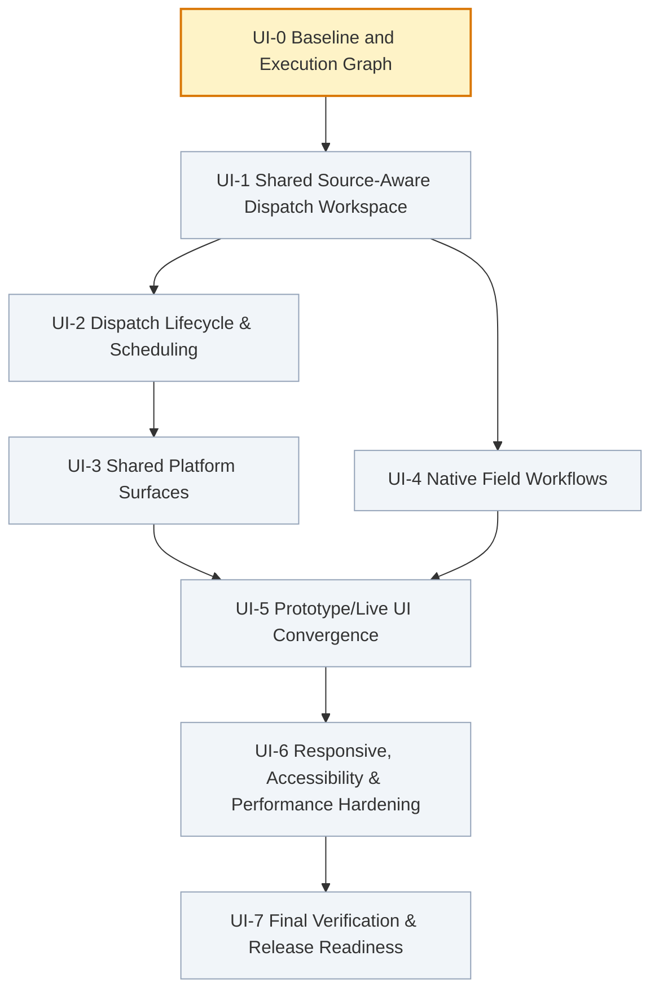

# Core Transaction 2 — UI Execution Dependency Graph

**Version:** 1.0.0  
**Updated:** 2026-08-15  
**Orchestrator Model:** Gemini 3.7 Flash  
**Active Phase:** `UI-0 Baseline and Execution Graph`

---

## 1. Graph Topology

---

## 2. Node Register & Status

| Node ID | Phase Name | State | Dependencies | Primary Ownership Scope | Exit Gate Summary |
| :--- | :--- | :--- | :--- | :--- | :--- |
| **UI-0** | Baseline and Execution Graph | `RUNNING` | *None* | Graph state, UI inventory, handoff structure | UI inventory complete, zero product code changes, baseline checks pass |
| **UI-1** | Shared Source-Aware Dispatch Workspace | `PENDING` | `UI-0` | Dispatch intake, Service/Rental/Sale identity, Manual intake, view models | Shared workspace with source badges, requirements, manual intake, reconciliation |
| **UI-2** | Dispatch Lifecycle & Scheduling | `PENDING` | `UI-1` | Day/Week/Month views, conflict review, activation, progression | Schedule views, activation/override gates, assignment progression, browser E2E |
| **UI-3** | Shared Platform Surfaces | `PENDING` | `UI-2` | Reports, attachments, notifications, exports, GPT, admin | Scoped reports, notifications center, export status/retry, GPT lifecycle, users/roles |
| **UI-4** | Native Field Workflows | `PENDING` | `UI-1` | `packages/field-mobile/` (Today's work, Heavy-crane drive mode, inspection) | Drive mode, park & secure confirmation, setup checks, tech inspection/maintenance |
| **UI-5** | Prototype/Live UI Convergence | `PENDING` | `UI-3`, `UI-4` | Prototype cleanup, fixture retirement, shared components | Eliminate fixture-only writes, retire obsolete views, unify status language |
| **UI-6** | Responsive, A11y & Perf Hardening | `PENDING` | `UI-5` | Responsive layouts, CSS tokens, WCAG 2.2 AA, MapLibre bundle | 320px/390px/tablet/desktop responsiveness, 44px targets, reduced motion, bundle audit |
| **UI-7** | Final Verification & Release Readiness | `PENDING` | `UI-6` | Release docs, test matrix, AI verification responses | All full CI & mobile suites pass, clean build, docs synchronized, completion report |

---

## 3. Node Ownership and File Boundaries

- **UI-0 owns**:
  - `.ai-reports/ui-execution/UI-EXECUTION-GRAPH.json`
  - `.ai-reports/ui-execution/UI-EXECUTION-GRAPH.md`
  - `.ai-reports/ui-execution/UI-INVENTORY.md`
  - `.ai-reports/ui-execution/handoffs/UI-0-HANDOFF.json`
  - `.ai-reports/ui-execution/handoffs/UI-0-HANDOFF.md`

- **UI-1 owns**:
  - `resources/js/pages/workspace.tsx`
  - `resources/js/components/workspace/live-dispatch-workspace.tsx`
  - `resources/js/components/workspace/live-dispatch-intake.tsx`
  - `resources/js/types/workspace.ts`
  - `resources/js/types/dispatch.ts`

- **UI-2 owns**:
  - `resources/js/pages/dispatch-detail.tsx`
  - `resources/js/components/workspace/schedule-board-week-view.tsx`
  - `resources/js/components/workspace/schedule-board-month-view.tsx`
  - `resources/js/components/surfaces/dispatch-surfaces.tsx`
  - `resources/js/components/surfaces/resource-surfaces.tsx`

- **UI-3 owns**:
  - `resources/js/components/workspace/reports-workspace-section.tsx`
  - `resources/js/components/workspace/notifications-workspace-section.tsx`
  - `resources/js/components/workspace/notification-center-popover.tsx`
  - `resources/js/components/workspace/exports-workspace-section.tsx`
  - `resources/js/components/workspace/gpt-workspace-section.tsx`
  - `resources/js/components/workspace/archive-workspace-section.tsx`
  - `resources/js/components/workspace/live-workspace-sections.tsx`

- **UI-4 owns**:
  - `packages/field-mobile/` (all mobile native screens, cards, panels, services)

- **UI-5 owns**:
  - `resources/js/pages/operations.tsx`
  - `resources/js/components/surfaces/`
  - `resources/js/data/fixtures/`

- **UI-6 owns**:
  - `resources/css/app.css`
  - `resources/js/components/ui/`
  - `resources/js/components/maplibre/`
  - `resources/js/components/live-tracking-map.tsx`

- **UI-7 owns**:
  - `Docs/`
  - `.ai-reports/` (final documentation and verification reports)

---

## 4. Execution Rules & Concurrency Guidelines

1. **Strict Dependency Order**:
   - UI-0 executes alone.
   - UI-1 starts only after UI-0 is `INTEGRATED`.
   - UI-2 and UI-4 execute in parallel or serialized as isolated worktrees after UI-1 is `INTEGRATED`.
   - UI-3 starts only after UI-2 is `INTEGRATED`.
   - UI-5 waits for both UI-3 and UI-4 to be `INTEGRATED`.
   - UI-6 waits for UI-5 to be `INTEGRATED`.
   - UI-7 waits for UI-6 to be `INTEGRATED`.

2. **Zero In-flight Cross-contamination**:
   - Each node executes in an isolated worktree and branch.
   - Only verified local commits are integrated.
   - Regressions are fixed within the node before marking it `PASSED`.

3. **Exit Gate Enforcement**:
   - Implementation, tests, visual review, and exit gate criteria must all pass before transitioning from `VERIFYING` to `PASSED`.
