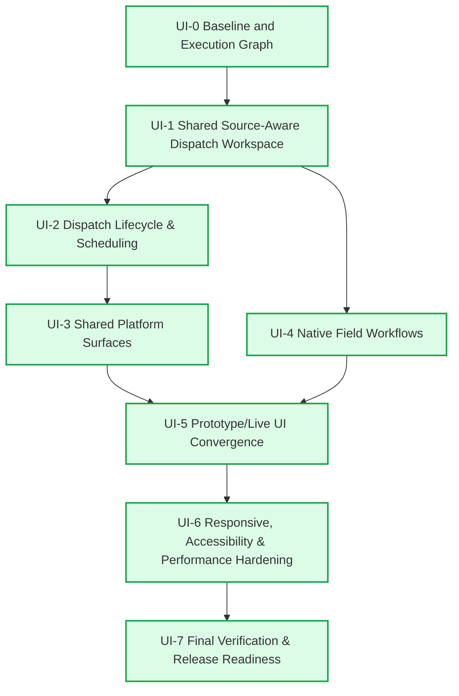

# Core Transaction 2 — UI Execution Dependency Graph

**Version:** 1.0.0  
**Updated:** 2026-08-15  
**Orchestrator Model:** Gemini 3.7 Flash  
**Active Phase:** `UI-7 Final Verification and Release Readiness`  
**Release Readiness:** `READY_GRAPH_COMPLETE=yes` (100% PASSED)

---

## 1. Graph Topology

---

## 2. Node Register & Status

| Node ID | Phase Name | State | Dependencies | Commit SHA | Primary Ownership Scope | Exit Gate Summary |
| :--- | :--- | :--- | :--- | :--- | :--- | :--- |
| **UI-0** | Baseline and Execution Graph | `PASSED` | *None* | `2440f30` | Graph state, UI inventory, handoff structure | UI inventory complete, zero product code changes, baseline checks pass |
| **UI-1** | Shared Source-Aware Dispatch Workspace | `PASSED` | `UI-0` | `d897cda` | Dispatch intake, Service/Rental/Sale identity, Manual intake, view models | Shared workspace with source badges, requirements, manual intake, reconciliation |
| **UI-2** | Dispatch Lifecycle & Scheduling | `PASSED` | `UI-1` | `590b109` | Day/Week/Month views, conflict review, activation, progression | Schedule views, activation/override gates, assignment progression, browser E2E |
| **UI-3** | Shared Platform Surfaces | `PASSED` | `UI-2` | `feb0819` | Reports, attachments, notifications, exports, GPT, admin | Scoped reports, notifications center, export status/retry, GPT lifecycle, users/roles |
| **UI-4** | Native Field Workflows | `PASSED` | `UI-1` | `83a4881` | `packages/field-mobile/` (Today's work, Heavy-crane drive mode, inspection) | Drive mode, park & secure confirmation, setup checks, tech inspection/maintenance |
| **UI-5** | Prototype/Live UI Convergence | `PASSED` | `UI-3`, `UI-4` | `a59bcab` | Prototype cleanup, fixture retirement, shared components | Eliminate fixture-only writes, retire obsolete views, unify status language |
| **UI-6** | Responsive, A11y & Perf Hardening | `PASSED` | `UI-5` | `36f5b1c` | Responsive layouts, CSS tokens, WCAG 2.2 AA, MapLibre bundle | 320px/390px/tablet/desktop responsiveness, 44px targets, reduced motion, bundle audit |
| **UI-7** | Final Verification & Release Readiness | `PASSED` | `UI-6` | `d6ad455` | Release docs, test matrix, AI verification responses | All full CI & mobile suites pass, clean build, docs synchronized, completion report |

---

## 3. Final Release Sign-Off

All 8 nodes across the Core Transaction 2 UI Execution Graph have satisfied their required exit criteria and achieved **PASSED** state. The full test suite (591 backend tests, 82 mobile tests, 0 lint/typecheck errors) and documentation sync are complete.
