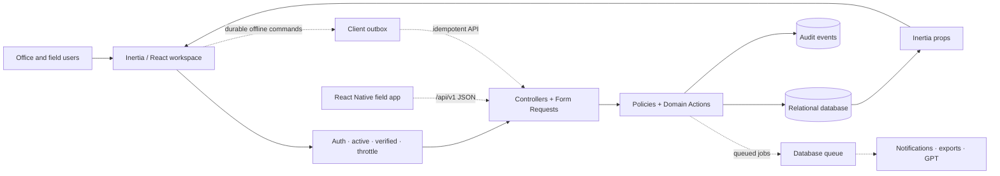
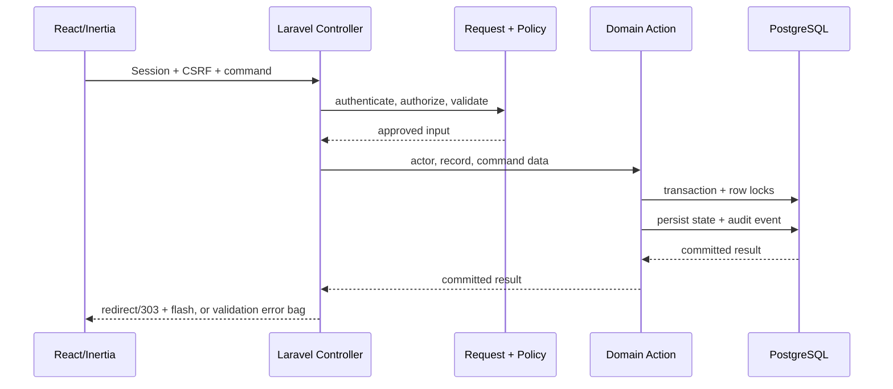

# Core Transaction 2 — Architecture

**Last updated:** 2026-08-01  
**Current style:** Modular Laravel monolith with Inertia/React

## Status legend

- Solid paths in diagrams are current.
- Dotted paths are recommended or planned.
- The routed UI is `resources/js/pages/workspace.tsx`; `operations.tsx` and its
  rich role surfaces are an unrouted fixture prototype that will be
  progressively converted into the canonical live experience.

## Business module boundary

The accepted product boundary is five top-level business modules:

1. Dispatch Job and Scheduling
2. Driver/Operator and Equipment Assignment
3. Fleet Management
4. Crane and Equipment Management
5. Fuel Management

Authentication, RBAC, personnel administration, audit, tracking, reports,
attachments, notifications, and GPT assistance are shared platform services.
The detailed ownership map is maintained in [Top-level modules](./modules.md).

## System context

## Current layers

### Presentation

- Vite builds React 19 and TypeScript.
- Inertia delivers authenticated pages and initial server-scoped data.
- The live workspace exposes a smaller subset of backend capabilities through
  explicit TypeScript view models mapped by
  `OperationsWorkspaceViewModel`; raw Eloquent serialization is no longer the
  routed page contract.
- The routed tracking surface now uses server-fed location view models,
  OpenStreetMap tiles, freshness filters, a synchronized list, measured
  polling, and a browser location outbox. The richer schedule board and local
  operations map still use fixture/reducer state. GPT, reports, attachments,
  and notifications have server-backed transitional routes, while their full
  routed UI remains a migration slice; packages/field-mobile contains the
  typed field API/workflow building blocks and a runnable Expo/React Native
  shell with a SecureStore token adapter. Native compile/install and
  supported-device authentication evidence remain open acceptance work.

### HTTP boundary

- `routes/web.php` and `routes/api.php` are composition roots for
  module-/platform-owned route files. The browser boundary provides
  authentication, the Inertia workspace, and transitional
  session-authenticated operations. Dispatch creation, fuel, approvals,
  location sharing, reports, attachments, notification mutations, and GPT
  lifecycle commands use redirects, Laravel validation errors, and/or typed
  flash. Some browser list/detail and summary endpoints still return
  transitional JSON; they are not stable external contracts.
- The active `/api/v1` bearer-token boundary provides mobile authentication,
  assigned dispatch work, assignment response, field progression, location
  sharing, Fleet/Equipment asset catalogs, and policy-scoped fuel-request
  catalogs. API controllers and route files live with their owning Modules or
  Platform capability.
- Middleware requires authenticated, active, verified users and applies CSRF
  and throttling. Identity middleware lives in `Platform/Identity`, while the
  Inertia adapter lives in `Platform/Workspace`.
- Form Requests handle complex validation/authorization boundaries; small controllers sometimes validate inline.
- Controllers orchestrate HTTP concerns and delegate critical workflows to actions.

### Domain and authorization

- The five business modules are physically organized beneath `app/Modules`.
  Tracking, records, identity, and administration are shared platform services
  beneath `app/Platform`; the currently unified asset persistence model lives
  in the intentionally small `app/Shared/Assets` kernel.
- Backed enums define canonical roles, permissions, priorities, and lifecycle states.
- Policies and permission checks enforce actions; `visibleTo(User)` scopes enforce record visibility in queries.
- Transactional actions handle assignment, activation, approval, dispatch/fuel transitions, and audit.

### Persistence

- Laravel migrations are authoritative.
- PostgreSQL/Supabase is server-only; browser and mobile clients have no
  operational Data API table privileges.
- Foreign keys, indexes, checks, soft deletes, transactions, locks, and optimistic versions protect integrity.
- SQLite is used for local tests where PostgreSQL-specific statements are guarded.

## Critical request flow

## Decisions

### Organize the product around five business modules

The product uses five stable business boundaries while remaining a modular
Laravel monolith. Fleet and Crane/Equipment Management share the current
`OperationalAsset` model and persistence table, but remain separate product
modules because their capabilities, policies, and workflows may diverge.

### Keep a modular monolith

Dispatch, approval, asset safety, and audit are tightly transactional. One Laravel deployment with clear actions, policies, models, and module-oriented tests is simpler and safer than premature service distribution.

### Keep the server authoritative

React may hide controls and provide optimistic feedback, but Laravel policies, permissions, scopes, validation, and state transitions decide every authoritative read and write.

### Use actions as transaction boundaries

Assignment, activation, approval, and transitions combine locking, invariants, persistence, and audit. Dedicated actions make those rules reusable without adding proxy-only service layers.

### Keep GPT advisory

Recommendation generation may create a recommendation record only. A separately authorized human command invokes the normal domain action and revalidates all rules.

### Converge progressively on the richer role experience

The richer role-adaptive prototype is the target product experience, but the
existing live route remains the production boundary during migration. The first
live dispatch slice now uses a role-adaptive shell, explicit mapped view models,
and an authoritative draft-creation command without fixture writes. A later
slice becomes live only after its fixtures and reducer-only writes are replaced
by the same standard.

Laravel backed-enum machine values are canonical across clients. Prototype
labels may map to display labels, but prototype-only concepts such as dispatch
“On hold,” fuel “Dispensed,” or asset “Offline” cannot become persisted domain
states implicitly.

### Use amber as the brand primary

Amber owns brand, primary action, focus, selection, and active-navigation roles.
Warning and conflict semantics must use a distinct palette plus text and
icon/shape cues.

### Use Inertia for browser mutations

Session-authenticated browser writes redirect after success, expose Laravel
validation error bags, and use typed flash for concise feedback. A separate
versioned JSON adapter is introduced for React Native and calls the same
policies, validation, and domain actions.

### Run a managed single-region production topology

Start with persistent Laravel web and worker services co-located with managed
Supabase PostgreSQL and private versioned S3-compatible object storage. Use a
direct PostgreSQL connection from persistent services when IPv6 is available,
or Supavisor session mode on IPv4-only runtimes. Use direct connections for
migrations and administrative operations. The database queue is the initial
asynchronous transport.

### Develop responsive web and React Native in parallel

The web workspace and focused native field application are parallel capstone
workstreams sharing one Laravel authority and canonical contracts. React Native
does not reproduce unrestricted office or administration features.

## Recommended evolution

1. Converge on the richer canonical role-adaptive UI and remove fixture
   persistence from each migrated production slice.
2. Convert browser writes to the accepted Inertia redirect/error/typed-flash
   contract.
3. Build the versioned React Native JSON adapter in parallel; both adapters
   call the same actions and policies.
4. Start asynchronous work with Laravel's database queue for notifications, exports, and GPT; keep audit writes synchronous.
5. Preserve the implemented actor-scoped SQLite command repository,
   idempotency keys/client command IDs, and version checks for offline replay.
6. Keep the accepted location capture, freshness, and 30-day precision
   retention enforced by the live browser slice; extend the completed native
   8-hour command behavior to device-backed location and complete production
   monitoring with explicit polling measurements.
7. Enforce the accepted 15 MiB/file and 10 files/record limits in private object
   storage with authorized, short-lived downloads and checksums.

## Current risks and open decisions

- Live and prototype frontends can drift in status vocabulary and behavior.
- The routed workspace mutation contract has focused HTTP coverage, but browser
  E2E evidence could not yet be collected and remaining unrouted JSON commands
  still require convergence or `/api/v1` separation.
- Device-backed native location, realtime transport, production object-storage
  integration, and complete routed shared-service UI remain open; the native
  mobile API and durable outbox, browser location outbox, OpenStreetMap tracking
  surface, GPT workflow, and private file/report pipeline are implemented.
- The public OpenStreetMap tile dependency is wired for the web slice; a
  production map/routing provider and usage policy remain open.
- The topology shape, 99.5% availability, 15-minute RPO, 4-hour RTO,
  location/offline limits, attachment limits, and GPT limits are accepted in
  [phase-0-baseline.md](./phase-0-baseline.md), but are not implemented or
  operationally proven.
- Session 0 recorded explicit production providers (AWS ECS/Fly.io compute, Supabase/S3 infrastructure, Sentry/Datadog monitoring, Mapbox routing, FCM/APNs push notifications) and retention schedules (7-year operational retention, 90-day raw AI retention) with assigned owners in [phase-0-baseline.md](./phase-0-baseline.md).
- The current CSS brand is already amber-oriented, but exact accessible brand
  and distinct warning tokens still require implementation and design QA.

## Testing and operations

Current Pest tests cover major backend authorization, workflow, safety,
report/attachment, notification, GPT, idempotency, retention, and tracking
behavior. Add frontend integration tests, critical browser E2E flows,
API/view-model contract tests, queue retry tests, accessibility checks,
production query-plan checks, monitoring, backups/restores, and deployment
rollback drills.

## Visual reference

[`Diagrams/system-overview.excalidraw`](./Diagrams/system-overview.excalidraw)
provides a visual summary of the current web client, mandatory planned mobile
client, shared Laravel boundary, operational rules, persistence, and dispatch
lifecycle. It is a communication aid; this document and the implemented
application remain authoritative.
