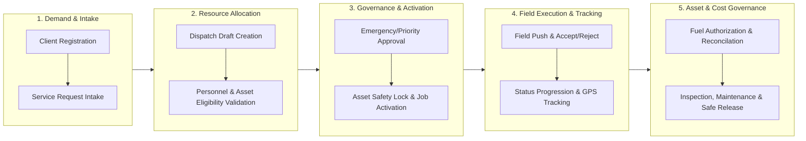
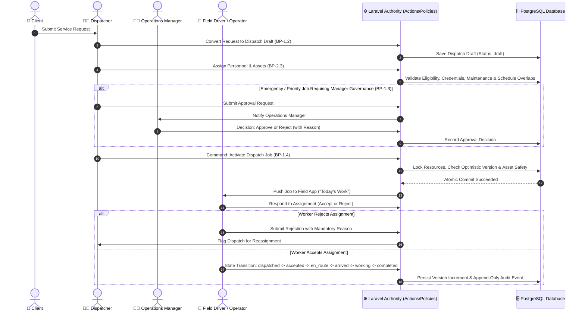
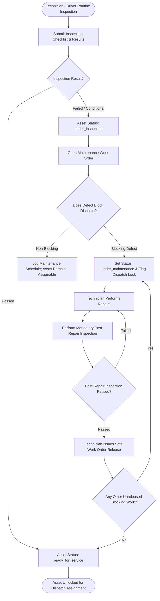

# Core Transaction 2 — Business Process Architecture (BPA)

**Last updated:** 2026-07-31  
**Status:** Visual and architectural reference for business process taxonomy, value streams, swimlane workflows, and RACI governance.

This document defines the **Business Process Architecture (BPA)** for **Core Transaction 2**. It structures the business capabilities into end-to-end value chains, process hierarchies, cross-functional swimlane diagrams, and governance controls.

For technical data flows, consult [dfd.md](./dfd.md); for system architecture, consult [Architecture.md](../Architecture.md); and for module definitions, consult [modules.md](../modules.md).

---

## 1. End-to-End Enterprise Value Stream (Level 0 BPA)

Core Transaction 2 converts client heavy-equipment and logistics demand into safely executed, fully audited field operations.

---

## 2. Business Process Hierarchy (Level 1 BPA)

| Module / Function | Process Code | Process Name | Trigger / Input | Primary Output |
| --- | --- | --- | --- | --- |
| **1. Dispatch & Scheduling** | `BP-1.1` | Client Intake & Request Management | Client inquiry / service demand | Submitted Service Request |
| | `BP-1.2` | Job Creation & Draft Conversion | Service Request or Direct Order | Uniquely referenced Dispatch Draft |
| | `BP-1.3` | Priority / Emergency Approval Protocol | High-priority flag on draft job | Manager Approval / Rejection Decision |
| | `BP-1.4` | Server-Authoritative Dispatch Activation | Complete resource assignment | Dispatched / Active Job |
| **2. Resource Assignment** | `BP-2.1` | Personnel Eligibility & Credentials Check | Draft Job staffing request | Qualified Personnel Selection |
| | `BP-2.2` | Asset Readiness & Overlap Check | Draft Job equipment request | Safe & Available Asset Selection |
| | `BP-2.3` | Resource Assignment & Conflict Lock | Personnel & Asset selection | Persisted Assignments (`DispatchPersonnelAssignment`, `DispatchAssetAssignment`) |
| **3. Fleet Management** | `BP-3.1` | Vehicle Inspection & Defect Intake | Pre/post-trip inspection | Passed Inspection or Maintenance Work Order |
| | `BP-3.2` | Maintenance Repair & Safe Release Gate | Defect report / scheduled service | Certified Asset (`ready_for_service`) |
| **4. Crane & Equipment** | `BP-4.1` | Heavy Equipment Certification Check | High-capacity lifting job | Verified Equipment Eligibility |
| | `BP-4.2` | Crane Maintenance & Inspection Release | Equipment fault / inspection | Released Operational Asset |
| **5. Fuel Management** | `BP-5.1` | Fuel Request Intake & Verification | Field driver fuel request | Pending Fuel Authorization |
| | `BP-5.2` | Fuel Approval & Dispense Logging | Pending request review | Verified Fuel Log & Reconciled Cost |
| **Shared Platform** | `BP-6.1` | GPS Location Ingestion & Outbox Sync | Driver mobile pings | OpenStreetMap Tracking Feed |
| | `BP-6.2` | GPT Advisory Dispatch Recommendation | Office user assistance request | Human-Reviewed Recommendation |
| | `BP-6.3` | Immutable System Audit Logging | Any state-changing domain action | Audit Event Record |

---

## 3. Detailed Process Swimlane Workflows (Level 2 BPA)

### BPA-1: End-to-End Dispatch Intake to Field Activation

### BPA-2: Operational Asset Inspection, Maintenance & Safe Release Protocol

---

## 4. Organizational Governance & RACI Matrix

The RACI matrix defines role accountability across Core Transaction 2 business processes:
- **R (Responsible)**: The role that completes the activity.
- **A (Accountable)**: The sole role with final approval and decision authority.
- **C (Consulted)**: Role offering advisory input or requirements.
- **I (Informed)**: Role updated on process progress.

| Process Name | Process Code | Client | Dispatcher | Manager / Approver | Field Driver / Operator | Maintenance Tech | System Admin |
| --- | --- | :---: | :---: | :---: | :---: | :---: | :---: |
| Service Intake & Request Conversion | `BP-1.1 / 1.2` | **C** | **R / A** | **I** | **I** | - | - |
| Emergency / Priority Dispatch Approval | `BP-1.3` | **I** | **R** | **A** | **I** | - | - |
| Personnel & Equipment Assignment | `BP-2.1 / 2.3` | - | **R / A** | **C** | **I** | **I** | - |
| Routine Dispatch Activation | `BP-1.4` | **I** | **R / A** | **I** | **I** | - | - |
| Field Work Execution & Status Update | `BP-4.1` | **I** | **I** | **I** | **R / A** | - | - |
| Asset Inspection & Defect Reporting | `BP-3.1` | - | **I** | **I** | **R** | **R / A** | - |
| Maintenance Work Order & Safe Release | `BP-3.2` | - | **I** | **I** | - | **R / A** | - |
| Fuel Request & Dispense Verification | `BP-5.1 / 5.2` | - | **C** | **A** | **R** | **I** | - |
| System RBAC & User Administration | `BP-7.1` | - | - | **C** | - | - | **R / A** |

---

## 5. Key Business Invariants & Policy Controls

1. **Two-Person Emergency Governance Rule**:
   A Dispatcher requesting an emergency job activation *cannot approve their own request*. An independent Operations Manager must evaluate and approve/reject the request.

2. **Asset Safety Release Gate**:
   An operational asset with an active, unreleased blocking maintenance work order *cannot be assigned or activated* on any dispatch job. The server enforces this at atomic lock time.

3. **Strict Field State Progression Invariant**:
   Field drivers must advance work in strict linear sequence (`dispatched` $\rightarrow$ `accepted` $\rightarrow$ `en_route` $\rightarrow$ `arrived` $\rightarrow$ `working` $\rightarrow$ `completed`). Out-of-order, skipped, or backward state jumps strictly fail.

4. **Human-in-the-Loop GPT Control**:
   GPT assistance generates advisory suggestions only. AI models cannot directly mutate persistence states or trigger activations without explicit human review and authorization.
