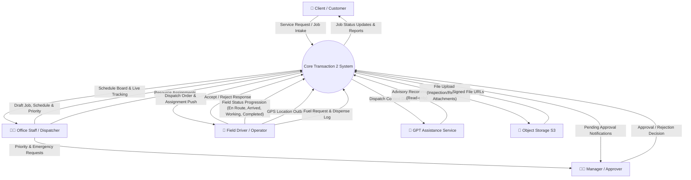
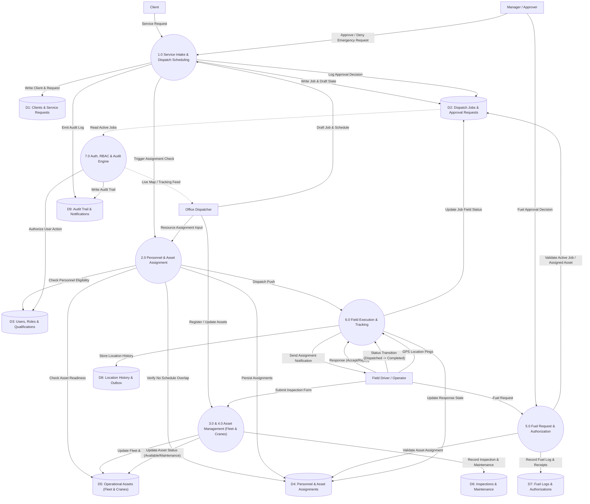
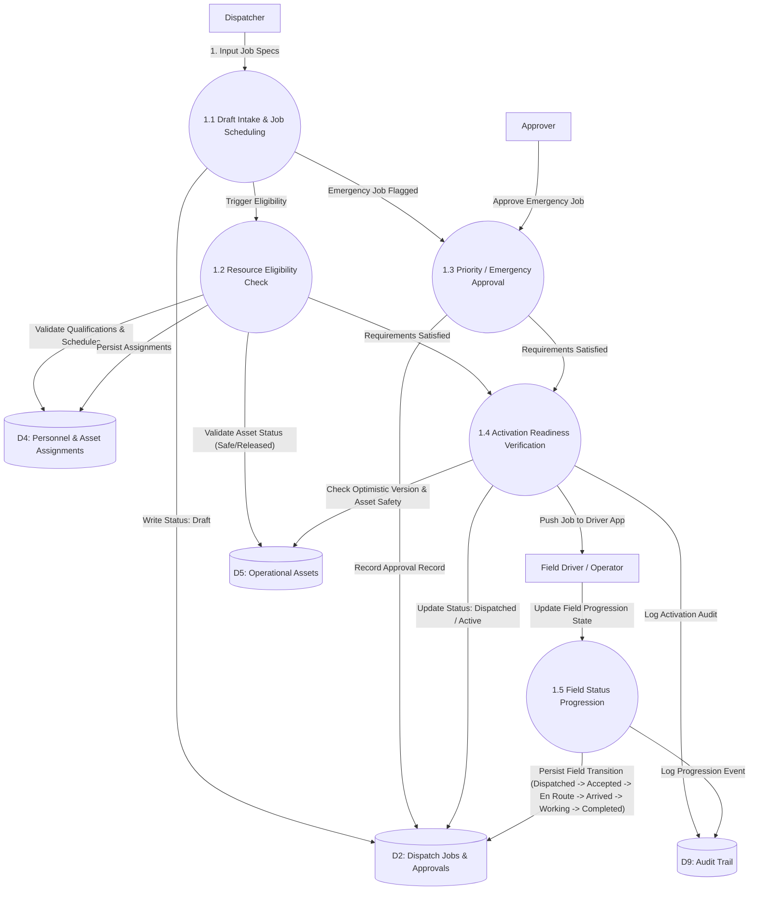
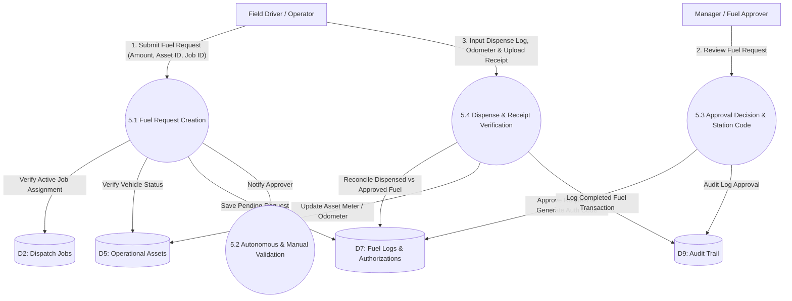

# Core Transaction 2 — Data Flow Diagram (DFD)

**Last updated:** 2026-07-31  
**Status:** Visual DFD reference for system data flow, processes, data stores, and external entities

This document provides Level 0 (Context Diagram), Level 1 (Modular System DFD), and Level 2 (Detailed Workflow DFDs) data flow diagrams for **Core Transaction 2**. It visualizes how external entities interact with system processes, transformed data flows, and relational data stores.

For authoritative system definitions, consult [Architecture.md](../Architecture.md), [modules.md](../modules.md), [business_rules.md](../business_rules.md), and [database.md](../database.md).

---

## 1. Level 0 DFD — Context Diagram

The Context Diagram defines the system boundary for Core Transaction 2, showing key external actors, system inputs, and system outputs.

---

## 2. Level 1 DFD — Decomposed Modular Data Flow

Level 1 decomposes the system into the 5 Core Business Modules and Shared Platform Services, detailing interactions with canonical data stores.

---

## 3. Level 2 DFD — Detailed Core Workflows

### 3.1 Dispatch Lifecycle & Field Activation Flow

### 3.2 Fuel Request, Authorization & Dispense Flow

---

## 4. DFD Element Legend & Conventions

| DFD Element | Symbol / Notation | Description in Core Transaction 2 |
| --- | --- | --- |
| **External Entity** | `[Rectangle]` | Users (Client, Dispatcher, Driver, Approver) or External Systems (S3 Storage, GPT AI Service) |
| **Process** | `((Circle / Bubble))` | Domain logic action executed by server (e.g. `ActivateDispatchJob`, `AssignDispatchResources`) |
| **Data Store** | `[(Database / Cylinder)]` | PostgreSQL relational tables (e.g. `dispatch_jobs`, `operational_assets`, `fuel_requests`) |
| **Data Flow** | `-->|Data Label|` | Typed parameters, JSON payloads, or domain events passing between components |

---

## 5. Architectural Data Flow Rules & Constraints

1. **Server Authority**: All data flow transitions are validated by Laravel Policies, Form Requests, and domain Actions. Frontend components do not directly write to Data Stores.
2. **Immutable Audit Trails**: Every state change in Process `1.0` through `6.0` automatically triggers an append-only write to `D9: Audit Trail`.
3. **Asynchronous Location Outbox**: Location updates from `E_FIELD` are collected in an offline browser/mobile outbox and flushed asynchronously via idempotent pings to `D8`.
4. **Advisory GPT Integration**: GPT assistance reads dispatch context from `D2`/`D5` but produces advisory recommendations only. Human intervention is required to convert recommendations into domain actions.
