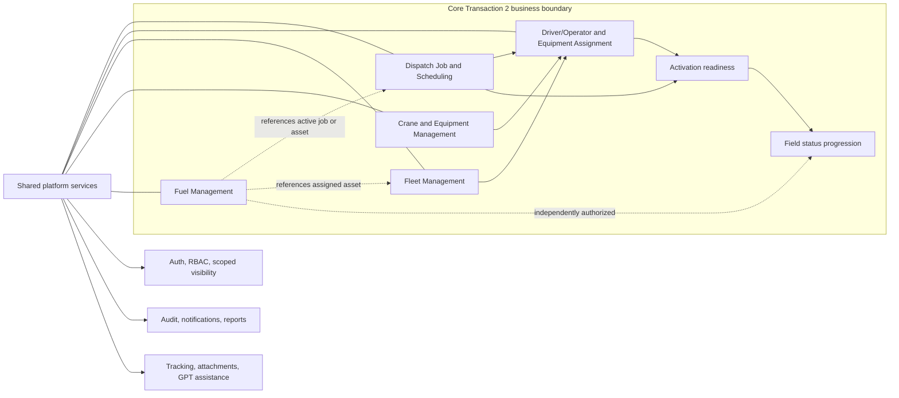
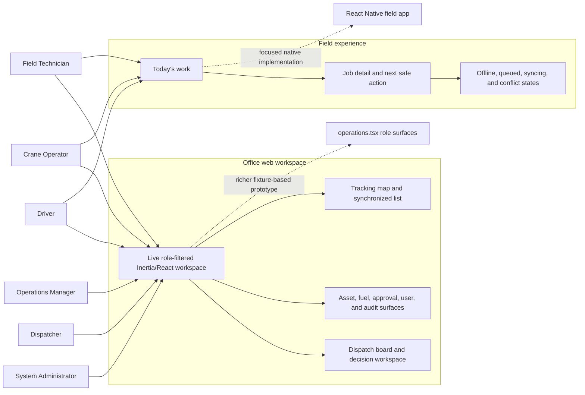
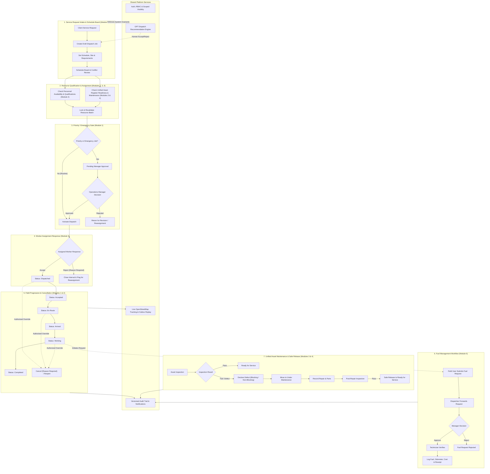

# Core Transaction 2 - Module and UI/UX Map

**Last updated:** 2026-07-31  
**Status:** Communication diagram for the accepted product boundary

This document visualizes the five business modules, their submodules, shared
platform services, role-based UI surfaces, and the main operational dependency
flow. It is a communication aid; [modules.md](../modules.md),
[features.md](../features.md), migrations, and application code remain
authoritative.

## Status legend

- **Live backend/UI** - server-backed behavior is exposed through the current
  routed workspace or a dedicated UI surface.
- **Partial** - the backend or a meaningful UI slice exists, but the complete
  experience is still being connected.
- **Prototype** - demonstrated by fixture/reducer UI and not evidence of live
  product behavior.
- **Planned** - accepted direction without a complete implementation.

## Business module boundary

Dispatch creates the work context. Assignment staffs and equips it. Fleet and
Crane/Equipment Management determine whether resources are safe and available.
Fuel remains an independently authorized workflow even when it references a
dispatch or asset.

## Module and submodule map

```mermaid
flowchart TB
    D[1. Dispatch Job and Scheduling]
    D1[Client and service-request intake]
    D2[Job creation and scheduling]
    D3[Priority and emergency approval]
    D4[Dispatch activation]
    D5[Field status progression]
    D6[Cancellation, reopen, archive, reassignment]
    D7[Schedule board and live tracking]
    D --> D1
    D --> D2
    D --> D3
    D --> D4
    D --> D5
    D --> D6
    D --> D7

    A[2. Driver/Operator and Equipment Assignment]
    A1[Personnel eligibility and qualifications]
    A2[Personnel assignment and response]
    A3[Operational-asset eligibility]
    A4[Asset assignment and approval metadata]
    A5[Conflict review and reassignment]
    A --> A1
    A --> A2
    A --> A3
    A --> A4
    A --> A5

    F[3. Fleet Management]
    F1[Fleet-vehicle registry]
    F2[Vehicle status and readiness]
    F3[Vehicle inspections]
    F4[Maintenance and safe release]
    F5[Assignment and utilization history]
    F6[Vehicle location updates]
    F --> F1
    F --> F2
    F --> F3
    F --> F4
    F --> F5
    F --> F6

    C[4. Crane and Equipment Management]
    C1[Crane registry and capacity]
    C2[Equipment registry and specifications]
    C3[Certification and qualification]
    C4[Equipment status and readiness]
    C5[Inspections and maintenance]
    C6[Assignment and utilization history]
    C --> C1
    C --> C2
    C --> C3
    C --> C4
    C --> C5
    C --> C6

    U[5. Fuel Management]
    U1[Fuel-request submission]
    U2[Forwarding and review]
    U3[Approval and rejection]
    U4[Verification]
    U5[Final fuel logging]
    U6[Monitoring and reporting]
    U --> U1
    U --> U2
    U --> U3
    U --> U4
    U --> U5
    U --> U6
```

## Role-based UI/UX surfaces

The current production boundary is the routed web workspace and dispatch
detail page. The richer `operations.tsx` role surfaces are design/prototype
sources, while `packages/field-mobile` contains the partial native field
application. The native app is intentionally focused on field work and does
not reproduce the office administration workspace.

## Operational dependency flow

Every state-changing action remains subject to server-side authorization,
validation, optimistic-version checks where applicable, and audit recording.
The UI should explain the next decision, its consequence, and any stale,
blocked, offline, or conflicting state before the user confirms an action.

## Current implementation references

- Live web entry point: `resources/js/pages/workspace.tsx`
- Live dispatch detail: `resources/js/pages/dispatch-detail.tsx`
- Live workspace sections: `resources/js/components/workspace/`
- Prototype role surfaces: `resources/js/pages/operations.tsx` and
  `resources/js/components/surfaces/`
- Native field entry point: `packages/field-mobile/src/navigation/AppNavigator.tsx`
- Server-side role navigation and capabilities:
  `app/ViewModels/OperationsWorkspaceViewModel.php`
