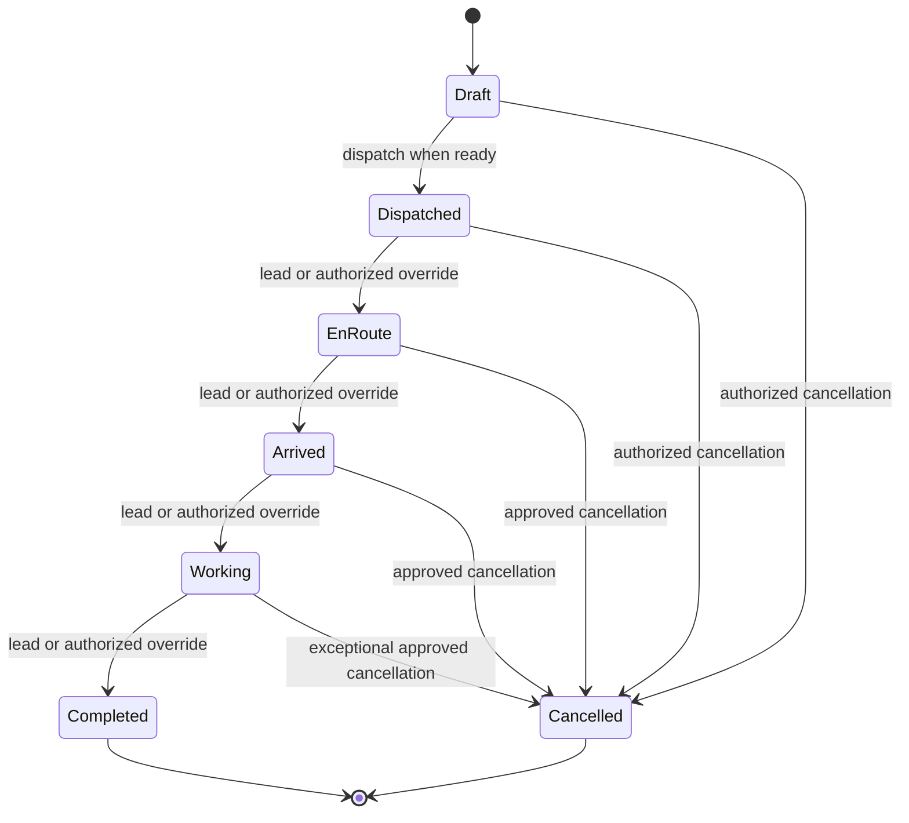
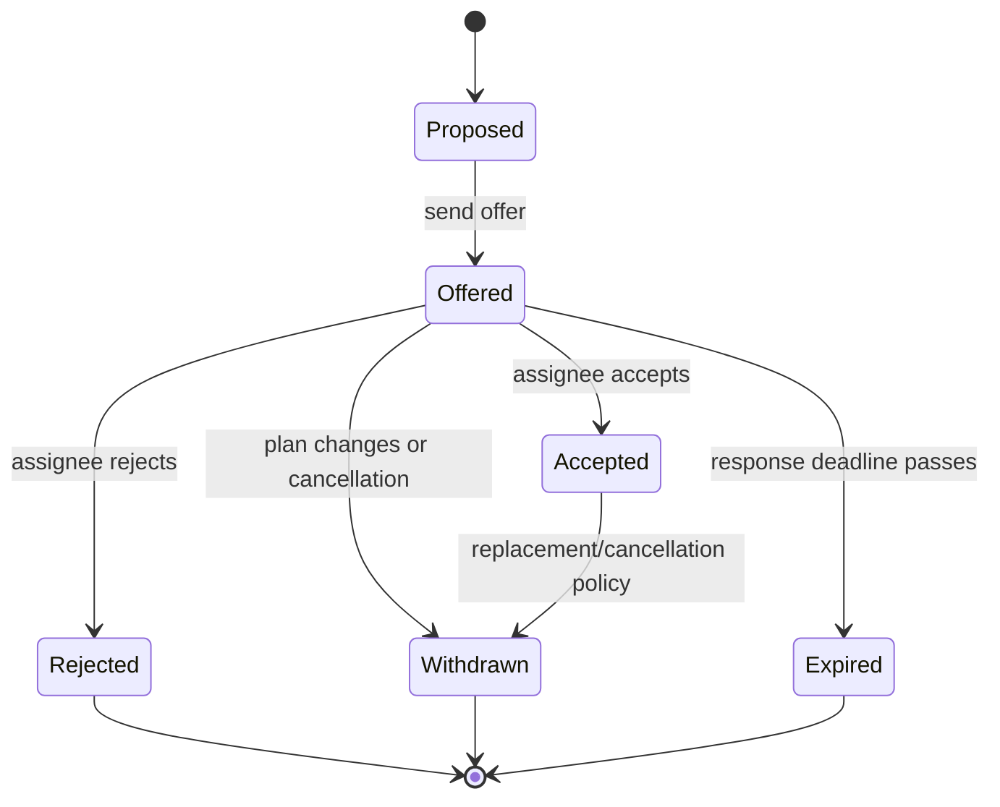
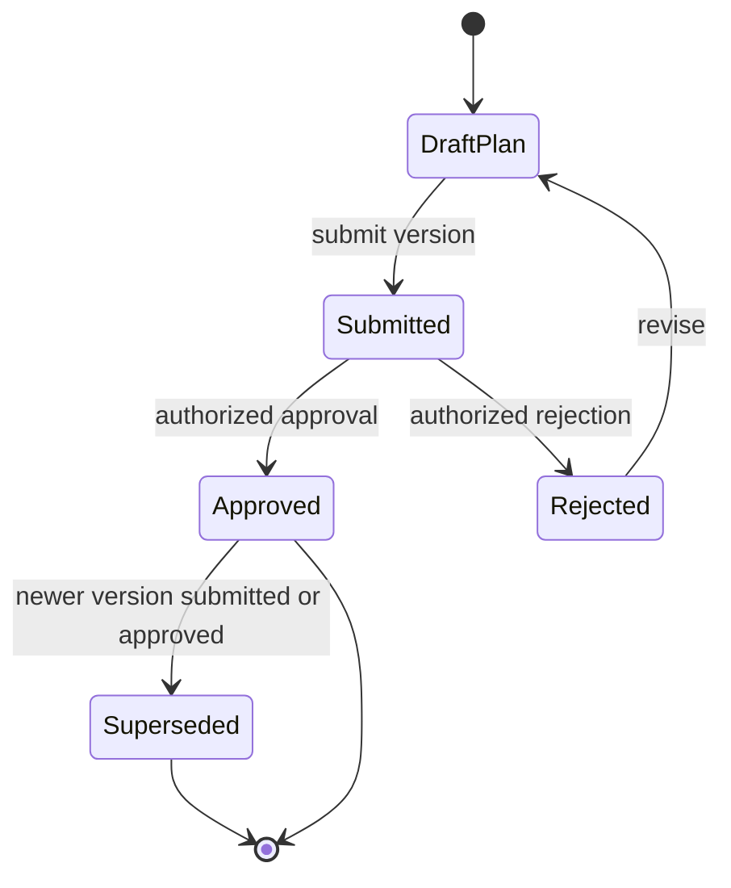

# ADR: Dispatch Backend V2 Domain Contract

- Status: accepted target contract; implementation pending
- Date: 2026-08-14
- Decision scope: Dispatch Backend V2 Phases 0–6
- Compatibility rule: existing runtime behavior is legacy until a phase is explicitly completed and verified

## Context

The current modular monolith contains dispatch lifecycle and assignment concepts that overlap. In particular, the current runtime vocabulary includes a job-level `accepted` status as well as assignment-level acceptance. That duplicate meaning is not the V2 target. The redesign must preserve existing user data, authorization, eligibility, asset safety, audit history, optimistic concurrency, and mobile idempotency while introducing a single domain model that web and mobile can share.

This ADR is a contract for later implementation. It does not remove current columns, enums, routes, or behavior, and it does not claim that V2 is running.

## Decision summary

1. A dispatch attempt has the execution lifecycle `draft -> dispatched -> en_route -> arrived -> working -> completed`, plus `cancelled`.
2. `accepted` describes an assignment offer only. A job/dispatch attempt is never accepted.
3. `pending_approval`, `scheduled`, and `ready` are derived conditions or approval/plan facts, not execution lifecycle states.
4. Every dispatch attempt has exactly one designated accepted lead. Only that lead or an explicitly authorized override can progress global execution.
5. Every mandatory assignment offer must be accepted before dispatch, except for an explicitly approved emergency override. An emergency override never removes the designated accepted-lead requirement.
6. Archive is orthogonal to execution and can apply only to terminal records. Archiving never resumes, cancels, or otherwise changes execution.
7. One dispatch is one scheduled execution attempt linked to one canonical operational handoff. A handoff may have multiple attempts when replacement/retry business rules permit it.
8. Web and mobile adapters invoke the same domain commands. A breaking mobile change uses `/api/v2` and a temporary tested `/api/v1` compatibility path.
9. State changes and audit records are atomic. Notifications, broadcasts, and other slow side effects happen after commit.
10. An `on_hold` state is explicitly deferred until stakeholders define its semantics and operational consequences.

## Actor and capability matrix

Capabilities are domain capabilities, not a promise that the current permission catalog already exposes these exact names. Each command must authorize the actor and record the actor, capability, reason, and version used.

| Actor | Read scope | May prepare/assign | May accept an offer | May dispatch | May progress global execution | May override | May cancel/reopen/archive | Audit/recovery |
| --- | --- | --- | --- | --- | --- | --- | --- | --- |
| Dispatcher | All dispatches allowed by tenant/workspace policy | Create or edit a draft plan; create offers; propose the lead | Own offer only | Dispatch when readiness passes | No, unless separately granted an override capability | No | Cancel only where policy grants it; no unilateral reopen/archive | Read audit |
| Operations manager / designated approver | All operational dispatches | Approve plans; designate or replace lead before execution | Own offer if also assigned | Dispatch or approve an emergency override | Yes, with reason, scope, expiry, and audit | Approve cancellation, reopen as a new attempt, archive terminal records | Full audit and exception review |
| Assigned field worker | Assigned offers and attempts only | No | Accept or reject own offer | No | No | No | Read own audit/evidence |
| Designated accepted lead | Assigned attempt and required operational context | No plan mutation by virtue of lead status | Own offer already accepted | No | Progress `dispatched -> en_route -> arrived -> working -> completed` for the designated attempt | No, unless separately granted | No | Add operational evidence/report entries |
| System administrator | Tenant-wide, subject to break-glass controls | Administrative recovery only | No implicit acceptance | Only through explicit audited recovery capability | Only through explicit audited recovery capability | Yes, with break-glass reason and review | Yes, with review; cannot silently rewrite history | Full audit and reconciliation |
| Rental/Sales/Service source adapter | Its canonical handoff and linked attempts | Create/update source handoff and request an attempt | No | No | No | No | Request cancellation/replacement through domain command | Correlation/audit metadata only |

The actor who creates an offer is not automatically the accepting actor. A dispatcher or manager may record a decision for another actor only through an explicit override/approval capability; ordinary assignment acceptance remains the assignee's action.

## Three separated state machines

### 1. Dispatch execution lifecycle

This is the only job/attempt lifecycle. `accepted` is intentionally absent.

Rules:

- A transition requires the expected current version and is recorded atomically with its audit event.
- The transition to `dispatched` is blocked until the readiness contract passes, including mandatory offer acceptance and a designated accepted lead, unless the emergency override policy applies.
- A cancelled attempt is terminal. Reopen creates a new draft replacement attempt linked to the same handoff; it does not mutate the cancelled attempt back to an active state.
- Completion is terminal for execution. Post-completion changes are closeout/audit corrections, not lifecycle transitions.

### 2. Assignment offer lifecycle

This is the only state machine that uses `accepted`.

Rules:

- A mandatory offer is blocking until `Accepted`, unless an authorized emergency override records the waived offer and its scope.
- Offers are scoped to an execution attempt and plan version. Replanning supersedes offers tied to an older version.
- Exactly one active accepted personnel offer is marked as the designated lead for an attempt. The uniqueness rule is enforced in the domain transaction and at the persistence boundary where supported.
- Asset assignments use their own eligibility/safety/readiness facts; they do not become personnel acceptance records.

### 3. Dispatch plan and approval lifecycle

Planning/approval is separate from execution and assignment state.

Rules:

- Each plan version is immutable after submission. A material change creates a new version.
- An approval binds to one exact plan version. Any newer submitted version supersedes approval for dispatch purposes; old approval is retained for audit but cannot authorize a newer attempt.
- `pending_approval` is a derived presentation/readiness condition from the current plan and approvals. It is not an execution status.

## Readiness blocker contract

Readiness is a deterministic projection over the current attempt, plan version, offers, eligibility, assets, schedule, source handoff, and approvals. It is not a stored lifecycle state.

The evaluator returns a stable, sorted list of typed blockers. Every blocker includes `code`, `severity` (`blocking` or `warning`), `message_key`, `evidence`, and the relevant `plan_version`/`attempt_version`. `ready` is true only when no `blocking` blocker exists.

The initial blocking vocabulary is:

| Code | Meaning |
| --- | --- |
| `missing_schedule` | Required execution window is absent or invalid |
| `missing_mandatory_assignment` | A mandatory role/resource has no current offer |
| `pending_mandatory_acceptance` | A mandatory offer is not accepted |
| `no_designated_lead` | No single designated lead exists |
| `lead_not_accepted` | The designated lead offer is not accepted |
| `approval_required` | Current plan version lacks required approval |
| `stale_plan_approval` | Approval belongs to a superseded plan version |
| `asset_unavailable` | Required asset is unavailable or already committed |
| `asset_unsafe` | Required asset fails inspection/maintenance/safety checks |
| `source_not_ready` | Canonical source handoff has not reached its dispatch-ready condition |
| `archived_record` | Terminal record is archived and cannot be dispatched |
| `concurrency_conflict` | The command's expected version is stale |

Warnings may explain non-blocking risks but must never be silently treated as acceptance, approval, or readiness. The evaluator is reused by web, mobile, API, and background reconciliation paths.

## Designated lead and mandatory acceptance policy

- The designated lead is a personnel assignment on the specific attempt, not a role inferred from the job title or the first person to accept.
- The lead must be qualified, eligible, active for the attempt, and in `Accepted` offer state.
- Designation, replacement, and removal are explicit commands requiring the assignment capability and optimistic version checks.
- Dispatch requires all mandatory offers accepted and exactly one accepted lead. A manager-approved emergency override may waive named mandatory offers only; it must record the approver, reason, affected offer(s), expiry/operational boundary, and audit event.
- An emergency override does not turn a job into `accepted`, does not auto-accept an offer, and does not bypass asset safety or the lead requirement.

## Plan-version and approval supersession policy

Plan versions are monotonic per handoff/attempt and are never reused. A material change to schedule, required assignments, lead, assets, source payload, or safety/eligibility facts creates a new version. Approval is a relation to the exact version, not a boolean on the job. When a new version is submitted, prior approval becomes superseded for dispatch even if it remains historically approved. Dispatch commands must re-evaluate the current version inside the same transaction that records the transition.

## Cancellation, reopen, and archive policy

- Cancellation is an explicit authorized command with a reason and audit record. It withdraws outstanding offers according to policy and prevents further execution transitions on that attempt.
- A cancelled attempt remains immutable as an historical attempt. Reopen means “request a new execution attempt” and creates a new draft attempt linked to the same canonical handoff; it never resets the cancelled attempt.
- Archive is orthogonal metadata on a terminal record (`completed` or `cancelled`). It changes visibility/retention only and cannot be used to dispatch, progress, or rewrite the lifecycle.
- Unarchive, if required by retention policy, restores visibility only; it does not make the record executable.
- No delete operation may remove the audit trail or source/attempt lineage.

## Source retry and replacement-attempt policy

- A rental, sales, or service handoff is the canonical operational source. A dispatch attempt references exactly one handoff and records a stable correlation/idempotency key.
- Retrying a failed command or post-commit side effect reuses the same attempt and idempotency key when no new execution attempt is intended.
- A replacement attempt is a new record with a monotonic sequence and a `replaces_attempt_id`/lineage relation when business rules permit it. The previous attempt must be terminal and remains queryable.
- Source updates never silently mutate a dispatched or completed attempt. They create a new plan version or replacement attempt according to the command policy.
- Source adapters do not directly write execution status; they invoke the shared domain commands and receive the same conflict, readiness, audit, and idempotency semantics as web/mobile callers.

## Deferred `on_hold` state

No `on_hold` execution state is introduced in V2 until stakeholders define its owner, entry/exit authority, timer behavior, billing implications, asset reservation behavior, safety semantics, notifications, and audit requirements. A blocked or paused business process must use a typed readiness blocker, pending approval, cancellation, or a new replacement attempt as appropriate. Future work must not add an `on_hold` enum value, route, or UI label as a convenience placeholder.

## Current implementation boundary

At Phase 0, the existing runtime still contains legacy values such as job-level `accepted`, `pending_approval`, and `scheduled`; existing tests and compatibility behavior may still reference them. No V2 runtime behavior is claimed here. Later phases must add characterization/compatibility tests before changing legacy data and must prevent new domain commands from assigning the duplicate job-level `accepted` meaning. The target contract above is the source of truth for new V2 design decisions.
