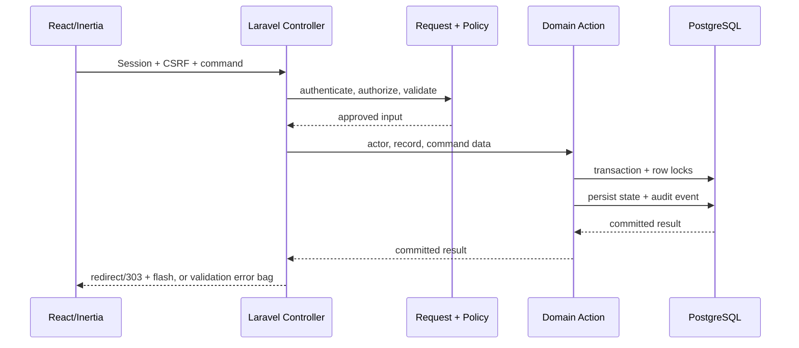

# Core Transaction 2 — Architecture

**Last updated:** 2026-09-16  
**Current style:** Two-Service Monorepo: Operations Monolith & BFF (`apps/operations`) + Tracking Microservice (`apps/tracking`), Inertia 3 / React 19 web frontend, REST API v1 & v2, and Laravel Reverb WebSockets

## Status legend

- Solid paths in diagrams are current.
- Dotted paths are recommended or planned.
- The routed UI is `apps/operations/resources/js/pages/workspace.tsx`; `operations.tsx` and its
  rich role surfaces are an unrouted fixture prototype that will be
  progressively converted into the canonical live experience.

## Business Architecture Boundary

The operational core of Core Transaction 2 is built around **5 Main Operational Business Modules**:

1. **Dispatch Job and Scheduling (Real-Time Activation)** (`apps/operations/app/Modules/Dispatch`, including **Dispatch Project Planning** in `Planning/`)
2. **Assign Driver/Operator and Equipment** (`apps/operations/app/Modules/Assignment`, integrating Hours of Service [HoS] duty cycle limits and operator compliance)
3. **Fleet Management** (`apps/operations/app/Modules/Fleet`, incorporating Driver Vehicle Inspection Reports [DVIR] for hauling and service vehicle pre/post-trip checks)
4. **Crane and Equipment Management** (`apps/operations/app/Modules/CraneEquipment`, including heavy crane safety, rigging gear inspections, and load verification)
5. **Fuel Management** (`apps/operations/app/Modules/Fuel`, tracking fuel bowsers, on-site storage, and asset consumption)

*(Note: DVIR inspections, Hours of Service compliance, Emergency SOS, and Statutory Safety Governance operate as sub-features and platform services embedded across these 5 modules and the mobile application).*

These operational modules execute and coordinate work from **3 Upstream Tri-Modal Business Transaction Flows** originating from Core 1:
- **Field Service Flow**: Client service requests converted into scheduled, dispatched field lifts.
- **Rental Flow**: Equipment reservations, operator assignment, checkout/return condition inspections (`apps/operations/app/Modules/Rental`).
- **Sales Flow**: Equipment sales orders, inventory reservations, delivery logistics, and ownership transfers (`apps/operations/app/Modules/Sales`).

Authentication and RBAC enforce **3 canonical system users**:
- `System Administrator` (`system_administrator`) — Platform configuration, user lifecycle, role-based access control, master data management, and system auditing.
- `Operations Manager` (`operations_manager` — consolidating supervisory dispatch desk, resource assignment, schedule approvals, fleet/crane oversight, fuel logistics, statutory safety governance, and emergency response)
- `Operator` (`operator` / `crane_operator` — field mobile application user executing dispatch trips, heavy crane lift operations, equipment telemetry, DVIR pre/post-trip safety inspections, HoS status recording, and SOS emergency triggers)

*(Workforce field personnel such as Riggers are non-software workforce crew tracked via `PersonnelProfile` and credentials without direct system login accounts).*

Statutory Philippine Safety Governance (DOLE/OSHC hazard rectification, digital lift plans, toolbox meetings, work stoppages) and SOS Emergency Safety, personnel administration (`PersonnelProfile`, `PersonnelCredential`), audit, tracking, reports, attachments, notifications, and proactive GPT assistance are shared platform services (`apps/operations/app/Platform`).
The detailed ownership map is maintained in [Top-level modules](./modules.md).

Core 1 owns Sales, CRM, Client, Job Order, Rental, and Project Management. Core
2 receives three upstream handoff types—service, rental, and sale—and owns the
operational processing of those records. Rental and sales currently expose
partial backend/API operational flow slices. Core 1 itself is outside this
repository's implementation scope. The authenticated Core 2 receiving adapter
and delivery handoffs remain unfinished; Core 1 commercial UI, contracts,
payments, billing, and invoicing are not Core 2 deliverables. See [Alibaton Business Context and CT2 Scope](../product/alibaton-business-scope.md) and
[Modular Monolith](./modular-monolith.md).

### Core HR and Workforce Management boundary

Core-2 does not serve as the master employee database or corporate payroll/leave system:
- **Core HR** (Core Human Capital Management, Employee Self-Service, Employee Records Management) is the authoritative upstream source of employee master records (`employee_number`, full legal name, contact details, official job title/department, and employment status).
- **Workforce Management** (Time & Attendance, Shift & Schedule Management, Timesheets, Leave Management, Workforce Analytics) is the upstream source of worker leave status and shift rosters, ensuring Core-2 sets `PersonnelProfile::$availability_status = 'on_leave'` to prevent scheduling conflicts across all assigned employees.
- **Core-2 Identity Platform** receives employee and leave events to auto-provision user accounts for software users, maintain `PersonnelProfile` and `PersonnelCredential` records for all operational employees (including non-software field personnel like **Riggers** who receive no web or mobile login accounts), enforce automated session revocation on termination, and provide completed dispatch timestamps back to Timesheet Management. See [Core HR & Workforce Management Integration](./hr-workforce-integration.md).

### Username login migration boundary

Identity owns username normalization, uniqueness, and the one-time backfill;
email remains a separate durable recovery and communication identity. The web
session adapter accepts normalized usernames. The versioned mobile adapter
uses username for new builds and temporarily accepts normalized legacy email
from older APKs. Both adapters feed the same password verification and account
state gates, so active, suspension, verified-email, generic-error, throttling,
session, CSRF, and Sanctum decisions cannot diverge. The migration and runtime
evidence for this boundary is covered by focused migration, authentication,
and mobile contract tests.

## System context

```mermaid
flowchart LR
    C1[External Core 1: Sales, CRM, Client, Job Order, Rental, Project]
    C1 -. planned commercial handoff .-> H{Service / Rental / Sale}
    
    CHR[External Core HR: HCM, ESS, Employee Records]
    CHR -. employee sync & termination kill-switch .-> SYNC[HR & WFM Adapter]

    WFM[External Workforce Management: Attendance, Shifts, Timesheets, Leave]
    WFM -. leave status & shift rosters .-> SYNC

    SYNC --> ID[Identity Platform & PersonnelProfile]
    
    U[Office and field users] --> UI[Inertia / React workspace]
    UI --> M[Auth · active · verified · throttle]
    M --> C[Controllers + Form Requests]
    C --> A[Policies + Domain Actions]
    A --> DB[(Operations DB: PostgreSQL)]
    A --> AU[(Audit events)]
    DB --> P[Inertia props]
    P --> UI
    RN[React Native field app] -. /api/v1 JSON .-> C
    V2[Dispatch API v2 Client] -. /api/v2 JSON .-> C
    C -->|Internal HMAC HTTP /internal/v1| TMS[Tracking Microservice apps/tracking]
    TMS --> TDB[(Tracking DB: core2_ms_tracking)]
    A -. queued jobs .-> Q[Dedicated Queues: operational | ai | reports]
    Q -.-> X[Notifications · mPDF exports · OpenRouter GPT · SOS sweeps]
    A -. realtime broadcast .-> REV[Laravel Reverb WebSockets]
    REV -. wss:// private channels .-> UI
    UI -. durable offline commands .-> O[Client outbox]
    O -. idempotent API .-> C
    H -. planned Core 2 receiving boundary .-> C
    A -. completed field hours .-> WFM
```

## Current layers

### Presentation

- Vite builds React 19 and TypeScript.
- Inertia delivers authenticated pages and initial server-scoped data.
- The live workspace exposes backend capabilities through explicit TypeScript view models mapped by `OperationsWorkspaceViewModel`.
- The routed tracking surface uses server-fed location view models, MapLibre GL JS with a configurable basemap, freshness filters, a synchronized list, measured polling, and a browser location outbox.
- The dispatch desk incorporates **Dispatch Project Planning** (multi-phase timelines, equipment reservations, and shift coverage) and **Proactive GPT Advisories** with drawer telemetry and one-click adoption.
- Full-stack error handling (`resources/js/pages/error.tsx`) delivers branded, accessible error experiences with unique incident Reference IDs across HTTP 401, 403, 404, 419, 429, 500, and 503.
- Laravel Echo connects to **Laravel Reverb** for zero-latency live workspace (`operations.workspace`), SOS incident updates (`operations.sos`), and safety governance broadcasts (`operations.safety`).
- `packages/field-mobile` provides the native React Native / Expo application with:
  - **Tactical Cockpit HUD**: Daylight and high-contrast Tactical Dark HUD mode tokens.
  - **Hours of Service (HoS) Cockpit**: Real-time shift timers, duty cycle tracking, and safeguard modals.
  - **Driver Vehicle Inspection Report (DVIR)**: Pre/post-trip checklists, equipment classification, and walkaround photo tagging.
  - **Heavy Crane Drive Mode**: Large-format in-cab turn-by-turn navigation with road clearance alerts.
  - **Floating SOS Jewel**: Centered raised jewel docked in a scooped bottom-navigation cradle notch with a 2-second hold trigger modal and interactive triage drawer.
  - **Durable SQLite Outbox**: Actor-scoped mutation queue with bounded exponential backoff and 429 `Retry-After` support.

### HTTP boundary

Web and canonical mobile authentication look up a normalized unique username; email remains the verified recovery address.

- `routes/web.php` and `routes/api.php` are composition roots for module-/platform-owned route files.
- `/operations` provides session-authenticated browser workspace routes with Inertia redirects and typed flash.
- `/operations/project-plans` provides multi-phase long-term project planning, shift allocations, and rostering.
- `/operations/gpt-recommendations` provides AI advisory generation, circuit-breaker toggling, and telemetry.
- `/operations/admin` provides break-glass emergency aborts, asset safety lockdowns, and system health checks.
- `/api/v2` provides the Dispatch Backend V2 domain contract (readiness projections, plan approvals, emergency overrides, offers, and monotonic progression).
- `/api/v1` provides the Sanctum-authenticated field mobile contract:
  - Authentication (`/api/v1/auth/*`)
  - Field dispatch jobs (`/api/v1/dispatch-jobs/*`) & handover claims (`/api/v1/dispatch-jobs/{job}/handover/*`)
  - Driver Vehicle Inspection Reports (`/api/v1/dvir/inspections/*`)
  - Hours of Service (`/api/v1/hos/*`)
  - Safety governance (`/api/v1/safety/*`: hazards, lift plans, toolbox meetings, work stoppages)
  - SOS emergency distress (`/api/v1/sos-incidents/*`, `/api/v1/sos-configuration`)
  - Location tracking & telemetry (`/api/v1/locations`, `/api/v1/dispatch/jobs/{id}/weather*`)
- **Granular Rate Limiting**: Dedicated named rate limiters protect operational surfaces:
  - `throttle:5,1` for login and password reset
  - `throttle:6,1` for email verification
  - `throttle:120,1` for general operations and admin routes
  - `throttle:gpt` (10/min) for AI advisory generation
  - `throttle:location` (60/min) for GPS telemetry pings
  - `throttle:safety` (30/min) for safety governance actions
  - `throttle:sos` (15/min) for emergency distress broadcasts
  - `throttle:uploads` (20/min) and `throttle:exports` (10/min) for attachments and report exports
  - On HTTP 429, the `Retry-After` header is emitted and parsed by mobile clients to back off outbox replay automatically.
- Middleware requires authenticated, active, verified users and applies CSRF and throttling.
- Form Requests handle complex validation/authorization boundaries; small controllers validate inline.
- Controllers orchestrate HTTP concerns and delegate critical workflows to single-responsibility actions.
- Shared file policy centralizes server-detected MIME, size, zero-byte, filename, count, private-disk, checksum, and retention enforcement across report and fuel receipt uploads.

### Domain and authorization

- The five main operational business modules are physically organized beneath `apps/operations/app/Modules` (`Dispatch`, `Assignment`, `Fleet`, `CraneEquipment`, `Fuel`), with DVIR and HoS integrated within vehicle and operator execution paths.
  Tracking client, records, identity, safety, and administration are shared platform services
  beneath `apps/operations/app/Platform`; the currently unified asset persistence model lives
  in the intentionally small `apps/operations/app/Shared/Assets` kernel.
- Backed enums define canonical roles, permissions, priorities, and lifecycle states.
- Policies and permission checks enforce actions; `visibleTo(User)` scopes enforce record visibility in queries.
- Transactional actions handle assignment, activation, approval, dispatch/fuel transitions, and audit.

### Persistence

The username migration uses nullable addition, deterministic bounded backfill,
verification, and only then non-null/unique constraints. It does not rewrite
email, password, session, or token data.

- Laravel migrations are authoritative.
- PostgreSQL/Supabase is server-only; browser and mobile clients have no
  operational Data API table privileges.
- Foreign keys, indexes, checks, soft deletes, transactions, locks, and optimistic versions protect integrity. Export retries and GPT retries use locked state transitions; GPT operational metrics cascade with 90-day recommendation pruning.
- SQLite is used for local tests where PostgreSQL-specific statements are guarded.

## Critical request flow



## Decisions

### Organize the product around 5 main operational modules and 3 tri-modal business flows

The operational engine is built upon five main operational business modules:
1. **Dispatch Job and Scheduling (Real-Time Activation)** (including Project Planning)
2. **Assign Driver/Operator and Equipment** (incorporating Hours of Service [HoS] compliance)
3. **Fleet Management** (incorporating Driver Vehicle Inspection Reports [DVIR])
4. **Crane and Equipment Management** (including crane safety and load charts)
5. **Fuel Management** (bowsers, on-site tanks, asset consumption)

Fleet and Crane/Equipment Management share the current `OperationalAsset` model and persistence table, but maintain
separate domain route/policy boundaries because their capabilities and workflows diverge. DVIR governs pre/post-trip
vehicle inspection checklists and defect lockouts within Fleet & Equipment operations, while Hours of Service enforces daily driver duty cycle limits within assignment and mobile execution.
Upstream commercial business flows from Core 1 (Service, Rental, and Sales) feed into this operational core.
Rental and Sales have backend operational flow handlers in `apps/operations/app/Modules/Rental` and `apps/operations/app/Modules/Sales` to coordinate
inventory reservation, checkout/return condition diffs, and prevent asset double-booking. Core 1 customer, CRM,
and financial billing interfaces are outside this architecture. Identity, safety governance, SOS emergency response,
records, notifications, reports, attachments, and proactive GPT remain shared platform services in Operations. High-frequency GPS telemetry ingestion and caching are isolated into the dedicated Tracking microservice (`apps/tracking`).

### Adopt Plan A (2-Service Model: Operations Monolith & BFF + Tracking Microservice)

Dispatch, approval, asset safety, fuel, and audit are tightly transactional and organized as a pragmatic modular monolith (`apps/operations/`). In contrast, high-frequency mobile GPS sample writes and map position lookups are isolated into the standalone Tracking microservice (`apps/tracking/`) with its own database (`core2_ms_tracking`) and HMAC service-to-service authentication. Internal background workloads (OpenRouter GPT advisories and mPDF compliance exports) remain isolated inside Operations as dedicated queue worker pools (`ai` and `reports` queues) rather than creating unnecessary microservice network hops.

### Keep the server authoritative

React may hide controls and provide optimistic feedback, but Laravel policies, permissions, scopes, validation, and state transitions decide every authoritative read and write.

### Use actions as transaction boundaries

Assignment, activation, approval, and transitions combine locking, invariants, persistence, and audit. Dedicated actions make those rules reusable without adding proxy-only service layers.

### Serialize shared asset use at one boundary

Rental, Sales, Assignment, and Dispatch own their asset-usage queries and
register checkers through the public `AssetUsageConflictChecker` contract.
`OperationalAssetAvailability` is the Shared coordinator: it accepts a typed
`AssetUsageRequest`, typed aggregate source, optional half-open window and
target status, locks all affected `operational_assets` rows in ascending ID
order, and combines stable conflict codes with safe operator-facing messages.
Shared Assets never imports product-module models, and Rental/Sales never query
each other's tables. Every supported writer rechecks the coordinator after its
critical locks; read-model eligibility uses the same conflict semantics.

Rental dates are inclusive business dates converted to application-timezone
half-open windows. Dispatch intervals remain half-open timestamps. Confirmed,
fulfilled, and transferred Sales orders are permanent asset commitments;
transferred assets remain `unavailable` and are rejected by every operational
status restoration path.

The thirteen Rental/Sales plus later server-owned tables use PostgreSQL RLS with
no Data API policies and no `anon`/`authenticated` table or sequence grants.
The local PostgreSQL catalog/security gate and an authorized target Supabase
catalog/Security Advisor check are separate release evidence; the remote target
check remains open until the authorized post-DDL verification is run.

### Keep GPT advisory

Recommendation generation may create a recommendation record only. A separately authorized human command invokes the normal domain action and revalidates all rules.

### Converge progressively on the richer role experience

The richer role-adaptive prototype is the target product experience, but the
existing live route remains the production boundary during migration. The first
live dispatch slice now uses a role-adaptive shell, explicit mapped view models,
and an authoritative draft-creation command without fixture writes. A later
slice becomes live only after its fixtures and reducer-only writes are replaced
by the same standard.

Laravel backed-enum machine values are canonical across clients. Prototype
labels may map to display labels, but prototype-only concepts such as dispatch
“On hold,” fuel “Dispensed,” or asset “Offline” cannot become persisted domain
states implicitly.

### Use the shared gold palette

Gold `#FFBF00` owns brand, primary action, focus, selection, and
active-navigation roles in web and mobile. Warning and conflict states use
semantic orange/amber tokens, with explicit text, icons, and shapes preserving
their meaning.

### Use Inertia for browser mutations

Session-authenticated browser writes redirect after success, expose Laravel
validation error bags, and use typed flash for concise feedback. A separate
versioned JSON adapter is introduced for React Native and calls the same
policies, validation, and domain actions.

### Run a managed single-region production topology on HostForge Platform

Production is deployed on **HostForge Platform** ([https://hostforgeplatform.cloud/platform](https://hostforgeplatform.cloud/platform)) under the primary organization domain **`alibaton-ph.com`**, with this project (Core-2) operating on the dedicated subdomain **`core-2.alibaton-ph.com`** (`https://core-2.alibaton-ph.com`).

The containerized service runs persistent Laravel web, queue, scheduler, and Reverb WebSocket services co-located with managed PostgreSQL (or Supabase) and Redis. Reverse proxy and edge TLS routing on HostForge terminate SSL certificates for `core-2.alibaton-ph.com`, forwarding HTTP traffic to Nginx/PHP-FPM and WebSocket upgrades (`wss://core-2.alibaton-ph.com/app`) to Reverb. Direct database connections or Supavisor session pooling are used for transactional workflows, with the database/Redis queue as asynchronous transport. See the [Deployment & Hosting Architecture Guide](./deployment.md).

### Develop responsive web and React Native in parallel

The web workspace and focused native field application are parallel capstone
workstreams sharing one Laravel authority and canonical contracts. React Native
does not reproduce unrestricted office or administration features.

## Recommended evolution

1. Converge on the richer canonical role-adaptive UI and remove fixture
   persistence from each migrated production slice.
2. Convert browser writes to the accepted Inertia redirect/error/typed-flash
   contract.
3. Build the versioned React Native JSON adapter in parallel; both adapters
   call the same actions and policies.
4. Start asynchronous work with Laravel's database queue for notifications, exports, and GPT; keep audit writes synchronous.
5. Preserve the implemented actor-scoped SQLite command repository,
   idempotency keys/client command IDs, and version checks for offline replay.
6. Keep the accepted location capture, freshness, and 30-day precision
   retention enforced by the live browser slice; extend the completed native
   8-hour command behavior to device-backed location and complete production
   monitoring with explicit polling measurements.
7. Enforce the accepted 15 MiB/file and 10 files/record limits in private object
   storage with authorized, short-lived downloads and checksums.

## Current risks and open decisions

- Live and prototype frontends can drift in status vocabulary and behavior.
- The routed workspace mutation contract has focused HTTP and Playwright
  coverage; remaining unrouted JSON commands still require convergence or
  `/api/v1` separation.
- Device-backed native location, realtime transport, production object-storage
  integration, and complete routed shared-service UI remain open; the native
  mobile API and durable outbox, browser location outbox, MapLibre tracking
  surface, GPT workflow, and private file/report pipeline are implemented.
- The browser renderer is MapLibre GL JS and the current configurable basemap is
  Stadia Maps Alidade Smooth. Stadia Free is development/evaluation-only and
  must not be used for operational or commercial deployment; Stadia Starter or
  another approved paid provider is required before production. Provider style,
  attribution, and public browser authentication are configuration boundaries,
  and map/style/tile/WebGL failures preserve the synchronized list. The
  production deployment checklist must also verify MapLibre's worker CSP
  (`worker-src blob:`) and the final provider's style, tile, sprite, and glyph
  hosts in `connect-src`/`img-src`.
- This migration does not implement routing, geocoding, ETA, traffic, or
  heavy-vehicle restrictions; those remain separate provider decisions.
- The topology shape, 99.5% availability, 15-minute RPO, 4-hour RTO,
  location/offline limits, attachment limits, and GPT limits are accepted in
  [phase-0-baseline.md](../archive/phase-0-baseline.md), but are not implemented or
  operationally proven.
- Session 0 records AWS ECS/Fly.io compute, Supabase/S3 infrastructure,
  Sentry/Datadog monitoring, separate routing/mobile-navigation decisions, and
  FCM/APNs push notifications, with assigned owners in
  [phase-0-baseline.md](../archive/phase-0-baseline.md).
- Web and mobile now share the `#FFBF00` gold brand palette, with accessible
  foreground tones and distinct semantic orange/amber warning accents. Visual
  QA remains part of release review.

## Testing and operations

Current Pest tests cover major backend authorization, workflow, safety,
report/attachment, notification, GPT, idempotency, retention, and tracking
behavior. Add frontend integration tests, critical browser E2E flows,
API/view-model contract tests, queue retry tests, accessibility checks,
production query-plan checks, monitoring, backups/restores, and deployment
rollback drills.

## Visual reference

[`Diagrams/system-overview.excalidraw`](../design/Diagrams/system-overview.excalidraw)
provides a visual summary of the current web client, mandatory planned mobile
client, shared Laravel boundary, operational rules, persistence, and dispatch
lifecycle. It is a communication aid; this document and the implemented
application remain authoritative.
