# Core Transaction 2 — Database

**Last updated:** 2026-09-22  
**Source of truth:** Laravel migrations and Eloquent models  
**Production target:** Managed PostgreSQL 16 (or Supabase) databases (`core2_production` for Operations and `core2_tracking_production` for Tracking), accessed only by persistent Laravel web and worker services

## Security boundary

Laravel is the application data boundary. PostgreSQL row-level security is enabled on server-owned tables and privileges are revoked from Supabase `anon` and `authenticated` roles. No RLS policies are created because browser Data API access is intentionally disabled; Laravel authentication, policies, permissions, scopes, validation, and transactions enforce access.

Application compute and Supabase PostgreSQL are co-located in one region.
Persistent Laravel web services and queue workers utilize Supabase's built-in
**Supavisor Connection Pooler** in **Transaction Mode (port 6543)** to support
high concurrency and prevent connection exhaustion. When connecting via the
transaction pooler, `PDO::ATTR_EMULATE_PREPARES` is enabled (`DB_EMULATE_PREPARES=true`)
to ensure statement execution compatibility across multiplexed pooler connections,
and username routing follows the `postgres.<project-ref>` format.
Artisan migrations, DDL schema updates, and administrative maintenance tasks
utilize a direct/session connection (`pgsql_direct` on port 5432). The database
queue is the initial queue topology. Hosting provider, final region, storage
provider, and monitoring vendor remain undecided.

## Module ownership

The persistence model supports the **5 core operational modules** and the operational data models for the **3 tri-modal inbound business flows**:

Core 1 owns Sales, CRM, Client, Job Order, Rental, and Project Management. Core
2 receives Core 1 service, rental, and sale handoffs and persists the
operational records needed for readiness, scheduling, fulfillment, dispatch,
asset state, and audit. The schema contains operational entities for all three inbound flows. Core 1 itself is outside this repository's scope. The
Core 2 receiving adapter and delivery handoffs remain unfinished; commercial
contracts, customer-facing screens, payments, billing, and invoicing remain
owned by Core 1. See [Alibaton Business Context and CT2 Scope](../product/alibaton-business-scope.md) and
[Modular Monolith](./modular-monolith.md).

### 5 Main Operational Business Modules
1. **Dispatch Job and Scheduling (Real-Time Activation)** — clients, service requests, dispatch jobs, approval requests, and multi-phase project planning.
2. **Assign Driver/Operator and Equipment** — personnel and asset assignment relations, and Hours of Service (HoS) compliance records.
3. **Fleet Management** — fleet vehicle records, roadworthiness lifecycle, and Driver Vehicle Inspection Reports (DVIR).
4. **Crane and Equipment Management** — crane and heavy equipment records, certifications, load charts, and safety inspections.
5. **Fuel Management** — fuel requests, verified fuel logs, burn rate baselines, and anomaly detection.

### Tri-Modal Inbound Flow Entities
- **Rental Operations** — reservations, reservation items, checkout, returns, and condition diff records.
- **Sales Fulfillment** — catalog items, quotes, orders, inventory ledger, and ownership transfers.

Fleet and Crane/Equipment Management intentionally share the
`operational_assets` table and Eloquent model. Identity, location, audit,
reports, attachments, notifications, and GPT records are shared platform data. See [Top-level modules](./modules.md).

## Domain map

```mermaid
erDiagram
    USERS ||--o| PERSONNEL_PROFILES : has
    USERS ||--o{ PERSONNEL_CREDENTIALS : holds
    CLIENTS ||--o{ SERVICE_REQUESTS : submits
    SERVICE_REQUESTS o|--o{ DISPATCH_JOBS : becomes
    DISPATCH_JOBS ||--o{ DISPATCH_PERSONNEL_ASSIGNMENTS : staffs
    USERS ||--o{ DISPATCH_PERSONNEL_ASSIGNMENTS : receives
    DISPATCH_JOBS ||--o{ DISPATCH_ASSET_ASSIGNMENTS : equips
    OPERATIONAL_ASSETS ||--o{ DISPATCH_ASSET_ASSIGNMENTS : allocated
    DISPATCH_JOBS ||--o{ APPROVAL_REQUESTS : requires
    OPERATIONAL_ASSETS ||--o{ INSPECTIONS : inspected
    OPERATIONAL_ASSETS ||--o{ MAINTENANCE_WORK_ORDERS : maintained
    USERS ||--o{ FUEL_REQUESTS : requests
    FUEL_REQUESTS ||--o{ FUEL_LOGS : produces
    USERS ||--o{ LOCATION_UPDATES : shares
    DISPATCH_JOBS ||--o{ JOB_REPORTS : documents
    JOB_REPORTS ||--o{ ATTACHMENTS : owns
    USERS ||--o{ AUDIT_EVENTS : acts
    USERS ||--o{ DVIR_INSPECTIONS : inspects
    OPERATIONAL_ASSETS ||--o{ DVIR_INSPECTIONS : inspected_in
    DVIR_INSPECTIONS ||--o{ DVIR_INSPECTION_CHECKS : contains
    DVIR_INSPECTIONS ||--o{ DVIR_INSPECTION_PHOTOS : documented_by
    USERS ||--o{ OPERATOR_SHIFTS : logs
    OPERATOR_SHIFTS ||--o{ OPERATOR_DUTY_LOGS : segments
    PROJECT_PLANS ||--o{ PROJECT_PLAN_PHASES : divides
    PROJECT_PLAN_PHASES ||--o{ PROJECT_PLAN_ALLOCATIONS : reserves
    PROJECT_PLAN_PHASES ||--o{ PROJECT_PLAN_SHIFTS : rosters
    PROJECT_PLAN_SHIFTS ||--o| DISPATCH_JOBS : links
    DISPATCH_JOBS ||--o{ SAFETY_LIFT_PLANS : governs
    DISPATCH_JOBS ||--o{ SAFETY_TOOLBOX_MEETINGS : convenes
    DISPATCH_JOBS ||--o{ SAFETY_WORK_STOPPAGES : halted_by
    USERS ||--o{ SAFETY_HAZARDS : reports
    CLIENTS ||--o{ RENTAL_RESERVATIONS : rents
    RENTAL_RESERVATIONS ||--o{ RENTAL_RESERVATION_ITEMS : contains
    OPERATIONAL_ASSETS ||--o{ RENTAL_RESERVATION_ITEMS : reserved
    RENTAL_RESERVATIONS ||--o| RENTAL_CHECKOUTS : checked_out
    RENTAL_RESERVATIONS ||--o| RENTAL_RETURNS : returned
    CLIENTS ||--o{ SALES_QUOTES : requests
    SALES_QUOTES ||--o{ SALES_QUOTE_ITEMS : contains
    SALES_CATALOG_ITEMS ||--o{ SALES_QUOTE_ITEMS : priced
    SALES_QUOTES ||--o| SALES_ORDERS : accepted_as
    SALES_ORDERS ||--o{ SALES_ORDER_ITEMS : contains
    SALES_CATALOG_ITEMS ||--o{ SALES_ORDER_ITEMS : fulfilled
    SALES_CATALOG_ITEMS ||--o{ SALES_INVENTORY_LEDGER : records
    SALES_ORDERS ||--o{ SALES_INVENTORY_LEDGER : commits
    SALES_ORDER_ITEMS ||--o| OWNERSHIP_TRANSFERS : transfers
    OPERATIONAL_ASSETS ||--o| OWNERSHIP_TRANSFERS : sold
```



## Table catalog

### Identity and access

The `users` table stores a required unique normalized `username` alongside the
required unique `email`. Email remains the verification and recovery address;
the username migration does not replace or rewrite it.

- `users`: identity, normalized username, email, phone, activation, and suspension metadata for interactive web and mobile software users. Username is unique and non-null after migration; email remains unique and is not replaced.
- Spatie RBAC tables: roles, permissions, and role/user mappings for the **3 canonical system users** (`system_administrator`, `operations_manager`, `operator` / `crane_operator`).
- `personnel_profiles`: employee number, availability, emergency contact, tracking all enterprise operational employees (both software users and non-user field staff such as Riggers).
- `personnel_credentials`: license, certification, or qualification validity and verification (e.g., TESDA Crane NC II, TESDA Rigging NC II, DOLE-BOSH).
- Laravel tables: sessions, password resets, personal access tokens (issued via Sanctum for mobile field users), cache, jobs, and migrations.

The personal-access-token table is used by the versioned field API. Tokens are
issued and revoked through Sanctum, and the Data API roles are denied access to
both personal access tokens and command logs by the follow-up server-only
migration.

### Username migration and backfill

The users table shall add a unique, non-null `username` column. Application
boundaries trim and lowercase usernames, then validate 3-50 ASCII characters
against the documented safe format. The database uniqueness
constraint remains authoritative for concurrent writes.

The one-time backfill reads users in ascending `id` order and derives a base
from the email local-part before `@`: lowercase it, replace runs of characters
outside `[a-z0-9._-]` with `-`, trim leading/trailing non-alphanumeric
separators, and fall back to `user-{id}` when empty or shorter than three
characters. Long bases are truncated to fit within 50 characters. A collision
gets the next deterministic numeric suffix (`-2`, `-3`, ...), truncating the
base further when necessary. Existing email values are never reset, deleted,
or exposed. The migration must complete with every username non-null and
unique before enforcing the final constraint. The focused migration and
backfill tests cover the schema, uniqueness, deterministic assignment, and
collision behavior.

### Modules 1–2: Dispatch and Assignment tables

- `clients`: unique code, company/contact details, active/inactive status, soft delete.
- `service_requests`: client, request/project identity, location, schedule, priority, `submitted`/`dispatching` status, requirements, creator, soft delete. One request may produce multiple dispatch jobs.
- `dispatch_jobs`: optional service request, unique reference, operational client/title/site snapshot, schedule, priority, status, requirements, `site_latitude`, `site_longitude`, `planned_crane_slots` JSON, creator/activator/canceller, optimistic `version`, soft delete.
- `dispatch_personnel_assignments`: job/user, assignment type, pending/accepted/rejected response status, `responded_at` timestamp, optional `response_reason`, assign/reassign and approval metadata, active interval.
- `dispatch_asset_assignments`: job/asset, assignment type, `site_latitude`, `site_longitude`, assign/approval metadata, active interval.
- `approval_requests`: polymorphic subject, kind, requested changes, requester, pending/approved/rejected status, decider and reason.

### Dispatch Project Planning tables (`app/Modules/Dispatch/Planning`)

- `project_plans`: unique reference, project title, client, site location, timeline bounds, baseline approval status (`draft`, `submitted`, `approved`, `rejected`), version, creator, and approver.
- `project_plan_phases`: parent project plan, phase name, start/end dates, required operators, riggers, and drivers per shift.
- `project_plan_allocations`: phase equipment reservations, asset ID, timeline window, allocation type, and maintenance collision protection.
- `project_plan_shifts`: linked dispatch job, phase, shift date/times, confirmed crew roster, and 24-hour exception approval status.

### Modules 3–4: Fleet and crane/equipment management

- `operational_assets`: unique code/registration, kind/subtype, manufacturer/model, specifications, capacity, meter, location, lifecycle status, `baseline_burn_rate`, `burn_rate_unit`, soft delete.
- `inspections`: asset, technician/operator, type, result, checklist, findings, completion time.
- `maintenance_work_orders`: asset, technician/operator, status, defect, blocking flag, schedule/due dates, work, parts, release evidence and verifier.

### Module 5: Fuel management and shared platform records

- `fuel_requests`: requester, optional job/asset, quantity/type/purpose, ordered review/approval/verification metadata.
- `fuel_logs`: verified fuel event, quantities, meter readings, station, price/cost, `variance_litres`, `variance_percentage`, `effective_burn_rate`, `burn_rate_unit`, `is_anomaly` flag, `anomaly_reason`, receipt path, recorder/verifier.
- `location_updates`: user, optional asset/job, coordinates, accuracy, speed, sharing, source, capture/receive times. Freshness is exposed by the model; the scheduled `location:prune` command clears coordinates older than 30 days while retaining non-coordinate metadata.
- `gpt_recommendations`: polymorphic subject, requester/decider, context hash, automation hash, recommendation payload, conflicts, model metadata, lifecycle, usage and expiry. Includes 15-minute recommendation expiry and circuit breaker integration.
- `gpt_recommendation_metrics`: stores safe aggregate operational metrics, cascading with 90-day recommendation pruning.
- `job_reports`: dispatch, author, work interval, summary, status, `ending_meter_value`, `meter_type`, `latitude`, `longitude`, `rejection_reason`, `resubmitted_count`, and submission time.
- `attachments`: polymorphic owner, private storage metadata, MIME, size, checksum (SHA-256) and retention. Accepted limits are 15 MiB/file, 10 files/owner.
- `report_exports`: creator, report type, format (CSV/PDF), status, attempts, error, file path, download token, expired_at.
- `notifications`: recipient, optional dispatch, status/data/read time, with authorized list and mark-read routes.
- `command_logs`: authenticated user, command UUID, action, payload hash, expected version, response/status, and replayable response payload for idempotent command processing.
- `audit_events`: actor, polymorphic subject, action, before/after JSON, reason, request ID, IP and occurrence time.

### Module 6: Driver Vehicle Inspection Report (DVIR) tables

- `dvir_inspections`: inspection record, inspector/operator ID (`user_id`), asset ID (`operational_asset_id`), linked dispatch job ID (`dispatch_job_id`), inspection type (`inspection_type`: `pre_trip`, `post_trip`), asset code/name, inspector name, starting/ending odometer km, engine hours, `has_defects` boolean flag, `critical_defects_count`, `signature_captured` flag, remarks, and `completed_at` timestamp.
- `dvir_inspection_checks`: parent DVIR inspection ID (`dvir_inspection_id`), external ID, component category, check label, status (`good`, `attention`, `critical`, `pending`), status label, notes, and sort order.
- `dvir_inspection_photos`: linked DVIR inspection ID (`dvir_inspection_id`), exterior camera angle (`front`, `back`, `driver_side`, `passenger_side`), storage disk, file path, original filename, mime type, byte size, SHA-256 checksum, caption, and upload timestamp.

### Module 7: Hours of Service (HoS) tables

- `operator_shifts`: driver/operator ID (`user_id`), assigned asset ID (`operational_asset_id`), linked dispatch job ID (`dispatch_job_id`), shift status (`active`, `completed`, `cancelled`), `started_at`, `ended_at`, cumulative `operating_minutes`, `driving_minutes`, `standby_minutes`, `break_minutes`, `is_certified` boolean, `certified_at` timestamp, certification statement, remarks, and partial unique index on `(user_id, status)` for active shifts.
- `operator_duty_logs`: shift ID (`operator_shift_id`), user ID (`user_id`), per-event equipment/job links (`operational_asset_id`, `dispatch_job_id`), previous/new duty status (`previous_duty_status`, `duty_status`: `operating`, `driving`, `standby`, `on_break`, `off_duty`), standby reason (`standby_reason`), `is_demurrage_billable` boolean flag for client delay billing, interval bounds (`started_at`, `ended_at`, `duration_minutes`), event occurrence and server acceptance timestamps (`occurred_at`, `accepted_at`), and the event location snapshot (`latitude`, `longitude`, `accuracy_metres`, `location_observed_at`, `location_source`, `location_freshness`, `location_name`). Open intervals are unique per shift; the server closes the previous interval at the next event occurrence and never reopens a completed shift for a delayed event.

HOS event coordinates are intentionally stored with the accepted duty record because an offline transition must retain the location observed when the operator acted; they are not a copy of the asset's latest tracking projection and are never replaced during synchronization. This is a documented extension of the existing location privacy boundary: the `location:prune` command applies the same configured 30-day retention window to duty-event coordinates, accuracy, and precise freshness based on the observation/event timestamp (not delayed server receipt), preserving the duty transition, occurrence/acceptance metadata, source, and an explicit `Location unavailable` state after redaction. The authenticated HOS API and existing visibility/authorization checks remain the access boundary; no separate latest-location table or tracking projection is used for historical event snapshots.

Operator HOS minutes remain canonical on `operator_shifts` and `CalculateHosClocksQuery`. Equipment-linked duty intervals are reported separately; an estimated equipment-use total is emitted only when an explicit equipment-kind policy names the statuses that count. Official meter readings remain sourced from the existing authorized meter-reading or telemetry workflows and are never modified by duty selections.

### Statutory Philippine Safety Governance tables (`apps/operations/app/Platform/Safety`)

- `safety_hazards`: ticket number, reporter ID, assigned investigator, hazard category, severity rating, location coordinates, status (`open`, `triaged`, `rectified`, `closed`), rectification notes, and clearance timestamp.
- `safety_lift_plans`: plan number, dispatch job ID, creator ID, authorizer ID (Operations Manager), crane asset ID, gross load tonnage, rated capacity tonnage, capacity utilization percentage, tandem lift flag, blind lift flag, powerline proximity flag, and authorization timestamp.
- `safety_toolbox_meetings`: meeting reference, dispatch job ID, conductor ID, meeting date, topic checklist, and participant cosignature ledger.
- `safety_work_stoppages`: stop-work notice number, dispatch job ID, issuer ID, lifting authorizer ID, imminent danger description, status (`active`, `lifted`), and resumption authorization timestamp.
- `safety_tower_crane_shift_logs`: tower crane asset, operator ID, anemometer wind speeds, load counts, structural observations, and handover clearance.

### Modules 8-9: Rental and Sales tables

The following twelve tables are implemented operational mirrors for the partial backend/API slice:

- `rental_reservations`: unique 48-character reference, client, creator, optional approver/dispatch job, `requested`/`reserved`/`checked_out`/`returned`/`closed` status, inclusive start/end dates, fulfillment mode, location/notes, derived `total_cents`, soft delete, and status/date indexes.
- `rental_reservation_items`: reservation, physical operational asset, quantity (supported value exactly 1), server-derived rate and line total; asset and reservation index.
- `rental_operator_assignments`: per-rental-item qualified operator, matched operator type, assigning actor, and half-open active interval bounded by the inclusive rental dates; unique item/operator assignment and operator-window index.
- `rental_checkouts`: one row per reservation through a unique reservation key, actor/time, nullable legacy `condition_before` JSON, and notes.
- `rental_returns`: one row per reservation through a unique reservation key, actor/time, nullable legacy `condition_after` JSON, and damage notes.
- `sales_catalog_items`: unique SKU, name/description, server-authoritative unit price, on-hand/reserved counters, optional unique linked operational asset, status, and status/on-hand index. A linked physical item has exactly one unit.
- `sales_quotes`: unique 48-character reference, client/creator, draft/accepted/rejected/expired status, currency, derived total, inclusive `valid_until`, and notes.
- `sales_quote_items`: quote, catalog item, bounded quantity, catalog-derived unit price, and checked line total.
- `sales_orders`: unique derived reference in a widened 64-character column, client, optional source quote, creator, confirmed/fulfilled/transferred/cancelled status, currency, derived total, and fulfillment time.
- `sales_order_items`: order, catalog item, quantity, persisted unit price and line total, plus the supporting catalog/order conflict index.
- `sales_inventory_ledger`: catalog item, optional order, actor, `initial_stock`, `reserve`, or `sale` entry type, signed quantity delta, and safe metadata.
- `ownership_transfers`: order/order item/catalog item, optional physical asset, actor/time, one unique transfer per order-item/catalog-item pair, and one unique transfer per physical asset. A transferred physical asset remains unavailable.

### Modules 10-11: Dispatch V2, Reference Sequences, and SOS Safety Tables

The Dispatch V2 persistence foundation, monotonic reference sequence generator, and SOS emergency response system complete the operational catalog:

- `dispatch_handoffs`: inbound operational handoff envelope, external reference, payload hash, and legacy dispatch job link.
- `dispatch_execution_attempts`: versioned attempt lifecycle (`draft` -> `dispatched` -> `en_route` -> `arrived` -> `working` -> `completed`/`cancelled`), correlation ID, and designated lead link.
- `dispatch_plan_versions`: immutable plan version snapshots and SHA-256 content hashes.
- `dispatch_plan_requirement_slots`: discrete staffing and equipment requirement allocations per plan version.
- `dispatch_plan_approvals`: multi-party review and supervisory approval records tied to specific plan versions.
- `dispatch_assignment_offers`: individual worker job offers with response lifecycle (`proposed` -> `offered` -> `accepted`/`rejected`/`withdrawn`/`expired`/`ended`).
- `dispatch_emergency_overrides`: time-bounded readiness waivers and emergency dispatch authorizations.
- `dispatch_idempotency_keys`: distributed command deduplication ledger with replayable response snapshots.
- `dispatch_audit_lineage`: causal relational graph connecting audit events to V2 entities.
- `dispatch_reconciliation_runs`: automated batch runners reconciling legacy V1 states into V2 contracts.
- `dispatch_reconciliation_findings`: fingerprint-indexed discrepancies detected during reconciliation.
- `dispatch_outbox_messages`: transactional outbox guaranteeing at-least-once delivery for asynchronous integration events.
- `dispatch_reference_sequences`: year-scoped atomic counters for monotonic reference generation (`sequence_key`, `year`, `last_value`).
- `sos_incidents`: high-priority emergency alerts with coordinates (`latitude`, `longitude`), category, escalation timeout, and resolution metadata.
- `sos_incident_recipients`: designated responders, management escalation targets, and acknowledgement timestamps.
- `sos_emergency_contacts`: prioritized hotline directory with salted SHA-256 phone hashes for fast lookup.
- `sos_delivery_attempts`: multi-channel delivery tracking (push, SMS, webhook) with idempotency keys and retry counters.

All 65 application and platform tables are subject to the server-only PostgreSQL hardening standard: PostgreSQL RLS is enabled, no Data API policies are created, and `anon`/`authenticated` receive no table or applicable sequence privileges. `FORCE ROW LEVEL SECURITY` is intentionally not used so the Laravel server-owned connection retains access.

The evidence query for a PostgreSQL target is:

```sql
select c.relname, c.relrowsecurity, c.relforcerowsecurity
from pg_class c join pg_namespace n on n.oid = c.relnamespace
where n.nspname = 'public'
order by c.relname;

select schemaname, tablename, policyname
from pg_policies
where schemaname = 'public';

select grantee, table_name, privilege_type
from information_schema.role_table_grants
where grantee in ('anon', 'authenticated')
  and table_schema = 'public';
```

The local PostgreSQL security suite (`apps/operations/tests/PostgreSQL/`) is evidence for the migration behavior. An
authorized post-DDL catalog query and Supabase Security Advisor run remain open
for the remote target and are not claimed by this repository change.

## Integrity and performance

- Unique identifiers protect clients, jobs, assets, credentials, and fuel requests.
- Foreign keys use cascade, restrict, or null-on-delete according to record ownership.
- PostgreSQL checks cover selected status sets, time order, coordinates, positive quantities, accuracy, capacity, meters, and costs.
- Common schedule, status, ownership, subject, and relationship lookups are indexed.
- Critical workflows use transactions and row locks; dispatch status also uses
  optimistic versions. Service-request conversion locks the request and commits
  the draft, request-state change, and audit records together. Resource
  assignment locks the job and selected personnel/assets in deterministic ID
  order, validates the complete batch, then commits assignments, exceptional
  approval, and audit history together.

Application logic enforces personnel role/type qualification, credential
validity, availability and schedule overlap, asset kind/readiness and schedule
overlap, blocking maintenance, duplicate prevention, independent approval,
ordered transitions, post-repair inspection, and assignment-scoped visibility.

## Current caveats

- The schema does not yet have a canonical Core 1 source-system reference,
  source transaction type/reference, source timestamp, or inbound idempotency
  record. The current client, service-request, rental, quote, and order creation
  paths are transitional until the Core 2 receiving model is designed.
- Some enum domains are enforced in PHP rather than database checks, and PostgreSQL-only checks do not run in SQLite tests.
- Duplicate active assignments are not prevented by a dedicated unique database
  constraint; personnel and asset conflicts are serialized through locked
  resource rows and rechecked transactionally in application code.
- Idempotency is enforced across all mutating API endpoints via `IdempotentCommandService` and unique command UUIDs. The native field mobile client implements a durable SQLite outbox (`packages/field-mobile`) with bounded exponential backoff and HTTP 429 `Retry-After` rate limit handling. Granular named rate limiters protect all operational and mobile surfaces.
- Several foreign-key actor/approver columns may need additional indexes as volume grows.
- Laravel timestamps are not explicitly documented as timezone-aware database types.
- [`Diagrams/operations-erd.prisma`](../design/Diagrams/operations-erd.prisma) is a
  conceptual visual reference, not an executable Prisma schema; Laravel
  migrations remain authoritative for the implemented database.

## Follow-up

Migration note: `2026_08_09_130000_add_usernames_to_users_table` adds the
username column, backfills existing users in deterministic bounded batches from
email local-parts with collision suffixes, verifies completion, and then adds
the required unique constraint. See
[Username Login Migration](../archive/username-login-migration.md).

- Complete exports, archived-record management, and routed UI for the report,
  attachment, notification, and GPT workflows.
- Add production location-retention enforcement, private-object versioning,
  finer-than-daily database recovery, independent logical backups, and
  rehearsed procedures proving the 15-minute RPO and 4-hour RTO.
- Verify query plans and index use with representative production data.

The operational-record/attachment retention schedule and AI audit retention
beyond 90 days remain **UNDECIDED** pending legal and business policy; the
implemented GPT metadata/metric boundary is 90 days.
