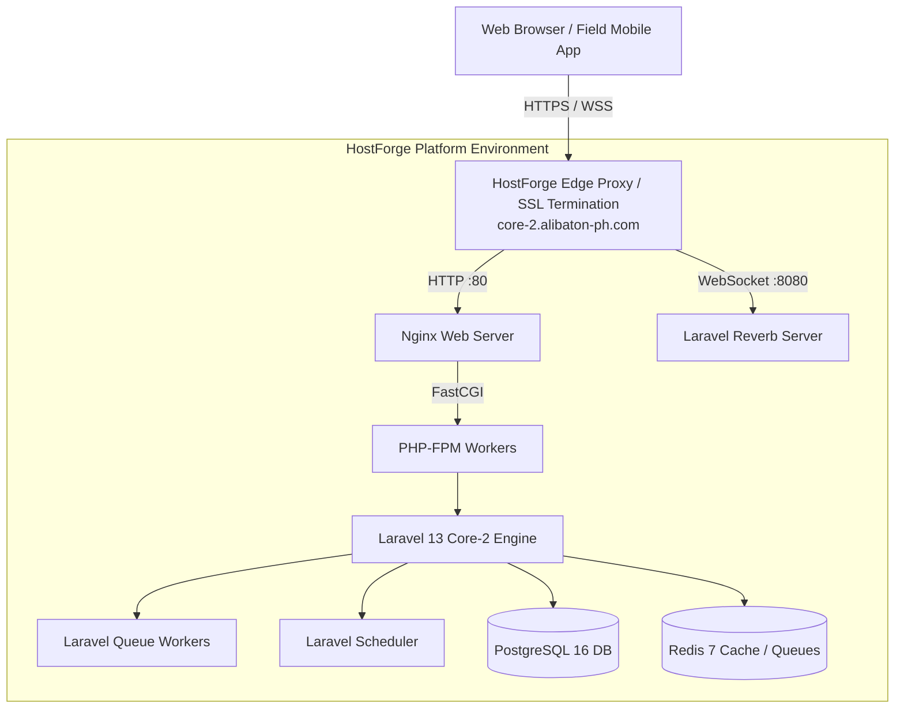

# Deployment & Hosting Architecture

**Last updated:** 2026-09-08
**Target Environment:** HostForge Platform  
**Platform URL:** [https://hostforgeplatform.cloud/platform](https://hostforgeplatform.cloud/platform)  
**Apex Domain:** `alibaton-ph.com`  
**Core-2 Subdomain:** `core-2.alibaton-ph.com`  

**Verification status:** The user confirmed that Core-2 is not deployed. HostForge
is the intended first-deployment platform. The topology below describes the
existing application's proposed deployment, not verified hosting capabilities.
The [pre-deployment restructuring handoff](../microservice/README.md) supersedes
earlier live-production migration assumptions. Platform, capacity, backup/restore
and independent-release evidence is required before deployment; local preparation
may proceed. No hosting account or production data was accessed. `/up` is the
configured Laravel health route; it does not establish database, broker, or
optional-service readiness.

---

## 1. Overview & Domain Topology

Core Transaction 2 (Core-2) is the operational dispatch, fleet, crane/equipment, and workforce assignment engine for Alibaton. First deployment is intended for **HostForge Platform** with domain routing under the `alibaton-ph.com` corporate hierarchy. The endpoint table below is proposed, not evidence of a live deployment.

```
alibaton-ph.com (Apex Domain)
├── core-2.alibaton-ph.com (Core-2 Web Workspace & API v1 - HostForge Platform)
└── [Future Core-1 / Corporate Services]
```

### Host & Endpoint Directory

| Service / Interface | Public URL | Description |
| :--- | :--- | :--- |
| **HostForge Management** | [https://hostforgeplatform.cloud/platform](https://hostforgeplatform.cloud/platform) | Cloud hosting control panel, container orchestration, and runtime management. |
| **Core-2 Web Workspace** | `https://core-2.alibaton-ph.com` | Authenticated Inertia 3 / React 19 operational workspace. |
| **Core-2 Mobile API** | `https://core-2.alibaton-ph.com/api/v1` | Sanctum bearer-token REST API for React Native / Expo field workers. |
| **Laravel Reverb (WebSockets)** | `wss://core-2.alibaton-ph.com/app` | Real-time workspace telemetry, GPS vehicle tracking, and notifications (reverse-proxied over TLS port 443). |
| **Health Check Endpoint** | `https://core-2.alibaton-ph.com/up` | Configured Laravel health route; dependency readiness and zero-downtime behavior require separate verification. |

---

## 2. Platform & Hosting Architecture (HostForge)

The existing application can be packaged as a containerized service. Deployment on **HostForge Platform** (`https://hostforgeplatform.cloud/platform`) is planned and requires capability verification. The following topology is the pre-restructuring proposal; the microservice handoff defines the target two-service topology (Operations + Tracking).

### Compute & Service Topology
- **Application Container (`app`)**: Single production container running Alpine Linux, Nginx, PHP 8.4 FPM, Laravel queue workers, scheduler daemon, and Laravel Reverb WebSocket server supervised via `supervisord`.
- **Database Service (`db`)**: Managed PostgreSQL 16 database (or Supabase PostgreSQL with Supavisor connection pooler).
- **In-Memory Cache / Key-Value Store (`redis`)**: Redis 7 instance for distributed sessions, atomic rate limiting, and real-time pub/sub brokering.
- **Edge Reverse Proxy & SSL/TLS**: HostForge ingress edge terminates TLS with automated Let's Encrypt certificates for `core-2.alibaton-ph.com` and proxies HTTP/HTTPS to port 80/443 and WebSocket upgrades (`Upgrade: websocket`) to the internal Reverb service on port 8080.



---

## 3. Production Environment Configuration

The following production environment variables should be configured within the HostForge platform management dashboard:

```dotenv
# Application Configuration
APP_NAME="Alibaton Core-2"
APP_ENV=production
APP_DEBUG=false
APP_KEY=base64:<32-byte-base64-generated-key>
APP_URL=https://core-2.alibaton-ph.com

# Session & Security
SESSION_DRIVER=redis
SESSION_LIFETIME=120
SESSION_ENCRYPT=true
SESSION_DOMAIN=.alibaton-ph.com
SESSION_SECURE_COOKIE=true
SANCTUM_STATEFUL_DOMAINS=core-2.alibaton-ph.com

# Database Connection (PostgreSQL / Supabase)
DB_CONNECTION=pgsql
DB_HOST=<production-db-host>
DB_PORT=5432
DB_DATABASE=core2_production
DB_USERNAME=<production-db-user>
DB_PASSWORD=<strong-db-password>
DB_SSLMODE=require

# Redis Cache & Queue
REDIS_CLIENT=phpredis
REDIS_HOST=<production-redis-host>
REDIS_PORT=6379
REDIS_PASSWORD=<strong-redis-password>
CACHE_STORE=redis
QUEUE_CONNECTION=redis

# Laravel Reverb (WebSockets on Subdomain)
BROADCAST_CONNECTION=reverb
REVERB_APP_ID=core2-prod
REVERB_APP_KEY=<public-reverb-key>
REVERB_APP_SECRET=<server-only-secret>
REVERB_HOST=0.0.0.0
REVERB_PORT=8080
REVERB_SCHEME=https

# Public Frontend Variables (Compiled into Vite Assets)
VITE_APP_NAME="Alibaton Core-2"
VITE_REVERB_APP_KEY=<public-reverb-key>
VITE_REVERB_HOST=core-2.alibaton-ph.com
VITE_REVERB_PORT=443
VITE_REVERB_SCHEME=https

# MapLibre GIS Production Credentials
VITE_MAP_PROVIDER=stadia
VITE_MAP_PLAN=starter
VITE_MAP_USE_CASE=commercial
VITE_STADIA_MAPS_API_KEY=<restricted-production-browser-key>

# Telemetry Ingestion & Tracking Microservice (Phase 2)
TRACKING_SERVICE_DRIVER=stream
TRACKING_STREAM_KEY=telemetry.gps.v1
TRACKING_STREAM_GROUP=tracking-ingest-workers
TRACKING_DLQ_STREAM_KEY=telemetry.gps.dlq
TRACKING_STREAM_MAXLEN=100000
TRACKING_SERVICE_SECRET=<strong-hmac-secret-min-16-chars>

# Tracking Microservice Read Replica Configuration (apps/tracking/.env)
# DB_HOST routes all ingestion writes and command receipts to primary
# DB_READ_HOST routes high-frequency fleet dispatch map queries to read replicas
TRACKING_DB_HOST=<tracking-primary-db-host>
TRACKING_DB_READ_HOST=<tracking-replica-db-host-1>,<tracking-replica-db-host-2>
TRACKING_DB_PORT=5432
TRACKING_DB_DATABASE=core2_ms_tracking

# Deployment Lifecycle Flags
RUN_MIGRATIONS=true
CACHE_CONFIG=true
```

### Tracking Consumer Group Monitoring & Operability

Monitor consumer group lag, active consumers, and Pending Entries List (PEL):

```bash
# Inspect consumer group progress, lag, and last delivered message ID
redis-cli XINFO GROUPS telemetry.gps.v1

# Inspect active consumer worker daemons
redis-cli XINFO CONSUMERS telemetry.gps.v1 tracking-ingest-workers

# Check unacknowledged pending messages (PEL)
redis-cli XPENDING telemetry.gps.v1 tracking-ingest-workers

# Monitor poison-pill messages routed to Dead Letter Queue (DLQ)
redis-cli XLEN telemetry.gps.dlq
redis-cli XREVRANGE telemetry.gps.dlq + - COUNT 10
```

---

## 4. Mobile Field App Configuration (`packages/field-mobile`)

Field technicians, drivers, and operators running the React Native / Expo application connect to the HostForge-hosted Core-2 backend via HTTPS:

```dotenv
# packages/field-mobile/.env.production
EXPO_PUBLIC_API_BASE_URL=https://core-2.alibaton-ph.com
```

All API communications target `https://core-2.alibaton-ph.com/api/v1` with Sanctum personal access tokens and persistent offline outbox queuing.

---

## 5. Security & TLS Checklist

1. **Domain Verification**: Ensure DNS `A` or `CNAME` records for `core-2.alibaton-ph.com` point to the HostForge ingress IP/host.
2. **TLS 1.3 Encryption**: Enforce HTTPS on all routes; plain HTTP requests must redirect with HTTP `301 Moved Permanently`.
3. **CORS & Origin Isolation**:
   - Web workspace origins restricted to `https://core-2.alibaton-ph.com`.
   - API endpoints accept authorization from authenticated mobile clients (`Bearer` token) and stateful web requests with CSRF.
4. **WebSocket Reverse Proxying**: Ensure HostForge / Nginx passes the `Upgrade` and `Connection` headers for `wss://core-2.alibaton-ph.com` connections.
5. **Asset Optimization**: Run `php artisan config:cache`, `php artisan route:cache`, and `php artisan view:cache` during build steps to ensure maximum response performance.
