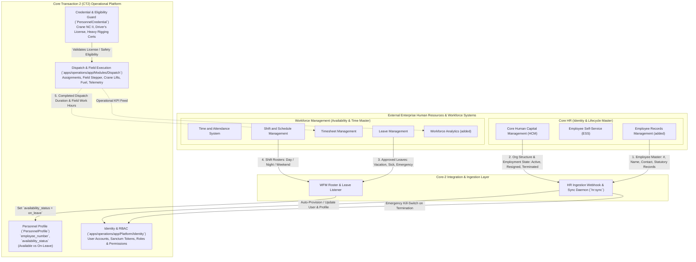
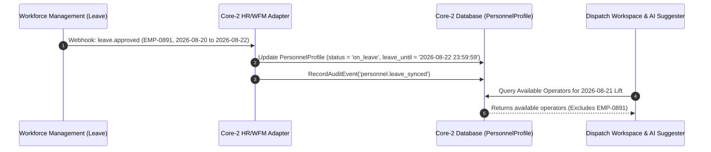
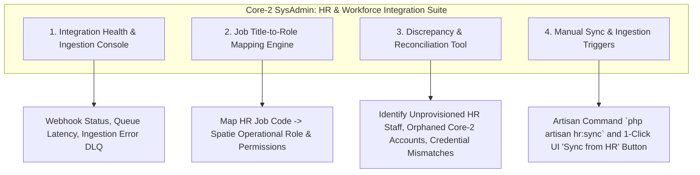

# Core HR and Workforce Management Integration Architecture

**Status:** Active System Architecture & Integration Contract  
**Last updated:** 2026-09-16  
**Applies to:** Core Transaction 2 (CT2) Identity Platform (`apps/operations/app/Platform/Identity`), Dispatch Assignment (`apps/operations/app/Modules/Assignment`), and System Administration

---

## 1. Executive Summary & Integration Context

In the Alibaton heavy equipment operational ecosystem, **Core-2 does not serve as the primary HR system of record or personnel registrar**. 

- **Core HR** is the upstream authoritative **System of Record (SoR)** for employee master identity, organizational hierarchy, and employment status.
- **Workforce Management (WFM)** is the upstream authoritative **System of Record** for shifts, attendance, rosters, and leave approvals.
- **Core-2 (CT2)** is the downstream **Operational Control Platform** responsible for user authentication, operational role-based access control (RBAC), equipment qualification eligibility, live field dispatch assignments, GPS tracking, and real-time operations.

---

## 2. Upstream Module Breakdown & System Boundaries

### A. Core HR Group (Source of Truth for Identity)

| Sub-Module | Upstream Responsibility | Ingestion into Core-2 (`CT2`) |
| :--- | :--- | :--- |
| **Core Human Capital Management (HCM)** | Defines corporate hierarchy: Official Department (*Heavy Lift Division, Logistics, Field Service*), Official Job Title (*Senior Heavy Equipment Operator, Transport Operator, Rigger*), and Employment Status (*Active, Probationary, Suspended, Resigned, Terminated*). | 1. **Interactive Software Roles (3 Canonical Users):** Maps Job Title $\rightarrow$ Core-2 System User Role (`System Administrator`, `Operations Manager`, `Operator`) and provisions `users` login account with mobile/web tokens. 2. **Non-Software Field Roles (Riggers & Crew):** Ingests Job Title (`'Rigger'`, etc.) as an employee [`PersonnelProfile`](../../apps/operations/app/Platform/Identity/Models/PersonnelProfile.php) without creating a `users` login account or issuing mobile/web tokens. 3. **Lifecycle Control:** `Terminated` status triggers instantaneous session termination, mobile token revocation, and assignment availability lockout (`is_active = false`, `availability_status = unavailable`). |
| **Employee Self-Service (ESS)** | Self-service portal where employees update phone numbers, addresses, or profile pictures. | Changes to contact information propagate to Core-2 via webhook to ensure operations managers and emergency notifications have up-to-date phone numbers. |
| **Employee Records Management (added)** | **Authoritative Master Data Store:** Maintains legal names, `employee_number`, official email, verified mobile number, emergency contacts, home address, and scanned compliance documents. | Synchronized into `users` (for software users) and `personnel_profiles` (`employee_number`, emergency contacts) via [`PersonnelProfile`](../../apps/operations/app/Platform/Identity/Models/PersonnelProfile.php) for all employees (including Riggers). |

---

### B. Workforce Management Group (Source of Truth for Availability & Time)

| Sub-Module | Upstream Responsibility | Ingestion & Interaction with Core-2 (`CT2`) |
| :--- | :--- | :--- |
| **Time and Attendance System** | Tracks corporate clock-in/out, biometric gate logs, and physical depot presence. | Can be correlated with Core-2 dispatch start times to detect discrepancies between depot clock-in and job departure. |
| **Shift and Schedule Management** | Plans worker rosters, shift rotations (Day Shift 07:00–16:00, Night Shift 19:00–04:00), and weekly rest days. | Core-2 evaluates shift alignment during dispatch planning to ensure operators and crew are not assigned outside their active working shift window. |
| **Timesheet Management** | Computes payroll-ready hours, overtime, night differential, and holiday premiums. | **Bidirectional Feed:** Core-2 transmits certified job execution timestamps (Arrival, Work Started, Lift Completed, Departure) back to Timesheet Management for field payroll processing. |
| **Leave Management** | Approves and tracks employee leaves: Vacation Leave, Sick Leave, Emergency Leave, and Bereavement. | **Critical Operational Guard:** When an employee has an active/approved leave period, Core-2 sets `PersonnelProfile::$availability_status = 'on_leave'`, preventing operations managers and automated assignment engines from scheduling them. |
| **Workforce Analytics (added)** | Analyzes labor productivity, overtime trends, and staffing utilization. | Ingests Core-2 dispatch operational metrics (completed dispatches, total crane operating hours, fuel economy index per driver). |

---

## 3. Data Synchronization & Lifecycles

### 3.1 Employee Provisioning Lifecycle

The ingestion pipeline processes employees according to their operational software interaction needs:

#### Path A: Interactive Software Users (3 System Users: System Administrator, Operations Manager, Operator)
1. **HR Ingestion Event**: Core HR creates/updates an employee record with `employee_number = 'EMP-2026-0891'`, `title = 'Mobile Crane Specialist'`, `department = 'Heavy Lift'`.
2. **Core-2 Staging & Role Mapping**:
   - The integration adapter maps `'Mobile Crane Specialist'` $\rightarrow$ [`RoleName::CraneOperator`](../../apps/operations/app/Platform/Identity/Enums/RoleName.php) (canonical `Operator` role).
   - Generates a normalized `username` (e.g., `marco.villanueva`).
   - Provisions a `users` record and binds [`PersonnelProfile`](../../apps/operations/app/Platform/Identity/Models/PersonnelProfile.php) with `employee_number` and `availability_status = 'available'`.
3. **Activation & Onboarding**:
   - Dispatches a secure, time-expiring setup token via email/SMS for web workspace and mobile field app access.
   - The employee sets their password and configures Multi-Factor Authentication (MFA) upon first login.

#### Path B: Non-Interactive Field Personnel (Riggers)
1. **HR Ingestion Event**: Core HR creates/updates an employee record with `employee_number = 'EMP-2026-0940'`, `title = 'Certified Heavy Rigger'`, `department = 'Heavy Lift'`.
2. **Core-2 Personnel Staging (No Software Account)**:
   - The integration adapter identifies `'Certified Heavy Rigger'` as a non-software operational role.
   - Provisions a [`PersonnelProfile`](../../apps/operations/app/Platform/Identity/Models/PersonnelProfile.php) and attaches statutory [`PersonnelCredential`](../../apps/operations/app/Platform/Identity/Models/PersonnelCredential.php) records (e.g., TESDA Rigger NC II, DOLE-BOSH).
   - Sets `availability_status = 'available'` for dispatch crew eligibility and critical lift plan assignment.
   - **No `users` record is created, no web session login is provisioned, and no Sanctum mobile token is issued.**
3. **Operational Execution**:
   - Operations managers assign Riggers to crane crews and lift plans based on qualifications.
   - On-site lift execution, outrigger checklists, exclusion zone enforcement, and timesheet hours are recorded and signed off via mobile/web by the assigned Operator or Operations Manager.

---

### 3.2 Automated Offboarding & Emergency Kill-Switch

When an employee resigns, is suspended, or is terminated in Core HR:

1. **Instant Webhook Notification**: Core HR emits `employee.terminated` or `employee.suspended`.
2. **Immediate Lockout in Core-2**:
   - Sets `users.is_active = false` and `users.suspended_at = now()`.
   - Deletes all active database sessions in the `sessions` table.
   - Revokes all Sanctum personal access tokens (`personal_access_tokens` table) to terminate active mobile app sessions immediately.
   - Sets `PersonnelProfile.availability_status = 'unavailable'`.
3. **Dispatch Safety Alert**:
   - If the terminated worker is assigned to any active (`dispatched`, `accepted`, `en_route`, `working`) or scheduled future dispatch, Core-2 generates high-priority in-app and WebSocket notifications to Operations Managers and Administrators requiring immediate personnel reassignment.
   - Records an immutable security audit event via [`RecordAuditEvent`](../../apps/operations/app/Platform/Audit/Actions/RecordAuditEvent.php) with `action = 'user.auto_terminated_from_hr'`.

---

### 3.3 Leave & Availability Synchronization

---

## 4. System Administrator Capabilities for HR & Workforce Governance

In Core-2, the **System Administrator** does not manually key in employee profile records, but instead governs the integration health, provisioning rules, and discrepancy resolution:

### 1. Integration Health & Error Dead-Letter Queue (DLQ)
- View incoming webhook health, delivery latencies, and failed payload errors (e.g., malformed phone numbers or duplicate employee IDs).
- Single-click retry mechanism for failed ingestion events.

### 2. Job Title to Role Mapping Configuration
- UI/Configuration interface allowing SysAdmins to map newly created HR job titles to Core-2 Spatie roles or designate non-software employee roles:
  - *Example (Software User):* Map `"Heavy Rigging Supervisor"` $\rightarrow$ `OperationsManager` with `dispatch.approve_priority` and `fleet.inspect` permissions.
  - *Example (Employee Only):* Map `"Rigger"` / `"Certified Rigger"` $\rightarrow$ `Non-Interactive Employee` (creates [`PersonnelProfile`](../../apps/operations/app/Platform/Identity/Models/PersonnelProfile.php) with TESDA credentials for crew assignment, but creates no `users` login account).

### 3. Discrepancy & Reconciliation Resolver
- An automated nightly reconciliation job (`hr:reconcile`) generating an admin dashboard report:
  - **Unprovisioned Staff**: Employees in Core HR who are active in software-required roles but have no Core-2 login account (excluding designated non-software employees such as Riggers).
  - **Orphaned Accounts**: Core-2 user accounts with no corresponding active `employee_number` in Core HR.
  - **Status Mismatches**: Workers marked `On Leave` in WFM but still showing `Available` in Core-2.

### 4. Credential Compliance Ingestion
- Ingests official government driver's licenses (LTO) and heavy equipment operator certifications (TESDA NC II) stored in Core HR into [`PersonnelCredential`](../../apps/operations/app/Platform/Identity/Models/PersonnelCredential.php), alerting administrators 30 days before field operator license expirations.
