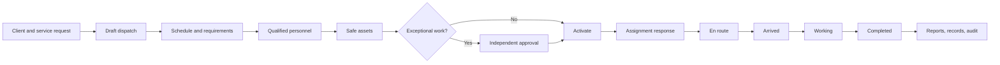

# Core Transaction 2 — Consolidated Product Requirements Document

**Document status:** Consolidated review and submission copy  
**Last consolidated:** 2026-07-31  
**Product stage:** Working vertical slices with remaining mobile, routed-record,
export, and production-readiness work

## Document purpose and authority

This document consolidates the product definition, module boundaries,
requirements, feature status, business rules, and accepted baseline decisions
for Core Transaction 2 (CT2). It is designed to stand alone for review while
keeping the detailed topic documents maintainable.

Authority is resolved in this order:

1. Laravel migrations and application code define currently implemented behavior.
2. Passing tests provide acceptance evidence.
3. [Product requirements](../prd.md), [business rules](../business_rules.md),
   and [Phase 0 decisions](../phase-0-baseline.md) define accepted intent and constraints.
4. [Requirements](../requirements.md), [feature catalog](../features.md), and
   [roadmap](../Roadmap.md) record maturity and delivery status.
5. This consolidated file summarizes those sources and does not silently
   promote prototype behavior to live behavior.

## 1. Product summary

CT2 is an internal operations platform for crane, trucking, and related
field-service work. It turns client demand into scheduled, staffed, equipped,
tracked, and auditable dispatch jobs. It combines dispatch, personnel and asset
assignment, fleet and equipment safety, fuel, location sharing, maintenance,
approvals, records, administration, and advisory GPT assistance in one
role-aware system.

The product has two coordinated clients:

- A responsive Inertia/React web workspace for office roles and field fallback.
- A focused React Native application for Drivers, Crane Operators, and Field
  Technicians.

Laravel remains the shared authority for authentication, authorization,
validation, lifecycle rules, transactions, concurrency, and audit behavior.

## 2. Problem statement

Dispatch decisions become unsafe and slow when job requirements, personnel
qualifications, asset readiness, approvals, fuel activity, and field progress
are split across unrelated channels. Based on empirical findings from operational
personnel ([BSIT Capstone Requirements Questionnaire](./supplements/capstone-requirements-questionnaire.md)),
current manual scheduling via OneDrive/Excel activity calendars leads to **frequent double bookings**,
qualification bottlenecks via physical HR/201 files, unmonitored equipment breakdowns
(hydraulic/electrical leaks and worn out parts), untracked heavy equipment, excessive fuel
consumption, and significant idle ("waiting") time.

The resulting failure modes include:

- double-booked personnel or assets;
- assignment of unavailable, unqualified, or unsafe resources;
- unclear ownership and delayed escalation;
- unauthorized exposure of another worker's assignments or location;
- fuel and approval stages being skipped or self-approved;
- lost context during poor connectivity; and
- operational decisions without attributable history.

CT2 must give office users a dense, fast decision surface and field users a
safe, touch-first workflow that remains understandable when connectivity is
limited.

## 3. Goals

1. Convert a client service request into one or more complete dispatch jobs.
2. Prevent unavailable, unqualified, conflicted, or unsafe assignments.
3. Require independent approval for priority, emergency, and other exceptional
   changes.
4. Restrict every user to the records and actions authorized for their role,
   permissions, ownership, and active assignments.
5. Make critical lifecycle changes attributable and auditable.
6. Show location freshness, sharing state, offline state, and synchronization
   uncertainty honestly.
7. Support an eight-hour disconnected field shift without duplicate commands
   or silent conflict overwrites.
8. Keep GPT recommendations explainable, advisory, expiring, and explicitly
   human-confirmed.
9. Meet WCAG 2.2 AA across the operational experience.

## 4. Non-goals for the active release

- Public customer registration or a customer portal
- Autonomous dispatch or direct operational writes by GPT
- Payroll, billing, invoicing, procurement, or enterprise accounting
- Direct browser or mobile access to Supabase operational tables
- Normal-workflow hard deletion of operational history
- A native duplicate of unrestricted office and administration features
- iOS or tablet field applications; the active native release targets Android
  phones running Android 11 or later only
- Premature microservice decomposition
- A stable public or partner API

## 5. Users and primary needs

| User | Primary needs |
| --- | --- |
| System Administrator | Provision internal accounts, assign one canonical role, manage account status and credentials, and review audit activity without removing the last active administrator. |
| Dispatcher | Record clients and service requests, schedule work, staff and equip jobs, resolve conflicts, activate routine work, monitor operations, and forward fuel requests. |
| Operations Manager | Independently decide exceptional approvals, oversee live operations and conflicts, and approve or reject fuel requests. |
| Driver | See only assigned work, accept or reject assignments, progress job status, share location when enabled, and submit fuel requests. |
| Crane Operator | Perform the same assigned-work journey as a Driver with crane-specific qualification and equipment context. |
| Field Technician | Inspect assets, open and complete maintenance work, verify safe release evidence, verify fuel stages, and record final fuel details. |

## 6. Product boundary

The accepted product boundary contains five business modules. Shared platform
services support these modules but are not additional business modules.

| Module | Responsibility | Current maturity |
| --- | --- | --- |
| Dispatch Job and Scheduling | Client intake, service requests, job creation, scheduling, exceptional approval, activation, field progression, cancellation, reopen, and archive | Live backend/UI with remaining management and convergence gaps |
| Driver/Operator and Equipment Assignment | Personnel and asset eligibility, conflicts, assignment response, ending, reassignment, and approval | Live backend/UI |
| Fleet Management | Fleet registry, status, inspections, maintenance, readiness, and utilization history | Live backend/UI; richer surfaces still evolving |
| Crane and Equipment Management | Crane/equipment registry, specifications, certification context, inspections, maintenance, readiness, and utilization history | Live backend/UI; shares the operational-asset implementation |
| Fuel Management | Request, forwarding, decision, verification, final logging, cost/meter details, and receipt evidence | Live backend/UI |

Shared services include authentication, RBAC, personnel administration,
tracking, reports, attachments, notifications, audit, exports, and GPT
assistance.

## 7. Core end-to-end experience

Supporting events—fuel, location, inspections, maintenance, attachments,
notifications, and GPT recommendations—remain linked to the authorized
dispatch or asset context.

## 8. Functional requirements

### 8.1 Identity and access

- Require an authenticated, active, non-suspended, verified internal account.
- Rate-limit sensitive access and recovery endpoints; regenerate or invalidate
  sessions when access changes.
- Assign one canonical role to each operational user.
- Enforce authorization in Laravel policies, permissions, actions, and scoped
  queries independently of frontend visibility.
- Prevent suspension or demotion of the last active System Administrator.
- Revoke existing sessions after role or activation changes.

### 8.2 Dispatch and scheduling

- Authorized users can create active clients and service requests with
  schedule, priority, requirements, location, and notes.
- A dispatch may be created directly or derived from a service request.
  One request may produce multiple unique dispatches for staged, retried, or
  rescheduled work.
- Linked dispatches derive request-owned fields server-side and reject client
  overrides.
- Jobs have unique references, valid schedule windows, canonical priorities and
  statuses, and optimistic versions.
- Activation requires active personnel and asset assignments, current safe
  assets, an allowed lifecycle state, and the latest applicable approval.
- Assigned field users progress only through
  `dispatched → accepted → en_route → arrived → working → completed`.
- Ending and reassignment preserve assignment history. Cancellation, reopen,
  archive, and restore follow explicit permissions, reasons, versions,
  transactions, and audit rules.

### 8.3 Personnel and asset assignment

- Validate account status, availability, role, credentials, duplicate
  selection, active assignments, and schedule overlap.
- Require a valid driver license at scheduled start for Drivers and a valid
  operator certification for Crane Operators.
- Assign only assets in a dispatchable readiness state with no unreleased
  dispatch-blocking maintenance and no overlapping active assignment.
- Lock and revalidate selected resources at confirmation time.
- Apply routine changes atomically; route post-activation and non-routine
  changes to an independent approver unless an explicit override is authorized.

### 8.4 Fleet, crane, and equipment safety

- Register trucks, vehicles, cranes, and equipment with unique asset codes.
- Scope asset visibility by permission or active assignment.
- Record inspections with type, result, checklist, findings, technician, and
  completion time.
- Move failed or conditional assets into inspection status.
- Record maintenance defects, blocking state, work, parts, scheduling, and
  next-due information.
- Require a passing post-repair inspection before safe release.
- Allow `ready_for_service` only when no unreleased blocking work remains.

### 8.5 Fuel

- Authorized field users submit a fuel request with quantity, type, purpose,
  and optional dispatch/asset context.
- Enforce the ordered workflow:
  `submitted → forwarded → approved/rejected → verified → logged`.
- Prevent requesters from approving their own requests.
- Final logging records quantity, price per litre, total cost, odometer, hour
  meter, station, remarks, and optional private receipt evidence.
- Reject wrong-stage transitions and duplicate final logs.

### 8.6 Tracking and offline behavior

- Users submit only their own location while explicitly sharing during active
  assigned work.
- Validate coordinates, capture time, accuracy, and dispatch/asset scope.
- Restrict operations-wide location visibility to authorized roles.
- Show capture time, receive time, sharing state, and freshness:
  fresh within 2 minutes, delayed through 10 minutes, stale after 10 minutes,
  and offline after 30 minutes or a reported network loss.
- Delete precise coordinates after 30 days while retaining permitted
  non-coordinate audit facts.
- Replay commands with a UUID/idempotency key and expected record version.
  Conflicts require explicit user resolution and never silently overwrite newer
  server state.

### 8.7 Records, notifications, exports, and GPT

- Preserve scoped job reports, private attachments, notifications, daily
  summaries, GPT recommendations, and audit events.
- Limit attachments to 15 MiB each and 10 files per owning record; initially
  allow JPEG, PNG, HEIC/HEIF, and PDF after content-based validation.
- Store files privately, record checksums, authorize every download, and audit
  sensitive access.
- Generate GPT recommendations asynchronously from bounded, redacted,
  permission-scoped context.
- Show reasons, assumptions, conflicts, model metadata, source freshness, and a
  15-minute expiry.
- Require a separately authorized human accept/reject action that re-enters the
  normal domain workflow.
- Deliver CSV/PDF exports asynchronously with independent authorization,
  24-hour download links, and 7-day generated-file retention.

## 9. Non-functional requirements

### Security and privacy

- Validate all untrusted input at the HTTP boundary.
- Use session authentication and CSRF for browser mutations and revocable
  Sanctum device tokens for `/api/v1`.
- Keep Supabase operational tables server-only; `anon` and `authenticated`
  roles receive no table privileges.
- Apply least privilege, ownership, and active-assignment scope.
- Keep precise location, private files, credentials, tokens, exports, and GPT
  context out of public storage and application logs.
- Apply dedicated throttles to abuse-prone endpoints.

### Consistency and reliability

- Run multi-record workflow changes inside short transactions.
- Use deterministic row locks for contended resources and optimistic versions
  for dispatch commands.
- Preserve foreign-key and database-constraint integrity.
- Make queued handlers and replayable commands idempotent.
- Target 99.5% monthly availability for critical authenticated operations,
  a 15-minute RPO, and a 4-hour RTO, backed by monitored and rehearsed recovery.

### Performance

- Paginate collections and eager-load required relations.
- Keep workspace queries capability-scoped and bounded.
- Index common status, schedule, ownership, and relationship lookups.
- Process GPT and exports asynchronously.
- Verify query plans against representative PostgreSQL data before rollout.

### Accessibility and responsive use

- Meet WCAG 2.2 AA.
- Support complete keyboard use, visible focus, screen-reader announcements,
  reduced motion, functional 200% zoom, and 44px minimum field targets.
- Never communicate status by color alone.
- Provide a synchronized list alternative to every map.

## 10. Canonical state vocabulary

| Domain | Canonical values |
| --- | --- |
| Dispatch priority | `routine`, `priority`, `emergency` |
| Service request | `submitted`, `dispatching` |
| Dispatch | `draft`, `pending_approval`, `scheduled`, `dispatched`, `accepted`, `en_route`, `arrived`, `working`, `completed`, `cancelled` |
| Fuel | `submitted`, `forwarded`, `approved`, `rejected`, `verified`, `logged` |
| Asset | `available`, `assigned`, `working`, `under_inspection`, `under_maintenance`, `awaiting_parts`, `ready_for_service`, `unavailable` |
| Approval | `pending`, `approved`, `rejected` |

Clients may present friendly labels but cannot invent or persist unapproved
machine states.

## 11. Current implementation boundary

### Live or server-backed

- Authentication, verification, recovery, RBAC, user management, scoped queries,
  and audit recording
- Client and service-request intake and one-to-many draft conversion
- Resource assignment, approval, activation, assignment response,
  reassignment, cancellation, reopen, archive/restore backend behavior, and
  assigned field progression
- Asset registry, inspection, maintenance, safe release, and readiness
- Full fuel workflow through final logging and receipt persistence
- Browser tracking map/list, freshness, polling, outbox, idempotency, and
  scheduled coordinate pruning
- Versioned field API for authentication, assigned jobs, assignment response,
  progression, location, idempotency, and conflict responses
- Server-backed reports, attachments, notifications, daily summaries, and GPT
  recommendation lifecycle

### Partial or in progress

- Convergence of all richer prototype surfaces onto one routed live web shell
- Production-ready React Native validation, durable eight-hour storage, device
  GPS/background behavior, and device-flow evidence
- Complete routed experiences for reports, attachments, notifications, archive
  management, exports, and GPT review
- Dedicated endpoint throttles, browser E2E coverage, production query/load
  evidence, accessibility review, monitoring, recovery drills, and rollout
  runbooks

### Deferred

- Customer-facing portal
- Native office/administration parity
- Autonomous AI actions
- Microservices without measured need
- Finance and enterprise accounting suites

## 12. Acceptance criteria

The active release is acceptable when:

1. A Dispatcher can create, staff, equip, and activate a routine dispatch.
2. Priority or emergency work cannot activate without independent approval.
3. Unsafe assets and unqualified, unavailable, or conflicted personnel cannot
   be assigned.
4. Field roles can see and mutate only their own active assigned work.
5. Fuel stages cannot be skipped, self-approved, or logged twice.
6. Blocking maintenance cannot be released without a later passing inspection.
7. Offline replay cannot duplicate a command or silently overwrite a newer
   server version.
8. Critical writes and sensitive downloads create attributable audit history.
9. GPT remains advisory and every accepted proposal identifies the human actor
   and normal domain action.
10. Web and mobile critical journeys pass authorization, validation, conflict,
    offline/retry, accessibility, security, and recovery checks.

## 13. Consolidated source map

- [Product requirements](../prd.md)
- [Top-level modules](../modules.md)
- [Requirements catalog](../requirements.md)
- [Feature catalog](../features.md)
- [Business rules](../business_rules.md)
- [User flows](../userflow.md)
- [Phase 0 baseline decisions](../phase-0-baseline.md)
- [Long-term plan](../long-term-plan.md)
- [Roadmap](../Roadmap.md)
- [BSIT Capstone Requirements Questionnaire](./supplements/capstone-requirements-questionnaire.md)
