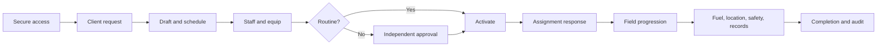

# Core Transaction 2 — Consolidated User Story Map

**Document status:** Consolidated product-delivery map  
**Last consolidated:** 2026-07-28  
**Primary sources:** [User flows](../userflow.md),
[requirements](../requirements.md), [feature catalog](../features.md), and
[business rules](../business_rules.md)

## 1. Product outcome

CT2 enables an authorized internal team to turn a client request into safe,
approved, staffed, equipped, tracked, completed, and auditable field work.
The story map follows that operational backbone and separates live behavior
from remaining capstone work.

## 2. Personas

| Persona | Outcome |
| --- | --- |
| System Administrator | Maintain secure internal access, roles, personnel records, credentials, and auditability. |
| Dispatcher | Convert demand into conflict-free, ready-to-run dispatch jobs. |
| Operations Manager | Independently control exceptional operational and fuel decisions. |
| Driver | Safely execute only assigned work and report field status, fuel, and location. |
| Crane Operator | Execute assigned crane work with qualification and equipment context. |
| Field Technician | Keep assets safe through inspection, maintenance, release, and fuel verification. |

## 3. Story backbone

| Activity | User outcome | Main stories | Maturity |
| --- | --- | --- | --- |
| Access the system | Enter a capability-scoped workspace securely | Sign in, verify email, recover access, enforce active status, load permitted navigation | Live backend/UI |
| Capture demand | Preserve accurate client requirements | Create client, submit service request, record schedule/site/priority/requirements | Live backend/UI |
| Plan dispatch | Create one or more executable work records | Create direct draft or convert request, preserve request snapshot, avoid duplicate references | Live backend/UI |
| Staff and equip | Select qualified, available, safe resources | Review eligibility, detect conflicts, assign personnel/assets, accept/reject assignment, reassign/end | Live backend/UI |
| Approve exceptions | Separate requester and decision maker | Review priority/emergency or override request, require reason, approve/reject independently | Live backend/UI |
| Execute field work | Advance work one valid step at a time | Activate, accept, en route, arrive, work, complete, recover from stale versions | Live web/API; native completion in progress |
| Support the job | Keep fuel, location, safety, and records attached to work | Share location, request/decide/log fuel, inspect, maintain, report, attach evidence, notify | Core server behavior live; some routed surfaces partial |
| Close and learn | Preserve attributable operational history | Complete, cancel/reopen, archive/restore, review reports, export, audit, evaluate GPT proposal | Backend slices live; management/export surfaces partial |

## 4. End-to-end journey

## 5. Stories by persona

### 5.1 System Administrator

| ID | User story | Acceptance focus | Maturity |
| --- | --- | --- | --- |
| US-ADM-01 | As an administrator, I want to create an internal account with one canonical role so that access is predictable. | Validated identity, canonical role, permission bundle, audit event | Live backend |
| US-ADM-02 | As an administrator, I want to activate, suspend, or change a user role so that access follows employment status. | Existing sessions revoked; affected user loses access immediately | Live backend |
| US-ADM-03 | As an administrator, I want the system to prevent removal of the last active administrator so that administration cannot be locked out. | Demotion/suspension rejected atomically | Live backend |
| US-ADM-04 | As an administrator, I want to maintain personnel availability and credentials so dispatch can make safe selections. | Credential kind, dates, verification, availability, audit | Live backend |
| US-ADM-05 | As an administrator, I want a complete management surface for users and archived records so routine administration does not require raw endpoints. | Authorized create/edit/search/restore flows and complete states | Partial |

### 5.2 Dispatcher

| ID | User story | Acceptance focus | Maturity |
| --- | --- | --- | --- |
| US-DSP-01 | As a Dispatcher, I want to register a client and service request so demand is captured once. | Active client, validated request, schedule/location/priority/requirements | Live backend/UI |
| US-DSP-02 | As a Dispatcher, I want to convert one request into multiple unique drafts so staged or rescheduled work keeps its source context. | Atomic request lock, derived fields, unique reference, audit | Live backend/UI |
| US-DSP-03 | As a Dispatcher, I want to see personnel and asset eligibility before assignment so I can resolve conflicts early. | Role, status, credentials, readiness, maintenance, overlap reasons | Live backend/UI |
| US-DSP-04 | As a Dispatcher, I want assignment confirmation to recheck current data so a stale page cannot create unsafe work. | Deterministic locks, one transaction, no partial writes | Live backend/UI |
| US-DSP-05 | As a Dispatcher, I want to activate a ready routine job so field execution can begin. | Active personnel and asset, safe asset, allowed state, version check | Live backend/UI |
| US-DSP-06 | As a Dispatcher, I want exceptional work routed to a manager so segregation of duties is preserved. | Pending approval, requester context, latest request governs activation | Live backend/UI |
| US-DSP-07 | As a Dispatcher, I want to end or replace assignments without deleting history. | Active intervals closed, replacements revalidated, version incremented | Live backend/UI |
| US-DSP-08 | As a Dispatcher, I want to forward fuel requests so they enter independent review. | Correct stage, permission, actor, audit | Live backend/UI |
| US-DSP-09 | As a Dispatcher, I want a bounded schedule and tracking view so I can see workload and freshness without treating client hints as authority. | Server-backed data, conflict labels, map/list parity, freshness | Partial/live slices |

### 5.3 Operations Manager

| ID | User story | Acceptance focus | Maturity |
| --- | --- | --- | --- |
| US-MGR-01 | As a manager, I want to approve or reject priority and emergency work with a reason so exceptional decisions are attributable. | Independent actor, pending state, required reason, revalidation | Live backend/UI |
| US-MGR-02 | As a manager, I want to review resource-change details before approval so I understand the complete impact. | Named end/replace payload, current conflicts, atomic apply | Live backend/UI |
| US-MGR-03 | As a manager, I want to approve or reject fuel requests without self-approval so cost control is separated from request creation. | Ordered transition, requester exclusion, audit | Live backend/UI |
| US-MGR-04 | As a manager, I want operations-wide location and schedule views so I can intervene in delayed or conflicting work. | `tracking.view_all`, freshness, list alternative, scoped data | Live/partial |
| US-MGR-05 | As a manager, I want routed reports, exports, notifications, and GPT review so operational review happens in one workspace. | Complete UI states, private downloads, advisory copy, audit | Partial/planned |

### 5.4 Driver and Crane Operator

| ID | User story | Acceptance focus | Maturity |
| --- | --- | --- | --- |
| US-FLD-01 | As a field worker, I want to see only my active assigned jobs so another worker's information remains private. | Active assignment scope, explicit DTO/view model, 404/empty isolation | Live web/API |
| US-FLD-02 | As a field worker, I want to accept or reject my assignment so dispatch knows whether I can perform it. | Own assignment only, rejection reason, history preserved, version/audit | Live web/API |
| US-FLD-03 | As a field worker, I want one valid next action so I cannot skip or reverse the dispatch lifecycle. | Immediate successor only, consequence confirmation, terminal handling | Live web/API |
| US-FLD-04 | As a field worker, I want a clear stale-version recovery state so I do not overwrite newer dispatch decisions. | `409`/validation conflict, current safe snapshot, explicit refresh | Live web/API |
| US-FLD-05 | As a field worker, I want to share location only during active work so dispatch can monitor progress without unnecessary tracking. | Explicit sharing, active work, capture/receive time, freshness | Browser live; native device work in progress |
| US-FLD-06 | As a field worker, I want commands queued during poor connectivity so an eight-hour shift does not lose work. | Durable store, UUID, expected version, retry, conflict resolution | Partial |
| US-FLD-07 | As a field worker, I want to submit a fuel request tied to a job or asset so fuel need enters the authorized workflow. | Quantity/type/purpose validation, own context, audit | Live backend/UI |

### 5.5 Field Technician

| ID | User story | Acceptance focus | Maturity |
| --- | --- | --- | --- |
| US-TEC-01 | As a technician, I want to record an inspection so asset safety state reflects current evidence. | Checklist, result, findings, technician, completion time | Live backend/UI |
| US-TEC-02 | As a technician, I want failed or conditional inspection results to block unsafe dispatch. | Asset moves under inspection; assignment/activation fail closed | Live backend/UI |
| US-TEC-03 | As a technician, I want to record maintenance work, parts, schedule, and blocking status so repairs are traceable. | Work order, defect, parts, work performed, next due, audit | Live backend/UI |
| US-TEC-04 | As a technician, I want release to require a later passing inspection so repaired equipment cannot return early. | Passing post-repair inspection and no open blocking work | Live backend/UI |
| US-TEC-05 | As a technician, I want to verify and log approved fuel with meter, cost, station, and receipt details so the final event is complete. | Verified-to-logged only, one log, private receipt, audit | Live backend/UI |

### 5.6 Shared records and assistance

| ID | User story | Acceptance focus | Maturity |
| --- | --- | --- | --- |
| US-SHR-01 | As an authorized worker, I want to submit and review a job report so completion evidence is preserved. | Assignment/permission scope, status transition, audit | Server-backed; routed UI partial |
| US-SHR-02 | As an authorized user, I want to attach private evidence so files remain linked and protected. | MIME-by-content, limits, checksum, private storage/download | Server-backed; routed UI partial |
| US-SHR-03 | As a recipient, I want workflow notifications so important events reach the right person. | Recipient scope, queued delivery, read state | Server-backed; routed UI partial |
| US-SHR-04 | As an office user, I want an explainable GPT proposal so I can review possible assignments without delegating authority. | Bounded/redacted context, reasons/conflicts, expiry, human action | Server-backed; routed UI partial |
| US-SHR-05 | As an authorized reviewer, I want asynchronous exports so large operational datasets do not block requests. | Dataset scope, CSV/PDF, private expiring link, retention, audit | Planned |

## 6. Release slices

### Slice A — Delivered operational foundation

- Secure internal access and six-role RBAC
- Client and service-request intake
- Dispatch creation, assignment, exceptional approval, activation, and field
  progression
- Assignment response, reassignment/end, cancellation, reopen, and
  archive/restore backend
- Asset registry, inspection, maintenance, and safe release
- Fuel request through final logging and receipt evidence
- Browser tracking, freshness, outbox replay, and 30-day coordinate pruning
- Server-backed reports, private attachments, notifications, and GPT lifecycle

### Slice B — Capstone completion

- Accepted native runtime and secure device authentication evidence
- Durable eight-hour mobile outbox and explicit conflict recovery
- Device GPS and background/foreground sharing behavior
- Complete routed reports, attachments, notifications, archive management, and
  GPT review
- Private asynchronous CSV/PDF exports
- Browser/mobile contract convergence, security review, E2E, CI, accessibility,
  performance, monitoring, recovery, and rollout proof

### Slice C — Deferred expansion

- Customer portal
- Billing, payroll, procurement, and accounting
- Native office/administration parity
- Public integrations or API contracts
- Microservices or realtime infrastructure without measured need
- Autonomous AI decisions

## 7. Cross-cutting acceptance states

Every operational story must deliberately cover:

- loading;
- empty;
- validation failure;
- authorization denied;
- safety blocked or disabled;
- stale/concurrent update;
- success;
- terminal/completed;
- offline, queued, syncing, failed, conflict, and synchronized where relevant;
- fresh, delayed, stale, and offline telemetry where relevant.

## 8. Definition of done for a story

A story is done only when:

1. Laravel authorizes and validates the action at the boundary.
2. Record visibility is scoped in the query, not only hidden in the client.
3. Multi-write state changes are atomic and auditable.
4. Canonical machine states and optimistic versions are preserved.
5. Meaningful success and failure paths have focused automated coverage.
6. Web/mobile presentation handles required accessibility and operational
   states.
7. Documentation and feature status match the passing implementation evidence.
