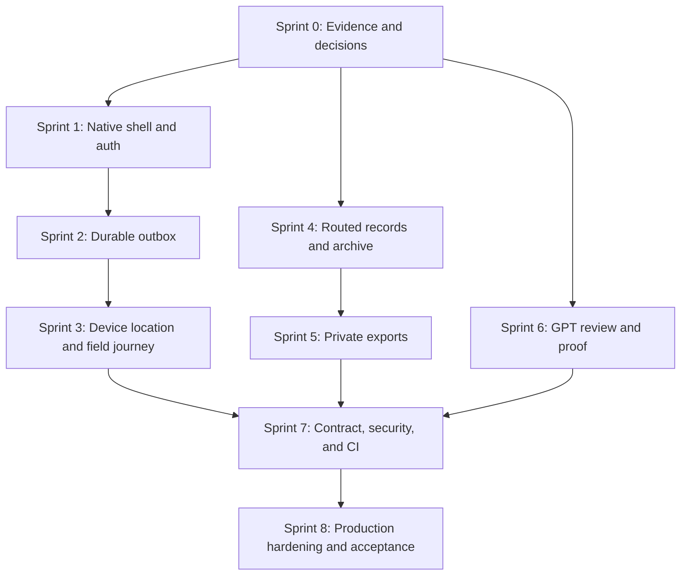

# Core Transaction 2 — Consolidated Sprint Plan

**Document status:** Active outcome-based delivery plan  
**Last consolidated:** 2026-07-31  
**Planning rule:** Exit gates, not calendar promises, determine completion.

## 1. Objective

Deliver a release-ready CT2 application with:

- one stable Inertia browser contract;
- one stable versioned mobile contract;
- a validated React Native field application for Driver, Crane Operator, and
  Field Technician;
- durable eight-hour offline command handling and explicit conflict recovery;
- device-backed location sharing that follows the accepted privacy and
  freshness rules;
- complete routed records, notifications, exports, archive, and GPT review;
- production security, accessibility, monitoring, recovery, rollout, and CI
  evidence.

This plan consolidates the [Roadmap](../Roadmap.md) and active
[Capstone Completion Plan](../plans/CAPSTONE_COMPLETION_PLAN.md). Detailed
product requirements and business rules remain authoritative.

## 1.1 Empirical Capstone Problem Alignment

This sprint plan directly maps sprint outcomes to the empirical operational pain points identified in the [BSIT Capstone Requirements Questionnaire](./supplements/capstone-requirements-questionnaire.md) from Bestlink College of the Philippines:

| Operational Problem | Survey Cause | Sprint Plan Resolution |
| --- | --- | --- |
| **Frequent Double Bookings** | Manual OneDrive/Excel calendar scheduling | **Sprint 0 & 4:** Automatic collision detection, database row-level locking, and schedule board conflict indicators. |
| **Qualification Bottlenecks** | Searching physical HR / 201 files | **Sprint 1 & 7:** Pre-activation automated check of driver licenses and crane operator certifications. |
| **Unmonitored Breakdowns** | Hydraulic/electrical leaks & wear | **Sprint 4 & 8:** Inspection checklists, defect work orders, and post-repair passing inspection safe release. |
| **Untracked Heavy Assets** | Real-time GPS for service vehicles only | **Sprint 3 & 8:** Mobile device GPS integration and live OpenStreetMap tracking for all fleet/cranes. |
| **Excessive Fuel Costs** | Weekly manual fuel logs | **Sprint 4 & 5:** 6-stage fuel workflow (`submitted` to `logged`), anti-self-approval rule, odometer/hour meter cost logging, and export reports. |
| **Informal Messaging Delays** | Calls, Viber, and Messenger | **Sprint 1, 2, & 3:** Dedicated React Native field mobile application with assigned job progression (`Today's Work`). |
| **Waiting / Idle Time** | Lack of central visibility | **Sprint 4 & 6:** Operations Overview dashboard surfacing pending approvals and resource blockers. |

## 2. Verified starting point

The remaining sprints must not rebuild these foundations:

- Internal authentication, verification, recovery, six-role RBAC, user
  management, scoped visibility, and audit recording
- Client/service-request intake and one-to-many dispatch conversion
- Web dispatch assignment, approval, activation, assignment response,
  progression, reassignment/end, cancellation, reopen, and archive/restore
  backend behavior
- Versioned `/api/v1` authentication, assigned-job, assignment-response,
  progression, location, idempotency, and conflict-response endpoints
- Fleet/crane/equipment registration, inspections, maintenance, and safe release
- Full fuel workflow through final logging, cost/meter details, receipt
  persistence, and history
- Browser tracking with map/list parity, freshness, polling, local outbox, and
  30-day precise-coordinate pruning
- Server-backed job reports, private attachments, notifications, daily
  summaries, and asynchronous GPT recommendations

The current worktree contains active mobile implementation work. Presence of
native files or dependencies is not by itself an accepted sprint result; each
exit gate still requires the validations below.

## 3. Dependency map



## 4. Sprint summary

| Sprint | Goal | Current planning status | Exit gate |
| --- | --- | --- | --- |
| 0 | Reconcile evidence and record blocking decisions | Baseline decisions recorded; stale fuel documentation reconciled in this consolidation | Status documents match code/tests; providers, policies, package management, and runtime decisions are explicit |
| 1 | Deliver a validated native shell and secure authentication | Complete for Android 11+ phones: clean API 30/API 36 builds and five-journey Detox suites pass, redacted leak scans pass, and the Android 12/API 31 physical-phone Maestro journey passes | App boots on target device/emulator, authenticates securely, restores/revokes token, gates field roles, and passes automated checks |
| 2 | Make the mobile outbox durable and conflicts explicit | Complete: durable SQLite restoration, reconnect replay, conflict recovery, and API 30/API 36 Detox acceptance pass | Eight-hour restart/reconnect tests prove no lost/duplicated command and no silent overwrite |
| 3 | Integrate device location and complete the native field journey | Planned after Sprint 2 | Assigned-job, response, progression, location, retry, and conflict flows pass device-level tests |
| 4 | Complete routed records, notifications, and archive management | Can run after Sprint 0 | Authorized users complete these workflows without transitional raw JSON screens |
| 5 | Deliver private asynchronous exports | Planned after Sprint 4 | Scoped CSV/PDF exports use queued generation, expiring private downloads, retention, and audit |
| 6 | Complete GPT review and operational safeguards | Can run after Sprint 0 | Recommendation review is routed, advisory, bounded, expiring, revalidated, monitored, and human-attributed |
| 7 | Converge contracts, security, tests, and CI | Depends on Sprints 3, 5, and 6 | Web/mobile critical paths pass CI, security, accessibility, offline, retry, and contract checks |
| 8 | Prove production readiness and conduct staged acceptance | Depends on Sprint 7 | Deployment, monitoring, recovery, load, accessibility, security, support, rollback, and owner sign-off are complete |

## 5. Sprint details

### Sprint 0 — Evidence reconciliation and blocking decisions

**Outcome**

Create one truthful status baseline before additional implementation.

**Work**

- Audit every `Partial` and `Planned` label against routes, actions, view
  models, migrations, UI, and tests.
- Correct stale status statements; final fuel logging is implemented and must
  not be listed as pending.
- Confirm npm workspace/package-lock ownership.
- Record native runtime, target OS/device matrix, secure storage, outbox,
  location, E2E, export, provider, retention, and ownership decisions.
- Keep code/migrations/tests above status documents in authority.

**Validation**

- `composer ci:check`
- `npm run build`
- `npm run types:check:mobile`
- `npm run test:mobile`

**Exit gate**

Current documentation matches verified behavior and all downstream blocking
decisions have an explicit value or responsible owner.

### Sprint 1 — Native shell and secure authentication

**Outcome**

Produce a runnable focused field application with secure device-bound access.

**Work**

- Validate the Expo development-build runtime and native project.
- Implement the native component tree and field-role navigation.
- Authenticate against `/api/v1` with a named device token.
- Store the token in Expo SecureStore; restore it at launch.
- Revoke the current device token on logout and fail closed after suspension.
- Configure environment handling without bundling secrets.
- Exercise Android API 30 and API 36 emulator targets plus one supported
  physical Android phone. iOS and tablet applications are outside the active
  release scope.

**Tests**

- Unit/integration tests for auth state, storage, login/logout, role gating, and
  safe API errors
- Mobile type check and package tests
- Expo doctor
- Android export/build smoke check
- Emulator or physical-device launch and navigation proof

**Exit gate**

The app boots, signs in, restores a session, rejects non-field roles, signs out,
and handles revoked/suspended access without exposing a raw token.

**Current evidence (2026-08-01)**

- Expo Doctor passes 20/20 and Expo dependency alignment passes.
- Current mobile tests pass 27 unit/workflow plus 15 rendered cases; focused auth/field
  API Pest coverage passes 22 tests with 110 assertions.
- Clean Android API 30 and API 36 native builds each pass all five current-code
  Detox journeys, with zero detections across ten retained log/APK sources.
- An Infinix X6815B running Android 12/API 31 passes the physical-phone Maestro
  journey for secure login, assigned-job isolation, cold-relaunch restoration,
  logout, and return to login.

Sprint 1 is complete for the accepted Android-phone scope. Sprint 2 has since
completed the durable SQLite outbox; device GPS remains Sprint 3 work and is not
pulled into this gate.

### Sprint 2 — Durable outbox and explicit conflict recovery

**Outcome**

Preserve retryable field commands for an eight-hour disconnected shift.

**Work**

- Replace memory-only outbox persistence with the accepted SQLite-backed store.
- Persist command UUID, action, payload, expected version, attempts, timing,
  and state.
- Restore queued commands after process/device restart.
- Apply bounded retry/backoff for retryable failures.
- Stop and surface authorization, validation, and version conflicts.
- Provide retry, discard, refresh, and review actions without silent overwrite.
- Keep server idempotency as the authoritative replay defense.

**Tests**

- Persistence across restart
- Offline queueing and reconnect replay
- Duplicate submission and duplicate response replay
- Network timeout and retry budget
- Stale version and explicit user resolution
- Revoked token with queued commands

**Exit gate**

Automated restart/reconnect coverage proves no command loss, duplication, or
silent conflict overwrite across the accepted offline window.

**Current evidence (2026-08-02)**

- File-backed SQLite coverage restores an eight-hour-old command after a real
  database close/reopen and replays the same command UUID exactly once.
- Current mobile coverage passes 30 unit/workflow plus 20 rendered integration
  cases, including offline cold start, automatic session verification after
  reconnect, revoked-token fail-closed behavior, cross-user isolation, manual
  retry/discard, and both explicit conflict resolutions.
- Focused Laravel idempotency and field-dispatch coverage passes 14 tests with
  77 assertions.
- The durable-outbox Detox journey passes on Android API 30 and API 36:
  queue offline, terminate and relaunch offline, reconnect, replay exactly once,
  clear queued/failed/conflict counts, and remain deduplicated after relaunch.
- Both native evidence runs report zero secret detections across 12 retained
  log/APK sources. These runs reuse the clean Sprint 1 native APK because this
  sprint changes JavaScript/TypeScript and the test harness only; the current
  bundle is supplied by Metro, so no new clean native build or NDK invocation
  is claimed.

Sprint 2 is complete for the accepted Android-phone scope. Device-backed GPS
and the complete location journey remain Sprint 3 work.

### Sprint 3 — Device location and complete field journey

**Outcome**

Complete the focused native journey with real device location behavior.

**Work**

- Integrate foreground/background location permissions and accepted copy.
- Capture every 30 seconds while moving in foreground and every 2 minutes while
  stationary/backgrounded, subject to OS constraints.
- Collect precise coordinates only during explicit sharing with active work.
- Queue location through the durable outbox.
- Complete assigned jobs, assignment response, forward-only progression,
  location status, fuel request, loading/empty/error/conflict/terminal states.
- Preserve 44px targets, one-handed primary actions, accessible labels, and
  safe-area behavior.

**Tests**

- Permission denied/limited/granted
- Sharing on/off and no-active-job restrictions
- Offline location queue and reconnect
- Cross-worker isolation
- Valid journey, invalid skips/reversals, stale version, and revoked access
- Maestro physical-device journey and selected Detox automation

**Exit gate**

A field user completes the accepted assigned-job journey on a supported device
with accurate sync/freshness state and without accessing another worker's data.

### Sprint 4 — Routed reports, attachments, notifications, and archive

**Outcome**

Expose existing server-backed record workflows through the canonical live web
workspace.

**Work**

- Add permission-scoped list/detail/create/review report screens.
- Add private attachment upload/download with limits and progress/error states.
- Add notification list and read-state controls.
- Add archived-record discovery and authorized restore.
- Remove direct Eloquent JSON from any newly stabilized route; use explicit
  view models/resources.
- Preserve Inertia redirects, error bags, typed flash, focus restoration, and
  audit history.

**Tests**

- Authorization/ownership, validation, MIME/size/count limits, checksums, and
  private download auditing
- Report state changes and archive/restore scope
- Empty/loading/error/success accessibility states
- Browser-facing integration and E2E coverage

**Exit gate**

Authorized users can complete the record and archive workflows without relying
on transitional endpoints or fixture state.

### Sprint 5 — Private asynchronous exports

**Outcome**

Generate large authorized exports without blocking web requests or exposing
files publicly.

**Work**

- Implement accepted datasets: dispatches, asset inspection/maintenance,
  fuel/receipt, location-audit, and system-audit.
- Support CSV and formatted PDF.
- Snapshot authorization and filters at request time.
- Queue idempotent export jobs and expose status/failure/retry.
- Store generated files privately.
- Issue 24-hour links and purge generated files after 7 days.
- Audit request, completion, download, and expiry.

**Tests**

- Permission and data segregation
- Queue retry/idempotency
- Correct filtering/formatting
- Private download and expiry
- Retention cleanup

**Exit gate**

Exports are scoped, asynchronous, private, expiring, audited, and verified with
representative data volumes.

### Sprint 6 — GPT review and operational proof

**Outcome**

Complete an explainable, bounded, human-controlled GPT review experience.

**Work**

- Route recommendation request, pending, completed, failed, expired,
  accept, and reject states.
- Show reasons, assumptions, conflicts, source freshness, model time, and
  responsible human.
- Revalidate through the normal domain action at acceptance.
- Enforce approved model, token, cost, latency, rate, and 15-minute expiry
  limits.
- Keep prompts/responses redacted according to retention policy.
- Add queue monitoring and failure/retry evidence.

**Tests**

- Authorization and role scope
- Expired/stale proposal
- Conflict revalidation
- Provider timeout/error and closed failure
- Human attribution and audit
- Token/cost/rate guards

**Exit gate**

GPT cannot mutate operations directly, stale output cannot be silently applied,
and every accepted proposal uses a normal authorized domain action.

### Sprint 7 — Contract, security, test, and CI convergence

**Outcome**

Make browser and mobile boundaries stable, secure, and continuously verified.

**Work**

- Finish browser Inertia convergence and explicit `/api/v1` resources/DTOs.
- Add endpoint-specific throttles for location, uploads, exports, and GPT.
- Complete web/mobile contract, E2E, offline, queue, and accessibility suites.
- Run focused security review for auth, authorization, input/files, secrets,
  tokens, private downloads, GPT context, and location.
- Verify query plans, N+1 protection, build reproducibility, and dependency
  audit.
- Remove production fixture writes and development-only routes.

**Required validation**

```powershell
composer ci:check
npm run build
npm run types:check:mobile
npm run test:mobile
npm run mobile:doctor
npm run mobile:export:android
```

Add device E2E, accessibility automation, dependency audit, and security checks
to CI once their runners are deterministic.

**Exit gate**

CI proves the critical Dispatcher → Manager → Field Worker journey across web
and mobile, including rejection, retry, isolation, stale versions, offline
replay, and sensitive-file boundaries.

### Sprint 8 — Production hardening, rollout, and acceptance

**Outcome**

Demonstrate that the system can be operated, recovered, supported, and rolled
back safely.

**Work**

- Deploy the accepted single-region web/worker/database/storage topology.
- Configure secrets, queues, scheduled commands, private storage, monitoring,
  alerts, and failure handling.
- Run load/concurrency tests with representative data.
- Rehearse restore to the 15-minute RPO and 4-hour RTO targets.
- Complete WCAG 2.2 AA review, security review, privacy review, and dependency
  audit.
- Publish runbooks for deployment, rollback, incident response, failed jobs,
  account revocation, location/retention, and GPT suspension.
- Stage rollout by role and device group.

**Exit gate**

Critical checks pass in the production-like environment, recovery and rollback
are rehearsed, owners approve policy enforcement, and the acceptance evidence
is archived.

## 6. Global delivery rules

- Preserve unrelated worktree changes.
- Keep clients as adapters; Laravel remains the domain authority.
- Validate external input and authorize every sensitive read/write.
- Use short transactions, deterministic locks, and optimistic versions.
- Add focused Pest coverage for externally visible Laravel behavior.
- Add frontend/mobile coverage for meaningful operational and failure states.
- Update affected documentation in the same change as implementation.
- Do not deploy, commit, push, or open a pull request without explicit approval.

## 7. Final definition of done

CT2 is release-ready only when:

- the mandatory native field app is validated on supported targets;
- eight-hour offline behavior and explicit conflicts are proven;
- record, export, archive, and GPT workflows are complete and permission-scoped;
- browser and mobile contracts are stable and call shared domain rules;
- no production route depends on fixture-only writes;
- critical workflows meet WCAG 2.2 AA;
- CI, security, load, monitoring, backup/restore, and rollback evidence pass;
- location, attachment, export, operational-record, token, and AI retention
  policies are enforced; and
- rollout owners approve support and incident procedures.

## 8. Deferred backlog

- Public customer portal
- Native office/administration parity
- Payroll, billing, procurement, and accounting
- Microservice decomposition
- Autonomous dispatch
- Public/external API contracts
- Realtime infrastructure without measured polling limitations
