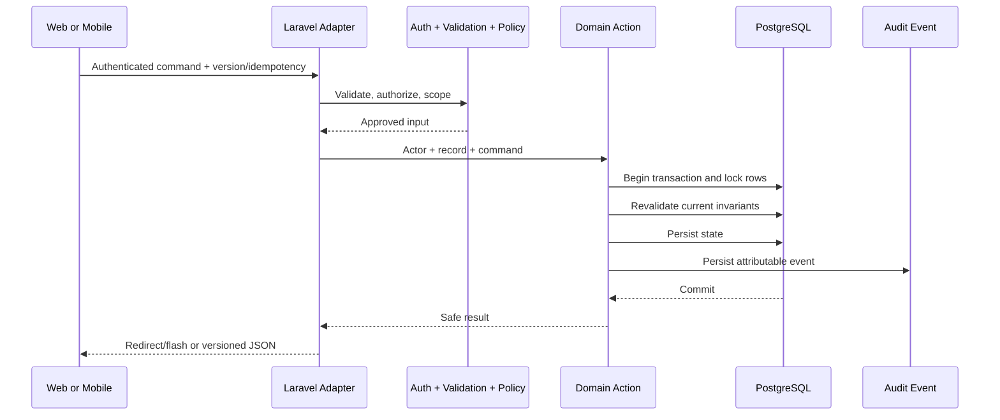
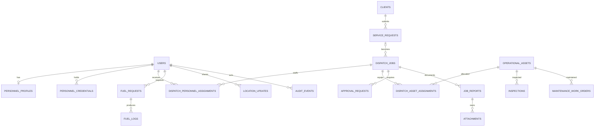
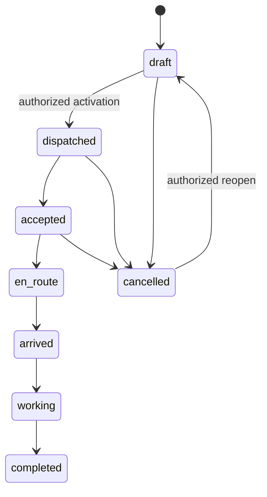
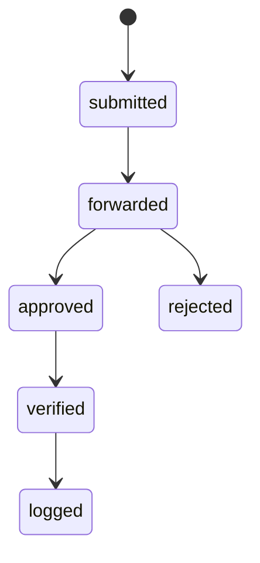
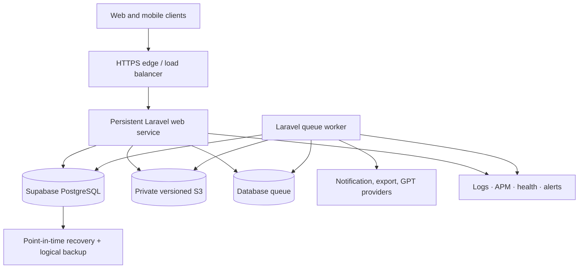

# Core Transaction 2 — Consolidated Technical Architecture

**Document status:** Consolidated architecture specification  
**Last consolidated:** 2026-07-28  
**Architecture style:** Modular Laravel monolith with Inertia/React web and a
focused React Native field client

## 1. Authority and scope

This document consolidates the accepted system architecture, HTTP boundaries,
data model, security controls, state machines, deployment topology, and
technical gaps.

Laravel migrations and application code are authoritative for implemented
behavior. The detailed [Architecture](../Architecture.md),
[Database](../database.md), [HTTP API](../API.md), and
[Phase 0 decisions](../phase-0-baseline.md) remain the maintainable source
documents.

## 2. Technology stack

| Layer | Technology |
| --- | --- |
| Backend | PHP 8.3+, Laravel 13 |
| Authentication | Laravel session authentication for web; Laravel Sanctum device tokens for `/api/v1` |
| Authorization | Spatie Laravel Permission, Laravel policies, permission checks, and scoped Eloquent queries |
| Web | Inertia 3, React 19, TypeScript, Vite, Tailwind CSS 4 |
| Mobile | React Native with Expo development build; focused field-role application |
| Database | PostgreSQL on managed Supabase; SQLite for compatible local tests |
| Queue | Laravel database queue initially |
| File storage | Private, versioned S3-compatible object storage in production |
| Maps | OpenStreetMap development/current web tiles; accepted production routing/provider direction is Mapbox |
| Testing | Pest 4, PHPUnit, TypeScript tests, mobile integration/device tests |
| Quality | PHPStan/Larastan, Laravel Pint, ESLint, Prettier |
| Monitoring direction | Sentry plus Datadog or Better Stack, with health, queue, database, and alert coverage |

## 3. System context

```mermaid
flowchart LR
    WEB[Office and field web users] --> INERTIA[Inertia / React workspace]
    MOBILE[React Native field app] --> API[/api/v1 JSON]
    INERTIA --> WEBMW[Session + CSRF + active + verified + throttle]
    API --> APIMW[Sanctum token + active + verified + throttle]
    WEBMW --> HTTP[Controllers + Form Requests]
    APIMW --> HTTP
    HTTP --> AUTHZ[Policies + scoped queries]
    AUTHZ --> ACTIONS[Domain actions]
    ACTIONS --> DB[(PostgreSQL)]
    ACTIONS --> AUDIT[(Audit events)]
    ACTIONS --> QUEUE[(Database queue)]
    QUEUE --> ASYNC[Notifications · exports · GPT]
    ACTIONS --> FILES[(Private object storage)]
    MOBILE --> OUTBOX[(Durable command outbox)]
    OUTBOX --> API
```

Clients adapt transport and presentation. They do not duplicate or replace
server-side domain rules.

## 4. Business module architecture

| Module | Owns | Important dependencies |
| --- | --- | --- |
| Dispatch Job and Scheduling | Clients, service requests, dispatch jobs, schedule, priority, approval, activation, field status, lifecycle commands | Assignment, asset readiness, audit |
| Driver/Operator and Equipment Assignment | Personnel/asset assignment, eligibility, conflicts, response, reassignment/end | Dispatch schedule, personnel credentials, asset state |
| Fleet Management | Fleet vehicle master data, readiness, inspections, maintenance | Assignment consumes safe/available state |
| Crane and Equipment Management | Crane/equipment master data, capacity/specifications, readiness, inspections, maintenance | Shares `OperationalAsset` storage and behavior |
| Fuel Management | Fuel request, decision stages, verification, log, cost/meter/receipt evidence | Optional dispatch/asset context, attachments, audit |

Shared platform services provide identity, RBAC, personnel profiles,
credentials, location, reports, attachments, notifications, exports, audit, and
GPT assistance.

The product boundaries do not require an `app/Modules` folder. Current Laravel
controllers, actions, models, policies, requests, and view models remain
organized in shared framework directories while ownership rules guide change
impact.

## 5. Application layers

### 5.1 Presentation

- Inertia delivers authenticated pages and initial server-scoped props.
- React components render capability-filtered web experiences.
- Explicit view models map domain data to TypeScript contracts; production
  pages should not depend on raw Eloquent serialization.
- The canonical target is one role-adaptive routed web shell. Fixture/reducer
  surfaces remain design sources until replaced with server-backed behavior.
- The React Native client supports field-only assigned work, assignment
  response, progression, location, and retry/conflict states.

### 5.2 HTTP adapters

- `/operations` is the browser boundary.
- `/api/v1` is the versioned field-mobile boundary.
- Controllers handle transport concerns and delegate critical behavior.
- Form Requests or equivalent request validation authorize and validate complex
  boundary input.
- Local `/dev/*` routes are development-only and not product contracts.

### 5.3 Domain and authorization

- Backed enums define roles, permissions, priorities, and canonical states.
- Policies authorize actions; visibility scopes constrain record discovery.
- Dedicated actions encapsulate assignment, activation, approval, dispatch and
  fuel transitions, lifecycle commands, idempotency, and audit.
- The same action/policy path is used for manual and GPT-assisted acceptance.

### 5.4 Persistence

- Laravel migrations define implemented schema and constraints.
- Eloquent models and relationships implement module and visibility behavior.
- Transactions, deterministic row locks, optimistic versions, foreign keys,
  checks, indexes, and soft deletes preserve integrity.
- PostgreSQL-specific checks are guarded when the local test environment uses
  SQLite.

### 5.5 Asynchronous work

- Audit writes remain synchronous with the owning critical transaction.
- Notifications, exports, and GPT processing use queued jobs.
- Queued work must be idempotent, retry-safe, observable, and represented by an
  explicit pending/completed/failed product state.

## 6. HTTP contracts

### 6.1 Browser contract

`/operations` uses:

- Laravel session authentication;
- CSRF protection;
- active-account and verified-email middleware;
- permission/policy authorization;
- redirects or `303 See Other` after successful mutations;
- Laravel validation error bags;
- typed flash feedback; and
- Inertia props/partial reloads for page state.

Transitional JSON list/detail routes are not a stable external or mobile
contract and should be converted to routed view models or deliberate
`/api/v1` resources.

### 6.2 Mobile contract

`/api/v1` uses:

- revocable, device-named Sanctum bearer tokens;
- explicit API Resources/DTOs;
- JSON validation and authorization errors;
- user-scoped UUID idempotency keys;
- expected record versions;
- `409 Conflict` with a safe current snapshot for stale versions;
- endpoint-specific rate limits; and
- shared policies, validation rules, actions, and audit behavior.

Mobile tokens persist across the accepted eight-hour shift and are immediately
revocable on logout or suspension. Tokens must be stored through platform
secure storage rather than plain async/local storage.

### 6.3 Key endpoint groups

| Boundary | Representative responsibilities |
| --- | --- |
| Authentication | Login, logout, recovery, verification, current user/device |
| Clients and service requests | List/create clients and requests |
| Dispatch | List/detail/create, assign/reassign, assignment response, activate, progress, cancel, reopen, archive, restore |
| Approval | Independent approve/reject with reason |
| Assets | Registry, status, inspection, maintenance, release |
| Fuel | Request, forward, approve/reject, verify, log |
| Tracking | Own location submission and authorized latest-location feed |
| Administration | Users, roles, activation, personnel profiles, credentials |
| Records | Reports, attachments, notifications, summaries, exports |
| GPT | Queue recommendation, inspect lifecycle, accept/reject |

## 7. Critical request flow



If validation, authorization, concurrency, safety, or audit persistence fails,
the authoritative state change fails closed.

## 8. Data architecture

### 8.1 Domain relationship map



### 8.2 Table groups

| Area | Primary tables |
| --- | --- |
| Identity | `users`, Spatie role/permission tables, `personnel_profiles`, `personnel_credentials`, sessions, personal access tokens |
| Dispatch | `clients`, `service_requests`, `dispatch_jobs`, `approval_requests` |
| Assignment | `dispatch_personnel_assignments`, `dispatch_asset_assignments` |
| Assets | `operational_assets`, `inspections`, `maintenance_work_orders` |
| Fuel | `fuel_requests`, `fuel_logs` |
| Tracking and records | `location_updates`, `job_reports`, `attachments`, `notifications`, `gpt_recommendations`, `command_logs`, `audit_events` |
| Framework | migrations, cache, jobs, failed jobs, password resets |

One service request may create multiple dispatch jobs. Fleet and
Crane/Equipment Management intentionally share `operational_assets`.
Assignments preserve active intervals instead of deleting historical rows.

### 8.3 Integrity and performance

- Unique keys protect client, dispatch, asset, credential, and request identity.
- Check constraints cover selected statuses, time ordering, coordinates,
  positive quantities, capacities, meters, and costs.
- Indexes support status, schedule, ownership, subject, and relationship lookups.
- Resource assignment locks job and selected resources in deterministic order,
  then validates the complete batch before committing.
- Duplicate active assignments are currently prevented through locked
  application checks rather than a dedicated partial unique constraint.
- Representative production data and PostgreSQL query plans must be verified
  before rollout.

## 9. Canonical state machines

### Dispatch execution



`pending_approval` and `scheduled` are canonical declared values but do not
currently represent direct field progression steps. Archive/restore acts on
soft deletion without inventing a new dispatch status.

### Fuel



Final logging creates one `FuelLog`; duplicate logging fails.

### Asset safety

Assets may be `available`, `assigned`, `working`, `under_inspection`,
`under_maintenance`, `awaiting_parts`, `ready_for_service`, or `unavailable`.
Failed/conditional inspection and blocking maintenance prevent assignment or
activation. Safe release requires a later passing inspection and no remaining
open blocking work.

## 10. Concurrency, idempotency, and offline behavior

- Dispatch commands carry an optimistic `version`.
- Contended records use database row locks and reauthorization inside the
  transaction.
- Mobile replayable commands carry a user-scoped command UUID and expected
  version.
- The server fingerprints the complete command envelope and replays the
  original response for a matching duplicate.
- Reusing an idempotency key with a different payload must fail.
- The client outbox exposes queued, syncing, failed, conflict, and completed
  states.
- Retryable commands persist for an eight-hour disconnected shift.
- A `409` conflict stops automatic overwrite and requires refresh/review.

## 11. Security architecture

### Authentication and session safety

- Rate-limit login and recovery.
- Regenerate browser sessions after login.
- Revoke sessions/tokens after access changes.
- Require active, non-suspended, verified internal users.
- Bind mobile tokens to named devices and store them in SecureStore.

### Authorization and data isolation

- Enforce permission and policy checks on every sensitive operation.
- Scope record discovery by permission, ownership, or active assignment.
- Never accept client-supplied ownership as authority.
- Omit credentials, co-worker assignment records, secrets, and internal fields
  from view models/resources.

### Database boundary

- Laravel is the only operational data boundary.
- Supabase RLS is enabled on server-owned tables and operational privileges are
  revoked from `anon` and `authenticated` roles.
- Browser and mobile clients do not access operational tables through the
  Supabase Data API.

### Files, location, and GPT

- Validate file MIME from content, enforce size/count/type limits, store
  privately, checksum, authorize download, and audit access.
- Collect precise location only during explicit active-work sharing and prune
  coordinates after 30 days.
- Redact secrets, precise location, and unnecessary PII from GPT context.
- Keep GPT advisory, bounded, expiring, rate-limited, and human-confirmed.

## 12. Production topology



- Co-locate compute, PostgreSQL, and storage in `ap-southeast-1` unless an
  approved residency/latency decision changes the region.
- Use a direct database connection from persistent services where IPv6 is
  available or Supavisor session mode from IPv4-only runtimes.
- Use direct connections for migrations, dumps, and administration.
- Start with database queue; introduce Redis, replicas, realtime transport, or
  microservices only from measured need.

## 13. Reliability and operations

- Availability target: 99.5% monthly for critical authenticated operations,
  excluding announced maintenance.
- RPO: 15 minutes.
- RTO: 4 hours.
- Use point-in-time/fine-grained database recovery, versioned object storage,
  and independent logical backups.
- Monitor HTTP failures, latency, database health, queue depth/failures, storage,
  scheduled commands, GPT usage/cost, and mobile sync conflicts.
- Rehearse deployment rollback, database restore, object recovery, failed-job
  handling, credential revocation, and provider suspension before acceptance.

## 14. Testing strategy

| Layer | Required evidence |
| --- | --- |
| Domain | Focused Pest tests for authorization, validation, state, transactions, locks, conflicts, audit, and rollback |
| HTTP | Inertia redirect/error/flash tests and explicit `/api/v1` resource/error/idempotency contracts |
| Web | Type checks, lint/format, build, component/integration tests, critical browser E2E, accessibility |
| Mobile | Type checks, unit/integration, Expo doctor, export/build smoke, emulator/device E2E, offline/restart/conflict |
| Database | Migration/constraint checks, PostgreSQL query plans, representative load and concurrency |
| Security | Auth, scope, input, upload/download, secrets, location, GPT, throttling, dependency audit |
| Operations | Queue retries, monitoring alerts, backup/restore, deployment rollback, incident runbooks |

## 15. Current gaps

- Complete acceptance evidence for the active native shell, secure storage,
  durable SQLite outbox, device GPS, and physical-device journeys
- Full routed web experiences for reports, attachments, notifications, archive
  management, exports, and GPT review
- Remaining browser contract convergence and removal of raw Eloquent JSON from
  stabilized boundaries
- Endpoint-specific rate limits for uploads, tracking, exports, and GPT
- Browser/mobile E2E, WCAG review, representative load/query evidence, and
  production security review
- Operational monitoring, recovery, retention enforcement, rollout, and
  rollback proof

## 16. Supporting artifacts

- [System overview diagram](../Diagrams/system-overview.excalidraw)
- [Conceptual operations ERD](../Diagrams/operations-erd.prisma)
- [Visual-reference authority](../Diagrams/README.md)
- [Detailed HTTP API](../API.md)
- [Detailed database reference](../database.md)
