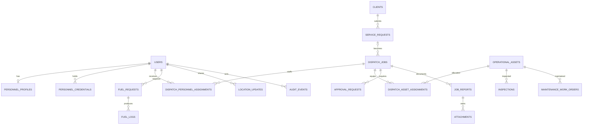

# Core Transaction 2 — Database

**Last updated:** 2026-07-26  
**Source of truth:** Laravel migrations and Eloquent models  
**Production target:** Managed single-region PostgreSQL/Supabase, accessed only
by persistent Laravel web and worker services

## Security boundary

Laravel is the application data boundary. PostgreSQL row-level security is enabled on server-owned tables and privileges are revoked from Supabase `anon` and `authenticated` roles. No RLS policies are created because browser Data API access is intentionally disabled; Laravel authentication, policies, permissions, scopes, validation, and transactions enforce access.

Application compute and Supabase PostgreSQL are co-located in one region.
Persistent Laravel services use a direct connection where IPv6 is available or
Supavisor session mode from IPv4-only runtimes. Migrations, logical dumps, and
administrative operations use a direct connection. The database queue is the
initial queue topology. Hosting provider, final region, storage provider, and
monitoring vendor remain undecided.

## Module ownership

The persistence model supports five top-level business modules:

1. Dispatch Job and Scheduling — clients, service requests, dispatch jobs, and
   approval requests.
2. Driver/Operator and Equipment Assignment — personnel and asset assignment
   relations attached to dispatch jobs.
3. Fleet Management — fleet vehicle records and their safety lifecycle.
4. Crane and Equipment Management — crane and non-fleet equipment records and
   their safety lifecycle.
5. Fuel Management — fuel requests and fuel logs.

Fleet and Crane/Equipment Management intentionally share the
`operational_assets` table and Eloquent model. Identity, location, audit,
reports, attachments, notifications, and GPT records are shared platform data
that supports the five modules. See [Top-level modules](./modules.md).

## Domain map

## Table catalog

### Identity and access

- `users`: identity, login, phone, activation, and suspension metadata.
- Spatie RBAC tables: roles, permissions, and role/user mappings.
- `personnel_profiles`: employee number, availability, emergency contact.
- `personnel_credentials`: license, certification, or qualification validity and verification.
- Laravel tables: sessions, password resets, personal access tokens, cache, jobs, and migrations.

The personal-access-token table is used by the versioned field API. Tokens are
issued and revoked through Sanctum, and the Data API roles are denied access to
both personal access tokens and command logs by the follow-up server-only
migration.

### Modules 1–2: Dispatch and assignment

- `clients`: unique code, company/contact details, active/inactive status, soft delete.
- `service_requests`: client, request/project identity, location, schedule,
  priority, `submitted`/`dispatching` status, requirements, creator, soft
  delete. One request may produce multiple dispatch jobs.
- `dispatch_jobs`: optional service request, unique reference, operational client/title/site snapshot, schedule, priority, status, requirements, creator/activator/canceller, optimistic `version`, soft delete.
- `dispatch_personnel_assignments`: job/user, assignment type, pending/accepted/rejected response status, `responded_at` timestamp, optional `response_reason`, assign/reassign and approval metadata, active interval.
- `dispatch_asset_assignments`: job/asset, assignment type, assign/approval metadata, active interval.
- `approval_requests`: polymorphic subject, kind, requested changes, requester, pending/approved/rejected status, decider and reason.

### Modules 3–4: Fleet and crane/equipment management

- `operational_assets`: unique code/registration, kind/subtype, manufacturer/model, specifications, capacity, meter, location, lifecycle status, soft delete.
- `inspections`: asset, technician, type, result, checklist, findings, completion time.
- `maintenance_work_orders`: asset, technician, status, defect, blocking flag, schedule/due dates, work, parts, release evidence and verifier.

### Module 5: Fuel management and shared platform records

- `fuel_requests`: requester, optional job/asset, quantity/type/purpose, ordered review/approval/verification metadata.
- `fuel_logs`: verified fuel event, quantities, meter readings, station,
  price/cost, receipt path, recorder/verifier. The verified-to-logged fuel
  transition creates this record and can attach private receipt evidence.
- `location_updates`: user, optional asset/job, coordinates, accuracy, speed,
  sharing, source, capture/receive times. Freshness is exposed by the model;
  the scheduled `location:prune` command clears coordinates older than 30 days
  while retaining non-coordinate metadata.
- `gpt_recommendations`: polymorphic subject, requester/decider, context hash,
  recommendation, conflicts, model metadata, lifecycle, usage and expiry. The
  accepted target is `gpt-5-mini` with asynchronous processing and 15-minute
  recommendation expiry; generation, review, accept, reject, and audit routes
  are live. A scheduled 90-day AI metadata retention policy is not yet present.
- `job_reports`: dispatch, author, work interval, summary, status and
  submission time. Scoped list/detail/submit/review routes are live.
- `attachments`: polymorphic owner, private storage metadata, MIME, size,
  checksum and retention. Accepted limits are 15 MiB/file, 10 files/owner, and
  JPEG, PNG, HEIC/HEIF, or PDF; private upload/download routes enforce the
  current limits and audit downloads.
- `notifications`: recipient, optional dispatch, status/data/read time, with
  authorized list and mark-read routes.
- `command_logs`: authenticated user, command UUID, action, payload hash,
  expected version, response/status, and replayable response payload for the
  idempotent browser command slice.
- `audit_events`: actor, polymorphic subject, action, before/after JSON, reason, request ID, IP and occurrence time.

## Integrity and performance

- Unique identifiers protect clients, jobs, assets, credentials, and fuel requests.
- Foreign keys use cascade, restrict, or null-on-delete according to record ownership.
- PostgreSQL checks cover selected status sets, time order, coordinates, positive quantities, accuracy, capacity, meters, and costs.
- Common schedule, status, ownership, subject, and relationship lookups are indexed.
- Critical workflows use transactions and row locks; dispatch status also uses
  optimistic versions. Service-request conversion locks the request and commits
  the draft, request-state change, and audit records together. Resource
  assignment locks the job and selected personnel/assets in deterministic ID
  order, validates the complete batch, then commits assignments, exceptional
  approval, and audit history together.

Application logic enforces personnel role/type qualification, credential
validity, availability and schedule overlap, asset kind/readiness and schedule
overlap, blocking maintenance, duplicate prevention, independent approval,
ordered transitions, post-repair inspection, and assignment-scoped visibility.

## Current caveats

- Some enum domains are enforced in PHP rather than database checks, and PostgreSQL-only checks do not run in SQLite tests.
- Duplicate active assignments are not prevented by a dedicated unique database
  constraint; personnel and asset conflicts are serialized through locked
  resource rows and rechecked transactionally in application code.
- Idempotency is applied to location and field dispatch commands; durable native
  outbox persistence and more granular mobile throttles remain open work.
- Several foreign-key actor/approver columns may need additional indexes as volume grows.
- Laravel timestamps are not explicitly documented as timezone-aware database types.
- [`Diagrams/operations-erd.prisma`](./Diagrams/operations-erd.prisma) is a
  conceptual visual reference, not an executable Prisma schema; Laravel
  migrations remain authoritative for the implemented database.

## Follow-up

- Complete exports, archived-record management, and routed UI for the report,
  attachment, notification, and GPT workflows.
- Add production location-retention enforcement, private-object versioning,
  finer-than-daily database recovery, independent logical backups, and
  rehearsed procedures proving the 15-minute RPO and 4-hour RTO.
- Verify query plans and index use with representative production data.

The operational-record/attachment retention schedule and AI audit retention
beyond 90 days are genuinely **UNDECIDED** pending legal and business policy.
