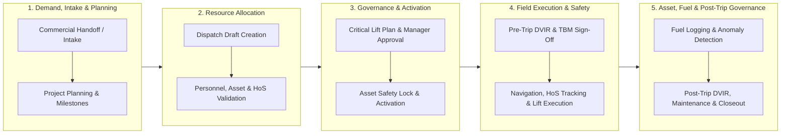
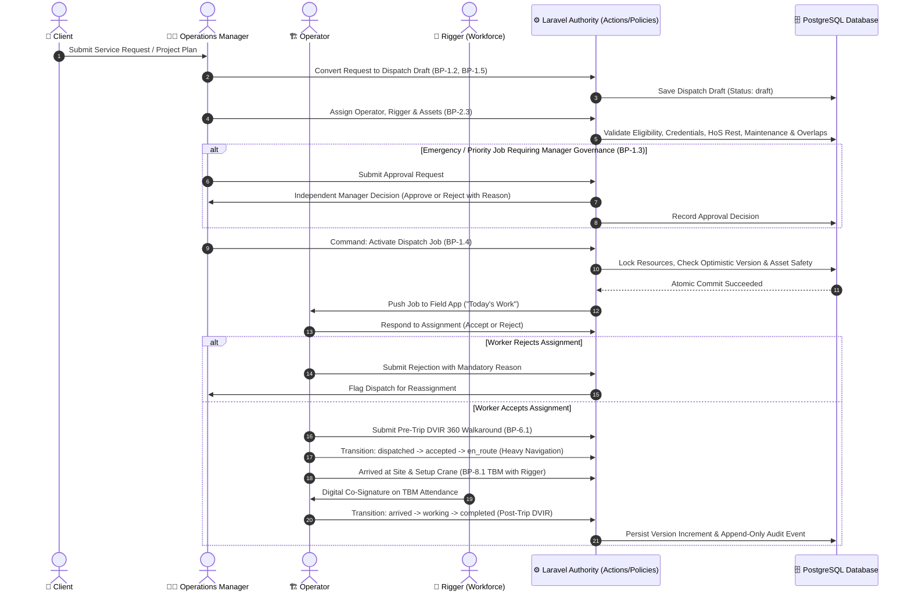
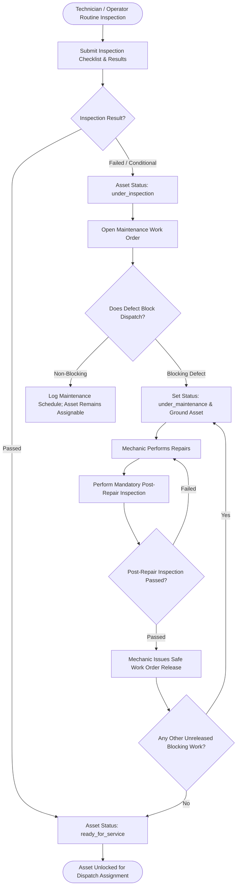

# Core Transaction 2 — Business Process Architecture (BPA)

> **Capstone Project Title:**  
> **DESIGN AND IMPLEMENTATION OF A GPT MINI POWERED DISPATCH AND RESOURCE MANAGEMENT PLATFORM WITH MOBILE APPLICATION FOR REAL TIME TRACKING FOR FIELD SERVICE MONITORING**

**Last updated:** 2026-09-05  
**Status:** Visual and architectural reference for business process taxonomy, value streams, swimlane workflows, and RACI governance.

This document defines the **Business Process Architecture (BPA)** for **Core Transaction 2**. It structures the business capabilities into end-to-end value chains across the **5 Main Operational Business Modules** for the **3 System Users** (`System Administrator`, `Operations Manager`, `Operator`).

For technical data flows, consult [dfd.md](./dfd.md); for system architecture, consult [Architecture.md](../../architecture/Architecture.md); and for module definitions, consult [modules.md](../../architecture/modules.md).

---

## 1. End-to-End Enterprise Value Stream (Level 0 BPA)

Core Transaction 2 converts client heavy-equipment and logistics demand into safely executed, fully audited field operations.

---

## 2. Business Process Hierarchy (Level 1 BPA)

| 5 Main Modules & Services | Process Code | Process Name | Trigger / Input | Primary Output |
| --- | --- | --- | --- | --- |
| **1. Dispatch Job and Scheduling (Real-Time Activation)** | `BP-1.1` | Client Intake & Handoff Conversion | Service demand / Core 1 handoff | Validated Service Request |
| | `BP-1.2` | Job Creation & Draft Conversion | Service Request or Direct Order | Uniquely referenced Dispatch Draft |
| | `BP-1.3` | Priority / Emergency Approval Protocol | High-priority flag on draft job | Manager Approval / Rejection Decision |
| | `BP-1.4` | Server-Authoritative Dispatch Activation | Complete resource assignment | Dispatched / Active Job |
| | `BP-1.5` | Project Planning & Multi-Crane Sequencing | Complex multi-day project demand | Sequenced Milestones & Conflict Check |
| **2. Assign Driver/Operator and Equipment** | `BP-2.1` | Personnel Eligibility & Credentials Check | Draft Job staffing request | Qualified Operator / Rigger Selection |
| | `BP-2.2` | Asset Readiness & Overlap Check | Draft Job equipment request | Safe & Available Asset Selection |
| | `BP-2.3` | Resource Assignment & Conflict Lock | Personnel & Asset selection | Persisted Batch Assignments |
| | `BP-2.4` | HoS Duty Status Tracking & Break Enforcement | Operator status toggle / driving time | Active Duty Log & Rest Prompts |
| | `BP-2.5` | HoS Fatigue Risk Scoring & Audit Trail | Continuous shift monitoring | Fatigue Risk Assessment & Supervisor Warning |
| **3. Fleet Management** | `BP-3.1` | Vehicle Inspection & Defect Intake | Pre/post-trip inspection | Passed Inspection or Maintenance Work Order |
| | `BP-3.2` | Maintenance Repair & Safe Release Gate | Defect report / scheduled service | Certified Asset (`ready_for_service`) |
| | `BP-3.3` | 360-Degree Walkaround Pre/Post-Trip DVIR | Operator shift start/end | Certified DVIR or Grounded Defect |
| | `BP-3.4` | DVIR Defect Repair & Operator Sign-Off | Reported DVIR defect | Maintenance Certification & Operator Acknowledgment |
| **4. Crane and Equipment Management** | `BP-4.1` | Heavy Equipment Certification Check | High-capacity lifting job | Verified Equipment Eligibility |
| | `BP-4.2` | Crane Maintenance & Inspection Release | Equipment fault / inspection | Released Operational Asset |
| **5. Fuel Management** | `BP-5.1` | Fuel Request Intake & Verification | Field driver fuel request | Pending Fuel Authorization |
| | `BP-5.2` | Fuel Approval & Dispense Logging | Pending request review | Verified Fuel Log & Reconciled Cost |
| | `BP-5.3` | Burn Rate Anomaly Detection | Completed fuel log calculation | Flagged Anomaly & Investigation Alert |
| **Platform: Statutory Safety** | `BP-6.1` | Toolbox Meeting (TBM) Digital Briefing | Daily shift start on site | Signed Digital TBM Record (DOLE Rule 1410) |
| | `BP-6.2` | Critical Lift Plan Authorization | Heavy lift >75% / complex rigging | Manager-Approved Lift Plan |
| | `BP-6.3` | Work Stoppage Order (WSO) Governance | Imminent danger observation | Immediate Dispatch Freeze & Resolution Audit |
| **Platform: SOS Emergency** | `BP-7.1` | SOS Distress Trigger & Reverb Broadcast | Worker emergency distress | Real-time Alert on `operations.sos` |
| | `BP-7.2` | Incident Escalation & Structured Resolution | Unacknowledged SOS alert / response | Escalated Alert or Documented Resolution |
| **Platform: Administration** | `BP-8.1` | User Lifecycle, RBAC & Break-Glass Overrides | SysAdmin configuration / incident | Provisioned Users, Permissions, Audit History |

---

## 3. Detailed Process Swimlane Workflows (Level 2 BPA)

### BPA-1: End-to-End Dispatch Intake to Field Activation

### BPA-2: Operational Asset Inspection, Maintenance & Safe Release Protocol

---

## 4. Organizational Governance & RACI Matrix

The RACI matrix defines role accountability across Core Transaction 2 business processes:
- **R (Responsible)**: The role that completes the activity.
- **A (Accountable)**: The sole role with final approval and decision authority.
- **C (Consulted)**: Role offering advisory input or requirements.
- **I (Informed)**: Role updated on process progress.

*(Note: The 3 canonical system users are **Operations Manager**, **Operator**, and **System Administrator**. The Client represents external commercial intake, and Riggers represent non-software workforce crew tracked via `PersonnelProfile` and credentials without user accounts).*

| Process Name | Process Code | Client | Operations Manager | Operator | Rigger (Workforce) | System Admin |
| --- | --- | --- | :---: | :---: | :---: | :---: |
| Service Intake & Handoff Conversion | `BP-1.1 / 1.2` | **C** | **R / A** | **I** | - | - |
| Project Planning & Milestones | `BP-1.5` | **C** | **R / A** | **I** | **I** | - |
| Emergency / Priority Dispatch Approval | `BP-1.3` | **I** | **R / A** | **I** | - | - |
| Personnel & Equipment Assignment | `BP-2.1 / 2.3` | - | **R / A** | **C** | **C** | - |
| Routine Dispatch Activation | `BP-1.4` | **I** | **R / A** | **I** | **I** | - |
| Hours of Service (HoS) Duty Logging | `BP-2.4 / 2.5` | - | **A** | **R** | - | - |
| Pre/Post-Trip DVIR Walkaround | `BP-3.3 / 3.4` | - | **A** | **R** | - | - |
| Asset Inspection & Defect Reporting | `BP-3.1` | - | **A** | **R** | - | - |
| Maintenance Work Order & Safe Release | `BP-3.2` | - | **R / A** | **I** | - | - |
| Heavy Equipment Certification Check | `BP-4.1 / 4.2` | - | **R / A** | **C** | - | - |
| Fuel Request & Dispense Verification | `BP-5.1 / 5.2 / 5.3` | - | **A** | **R** | - | - |
| Toolbox Meeting (TBM) Briefing | `BP-6.1` | - | **A** | **R** | **R** | - |
| Critical Lift Plan Authorization | `BP-6.2` | **C** | **R / A** | **C** | **C** | - |
| Work Stoppage Order (WSO) Governance | `BP-6.3` | **I** | **A** | **R** | **R** | - |
| Field Execution & Status Update | `BP-1.4` | **I** | **I** | **R / A** | **R** | - |
| SOS Emergency Distress & Response | `BP-7.1 / 7.2` | - | **A** | **R** | **I** | - |
| System RBAC & User Administration | `BP-8.1` | - | **C** | - | - | **R / A** |

---

## 5. Key Business Invariants & Policy Controls

1. **Two-Person Emergency Governance Rule**:
   An operations coordinator requesting an emergency job activation *cannot approve their own request*. An independent Operations Manager must evaluate and approve/reject the request.

2. **Asset Safety Release Gate**:
   An operational asset with an active, unreleased blocking maintenance work order or critical DVIR defect *cannot be assigned or activated* on any dispatch job. The server enforces this at atomic lock time.

3. **Strict Field State Progression Invariant**:
   Operators must advance work in strict linear sequence (`dispatched` $\rightarrow$ `accepted` $\rightarrow$ `en_route` $\rightarrow$ `arrived` $\rightarrow$ `working` $\rightarrow$ `completed`). Out-of-order, skipped, or backward state jumps strictly fail.

4. **Human-in-the-Loop GPT Control**:
   GPT assistance generates advisory suggestions only. AI models cannot directly mutate persistence states or trigger activations without explicit human review and authorization.
