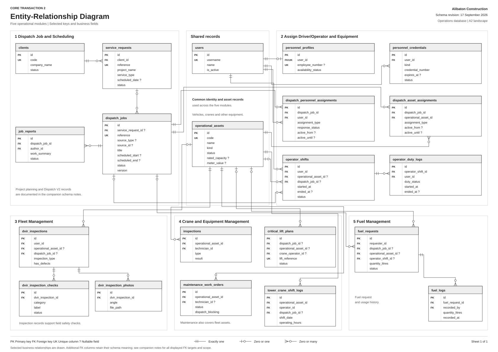
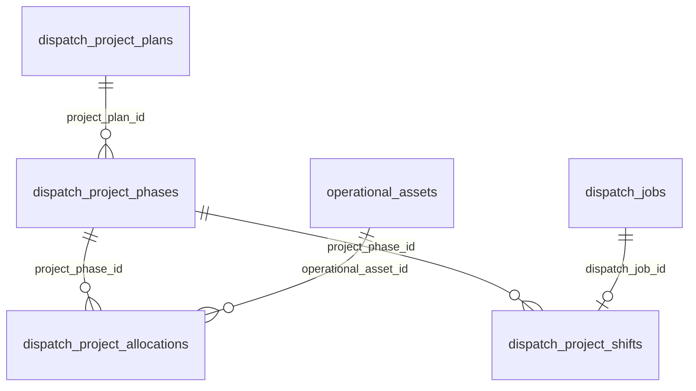
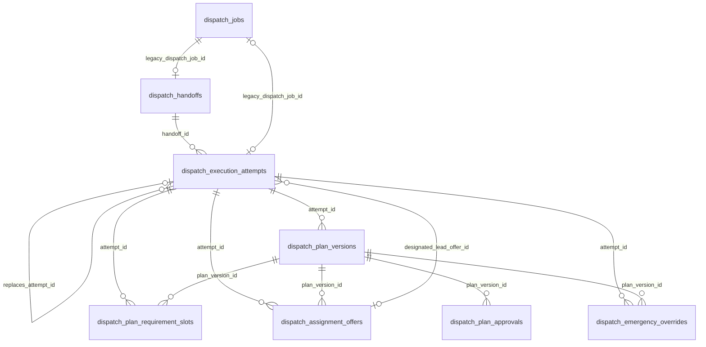
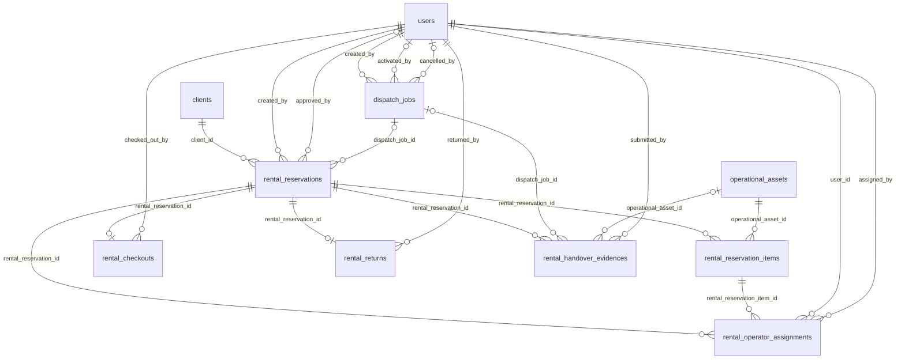
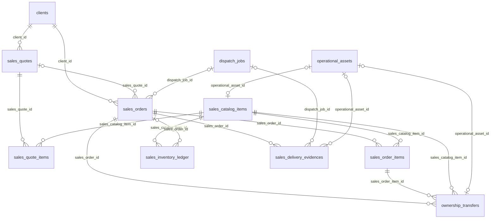

# Core Transaction 2 - Entity-Relationship Diagram

Last updated: 2026-09-17.

The main sheet presents the five operational modules, their shared records, and the keys used to connect them. It contains 21 tables and 122 selected fields. Table names, foreign keys, nullable columns, and single-column unique constraints were checked against the repository migrations.

- [Print PDF - A2 landscape](../../../output/pdf/core2-erd.pdf)
- [Vector diagram](./capstone-erd-clear.svg)
- [Editable diagrams.net diagram](./capstone-erd.drawio)
- [Field and relationship source manifest](./capstone-erd.schema.json)



## Scope and notation

This is the core operational ERD. The printable sheet shows selected business fields and 23 principal relationships. The Mermaid source below includes every declared foreign key among the displayed fields. Additional scheduling, transaction, platform, and tracking records are summarized after the main ERD. Framework tables and a complete column-by-column database dump are outside this sheet's scope.

The revision describes the current repository, including local migration additions. It does not certify which migrations have been applied to a live database.

| Mark | Meaning |
| --- | --- |
| PK | Primary key |
| FK | Declared foreign key |
| UK | Single-column unique constraint |
| ? | Nullable column |
| Two bars | Exactly one related parent |
| Circle and bar | Zero or one related record |
| Circle and crow's foot | Zero or many related records |

A nullable foreign key permits a child record without that parent. A parent may have no child records unless another constraint requires them. The connecting line itself does not indicate whether a relationship is optional; the endpoint symbols do.

## Five-module mapping

| Module | Records shown |
| --- | --- |
| 1. Dispatch Job and Scheduling | `clients`, `service_requests`, `dispatch_jobs`, `job_reports` |
| 2. Assign Driver/Operator and Equipment | `personnel_profiles`, `personnel_credentials`, `dispatch_personnel_assignments`, `dispatch_asset_assignments`, `operator_shifts`, `operator_duty_logs` |
| 3. Fleet Management | `dvir_inspections`, `dvir_inspection_checks`, `dvir_inspection_photos` |
| 4. Crane and Equipment Management | `inspections`, `maintenance_work_orders`, `critical_lift_plans`, `tower_crane_shift_logs` |
| 5. Fuel Management | `fuel_requests`, `fuel_logs` |
| Shared records | `users`, `operational_assets` |

Fleet and Crane/Equipment Management share `operational_assets`. Its `kind` and `subtype` distinguish asset categories. Inspection and maintenance records can apply to both. Placement within a module indicates the business area where a table is explained; it does not impose a database restriction.

The three software roles are held through the permission model. Separate administrator, manager, and operator account tables are not created by these migrations.

## Schema details that affect the diagram

- `dispatch_jobs.service_request_id` is nullable. Manual, rental, and sales dispatches do not require a service-request row.
- `dispatch_jobs.source_type` and `source_id` form a polymorphic application reference. They are not declared database foreign keys.
- `personnel_profiles.user_id` is required and unique in the current migrations. The product description of employees without user accounts is broader than this implemented relationship; the diagram follows the migrations.
- `personnel_credentials` has a composite unique constraint on `(kind, credential_number)`. A credential number is not independently unique.
- An operator may have many historical shifts. A partial unique index permits at most one `active` or `on_break` shift per user; it does not make `operator_shifts.user_id` globally unique.
- `fuel_requests` may reference a job, an asset, and an operator shift independently. Its requester remains required.
- Creator, reviewer, approver, and other role/audit columns are only partly displayed. The table below records FK columns visible on the sheet whose connector lines were omitted for legibility.

| Displayed foreign key | References |
| --- | --- |
| `job_reports.author_id` | `users.id` |
| `operator_duty_logs.user_id` | `users.id` |
| `dvir_inspections.user_id` | `users.id` |
| `dvir_inspections.dispatch_job_id` | `dispatch_jobs.id` |
| `inspections.technician_id` | `users.id` |
| `maintenance_work_orders.technician_id` | `users.id` |
| `critical_lift_plans.dispatch_job_id` | `dispatch_jobs.id` |
| `critical_lift_plans.crane_operator_id` | `users.id` |
| `tower_crane_shift_logs.operator_id` | `users.id` |
| `tower_crane_shift_logs.dispatch_job_id` | `dispatch_jobs.id` |
| `fuel_requests.requester_id` | `users.id` |
| `fuel_requests.operator_shift_id` | `operator_shifts.id` |
| `fuel_logs.recorded_by` | `users.id` |

## Main ERD source

```mermaid
erDiagram
    clients ||--o{ service_requests : client_id
    service_requests o|--o{ dispatch_jobs : service_request_id
    dispatch_jobs ||--o{ job_reports : dispatch_job_id
    users ||--o{ job_reports : author_id
    users ||--o| personnel_profiles : user_id
    users ||--o{ personnel_credentials : user_id
    dispatch_jobs ||--o{ dispatch_personnel_assignments : dispatch_job_id
    users ||--o{ dispatch_personnel_assignments : user_id
    dispatch_jobs ||--o{ dispatch_asset_assignments : dispatch_job_id
    operational_assets ||--o{ dispatch_asset_assignments : operational_asset_id
    users ||--o{ operator_shifts : user_id
    operational_assets o|--o{ operator_shifts : operational_asset_id
    dispatch_jobs o|--o{ operator_shifts : dispatch_job_id
    operator_shifts ||--o{ operator_duty_logs : operator_shift_id
    users ||--o{ operator_duty_logs : user_id
    users ||--o{ dvir_inspections : user_id
    operational_assets o|--o{ dvir_inspections : operational_asset_id
    dispatch_jobs o|--o{ dvir_inspections : dispatch_job_id
    dvir_inspections ||--o{ dvir_inspection_checks : dvir_inspection_id
    dvir_inspections ||--o{ dvir_inspection_photos : dvir_inspection_id
    operational_assets ||--o{ inspections : operational_asset_id
    users ||--o{ inspections : technician_id
    operational_assets ||--o{ maintenance_work_orders : operational_asset_id
    users o|--o{ maintenance_work_orders : technician_id
    dispatch_jobs o|--o{ critical_lift_plans : dispatch_job_id
    operational_assets o|--o{ critical_lift_plans : operational_asset_id
    users o|--o{ critical_lift_plans : crane_operator_id
    operational_assets ||--o{ tower_crane_shift_logs : operational_asset_id
    users ||--o{ tower_crane_shift_logs : operator_id
    dispatch_jobs o|--o{ tower_crane_shift_logs : dispatch_job_id
    users ||--o{ fuel_requests : requester_id
    dispatch_jobs o|--o{ fuel_requests : dispatch_job_id
    operational_assets o|--o{ fuel_requests : operational_asset_id
    operator_shifts o|--o{ fuel_requests : operator_shift_id
    fuel_requests ||--o{ fuel_logs : fuel_request_id
    users ||--o{ fuel_logs : recorded_by
    clients {
        bigint id PK
        string code UK
        string company_name
        string status
    }
    service_requests {
        bigint id PK
        bigint client_id FK
        string reference UK
        string project_name
        string service_type
        timestamp scheduled_date "nullable"
        string status
    }
    dispatch_jobs {
        bigint id PK
        bigint service_request_id FK "nullable"
        string reference UK
        string source_type "nullable"
        bigint source_id "nullable"
        string title
        timestamp scheduled_start "nullable"
        timestamp scheduled_end "nullable"
        string status
        integer version
    }
    job_reports {
        bigint id PK
        bigint dispatch_job_id FK
        bigint author_id FK
        string work_summary
        string status
    }
    users {
        bigint id PK
        string username UK
        string name
        boolean is_active
    }
    operational_assets {
        bigint id PK
        string code UK
        string name
        string kind
        string status
        decimal rated_capacity "nullable"
        decimal meter_value "nullable"
    }
    personnel_profiles {
        bigint id PK
        bigint user_id FK,UK
        string employee_number UK "nullable"
        string availability_status
    }
    personnel_credentials {
        bigint id PK
        bigint user_id FK
        string kind
        string credential_number
        date expires_at "nullable"
        string status
    }
    dispatch_personnel_assignments {
        bigint id PK
        bigint dispatch_job_id FK
        bigint user_id FK
        string assignment_type
        string response_status
        timestamp active_from "nullable"
        timestamp active_until "nullable"
    }
    dispatch_asset_assignments {
        bigint id PK
        bigint dispatch_job_id FK
        bigint operational_asset_id FK
        string assignment_type
        timestamp active_from "nullable"
        timestamp active_until "nullable"
    }
    operator_shifts {
        bigint id PK
        bigint user_id FK
        bigint operational_asset_id FK "nullable"
        bigint dispatch_job_id FK "nullable"
        timestamp started_at
        timestamp ended_at "nullable"
        string status
    }
    operator_duty_logs {
        bigint id PK
        bigint operator_shift_id FK
        bigint user_id FK
        string duty_status
        timestamp started_at
        timestamp ended_at "nullable"
    }
    dvir_inspections {
        bigint id PK
        bigint user_id FK
        bigint operational_asset_id FK "nullable"
        bigint dispatch_job_id FK "nullable"
        string inspection_type
        boolean has_defects
    }
    dvir_inspection_checks {
        bigint id PK
        bigint dvir_inspection_id FK
        string category
        string label
        string status
    }
    dvir_inspection_photos {
        bigint id PK
        bigint dvir_inspection_id FK
        string angle
        string file_path
    }
    inspections {
        bigint id PK
        bigint operational_asset_id FK
        bigint technician_id FK
        string type
        string result
    }
    maintenance_work_orders {
        bigint id PK
        bigint operational_asset_id FK
        bigint technician_id FK "nullable"
        string status
        boolean dispatch_blocking
    }
    critical_lift_plans {
        bigint id PK
        bigint dispatch_job_id FK "nullable"
        bigint operational_asset_id FK "nullable"
        bigint crane_operator_id FK "nullable"
        string lift_reference UK
        string status
    }
    tower_crane_shift_logs {
        bigint id PK
        bigint operational_asset_id FK
        bigint operator_id FK
        bigint dispatch_job_id FK "nullable"
        date shift_date
        decimal operating_hours
    }
    fuel_requests {
        bigint id PK
        bigint requester_id FK
        bigint dispatch_job_id FK "nullable"
        bigint operational_asset_id FK "nullable"
        bigint operator_shift_id FK "nullable"
        decimal quantity_litres
        string status
    }
    fuel_logs {
        bigint id PK
        bigint fuel_request_id FK
        bigint recorded_by FK
        decimal quantity_litres
        timestamp recorded_at
    }
```



## Project planning and Dispatch V2

These records extend modules 1 and 2. A project shift has one required, unique `dispatch_job_id`; a dispatch job may have zero or one project-shift row. A canonical handoff also has one required, unique legacy job link.



Dispatch V2 preserves handoffs, execution attempts, plan versions, requirement slots, offers, and approvals:



Related persistence includes `dispatch_idempotency_keys`, `dispatch_outbox_messages`, `dispatch_audit_lineage`, `dispatch_reconciliation_runs`, and `dispatch_reconciliation_findings`.

## Rental and sales operational records

The diagrams below show the implemented Core-2 records. They do not establish completion of upstream Core 1 integration or move commercial ownership into Core-2.



Sales catalog and fulfillment records:



`rental_handover_evidences` and `sales_delivery_evidences` are defined by the 17 September migration. Each evidence row has a required parent reservation/order, a required submitting user, and an optional dispatch job.

`sales_orders.sales_quote_id` is not unique in the migrations. The physical schema therefore permits multiple orders to refer to a quote. `ownership_transfers` has composite uniqueness on `(sales_order_item_id, sales_catalog_item_id)` and single-column uniqueness on `operational_asset_id`; the latter must not be mistaken for uniqueness on `sales_order_item_id` alone.

## Shared platform and Tracking database

| Area | Principal records |
| --- | --- |
| AI assistance | `gpt_recommendations`, `gpt_recommendation_metrics` |
| Audit and documents | `audit_events`, `attachments`, `notifications`, `report_exports` |
| Emergency response | `sos_incidents`, `sos_incident_recipients`, `sos_delivery_attempts`, `sos_emergency_contacts` |
| Site safety | `toolbox_meetings`, `site_hazard_tickets`, `work_stoppage_notices` |

GPT subjects, attachment owners, and audit subjects use polymorphic identifiers rather than a foreign key to every possible subject table. JSON arrays such as work-stoppage asset IDs and toolbox-meeting attendance are not junction tables and do not create foreign-key constraints.

Tracking is stored in a separate service database:

| Tracking table | Key references |
| --- | --- |
| `location_samples` | Scalar `user_id`; optional scalar `operational_asset_id` and `dispatch_job_id` |
| `latest_locations` | Nullable, unique `user_id`; optional scalar `operational_asset_id`, `dispatch_job_id`, and `location_sample_id` |
| `tracking_command_receipts` | Unique `command_id`; optional scalar `user_id` and `location_sample_id` |

These reference columns have no declared foreign-key constraints, including `location_sample_id` within Tracking. The Operations database retains the older `location_updates` table and model. A cross-service ID reference must not be drawn as a database-enforced relationship between Operations and Tracking.

## Source and verification

The build script checks all selected table/column names and drawn FK targets against the migrations, and rejects overlapping entities or connectors through table interiors. The PDF is rendered and visually reviewed after generation. This documentation change does not run migrations or modify application data.

Sources for the main sheet:

- [0001_01_01_000000_create_users_table.php](../../../apps/operations/database/migrations/0001_01_01_000000_create_users_table.php)
- [2026_07_17_033608_add_account_status_to_users_table.php](../../../apps/operations/database/migrations/2026_07_17_033608_add_account_status_to_users_table.php)
- [2026_07_17_033609_create_dispatch_foundation_tables.php](../../../apps/operations/database/migrations/2026_07_17_033609_create_dispatch_foundation_tables.php)
- [2026_07_17_033610_create_maintenance_and_fuel_tables.php](../../../apps/operations/database/migrations/2026_07_17_033610_create_maintenance_and_fuel_tables.php)
- [2026_07_17_033612_create_clients_requests_and_personnel_tables.php](../../../apps/operations/database/migrations/2026_07_17_033612_create_clients_requests_and_personnel_tables.php)
- [2026_07_17_033613_align_dispatch_assets_and_operations_tables.php](../../../apps/operations/database/migrations/2026_07_17_033613_align_dispatch_assets_and_operations_tables.php)
- [2026_07_17_033614_create_reports_attachments_and_notifications_tables.php](../../../apps/operations/database/migrations/2026_07_17_033614_create_reports_attachments_and_notifications_tables.php)
- [2026_07_26_000001_add_response_fields_to_dispatch_personnel_assignments_table.php](../../../apps/operations/database/migrations/2026_07_26_000001_add_response_fields_to_dispatch_personnel_assignments_table.php)
- [2026_08_09_130000_add_usernames_to_users_table.php](../../../apps/operations/database/migrations/2026_08_09_130000_add_usernames_to_users_table.php)
- [2026_08_11_100000_create_rental_and_sales_tables.php](../../../apps/operations/database/migrations/2026_08_11_100000_create_rental_and_sales_tables.php)
- [2026_08_14_120000_add_source_to_dispatch_jobs.php](../../../apps/operations/database/migrations/2026_08_14_120000_add_source_to_dispatch_jobs.php)
- [2026_08_24_120000_add_dispatch_read_model_indexes.php](../../../apps/operations/database/migrations/2026_08_24_120000_add_dispatch_read_model_indexes.php)
- [2026_08_27_150000_add_telemetry_and_resubmission_to_job_reports.php](../../../apps/operations/database/migrations/2026_08_27_150000_add_telemetry_and_resubmission_to_job_reports.php)
- [2026_08_27_170000_add_variance_and_anomaly_to_fuel_logs.php](../../../apps/operations/database/migrations/2026_08_27_170000_add_variance_and_anomaly_to_fuel_logs.php)
- [2026_08_28_140000_add_site_coordinates_to_dispatch_jobs.php](../../../apps/operations/database/migrations/2026_08_28_140000_add_site_coordinates_to_dispatch_jobs.php)
- [2026_08_28_150000_add_site_coordinates_to_dispatch_asset_assignments.php](../../../apps/operations/database/migrations/2026_08_28_150000_add_site_coordinates_to_dispatch_asset_assignments.php)
- [2026_08_28_160000_add_planned_crane_slots_to_dispatch_jobs.php](../../../apps/operations/database/migrations/2026_08_28_160000_add_planned_crane_slots_to_dispatch_jobs.php)
- [2026_08_29_170000_create_safety_governance_tables.php](../../../apps/operations/database/migrations/2026_08_29_170000_create_safety_governance_tables.php)
- [2026_08_30_140000_create_lifting_and_tower_crane_shift_tables.php](../../../apps/operations/database/migrations/2026_08_30_140000_create_lifting_and_tower_crane_shift_tables.php)
- [2026_08_31_150000_create_hours_of_service_tables.php](../../../apps/operations/database/migrations/2026_08_31_150000_create_hours_of_service_tables.php)
- [2026_08_31_160000_create_dvir_tables.php](../../../apps/operations/database/migrations/2026_08_31_160000_create_dvir_tables.php)
- [2026_09_06_120000_add_digital_signatures_to_job_reports_table.php](../../../apps/operations/database/migrations/2026_09_06_120000_add_digital_signatures_to_job_reports_table.php)
- [2026_09_06_130000_create_dvir_inspection_photos_table.php](../../../apps/operations/database/migrations/2026_09_06_130000_create_dvir_inspection_photos_table.php)
- [2026_09_06_140000_add_storage_disk_and_checksum_to_dvir_photos.php](../../../apps/operations/database/migrations/2026_09_06_140000_add_storage_disk_and_checksum_to_dvir_photos.php)
- [2026_09_07_020000_add_operator_shift_id_to_fuel_requests_table.php](../../../apps/operations/database/migrations/2026_09_07_020000_add_operator_shift_id_to_fuel_requests_table.php)
- [2026_09_07_120000_add_mobile_idempotency_to_fuel_requests.php](../../../apps/operations/database/migrations/2026_09_07_120000_add_mobile_idempotency_to_fuel_requests.php)
- [2026_09_13_120000_add_email_otp_to_users_table.php](../../../apps/operations/database/migrations/2026_09_13_120000_add_email_otp_to_users_table.php)

Supplemental relationships come from the [Operations migrations](../../../apps/operations/database/migrations/) and [Tracking migrations](../../../apps/tracking/database/migrations/).

To regenerate with Python and ReportLab installed, run from the repository root:

```text
python Docs/design/Diagrams/build-capstone-erd.py
```

The PDF is written to `output/pdf/core2-erd.pdf`; the SVG, editable diagram, manifest, and this companion source are written beside the builder. Review both the diagram and this source after changing the selected schema fields. Earlier `.prisma` reference diagrams are historical views and have not been synchronized by this revision.
