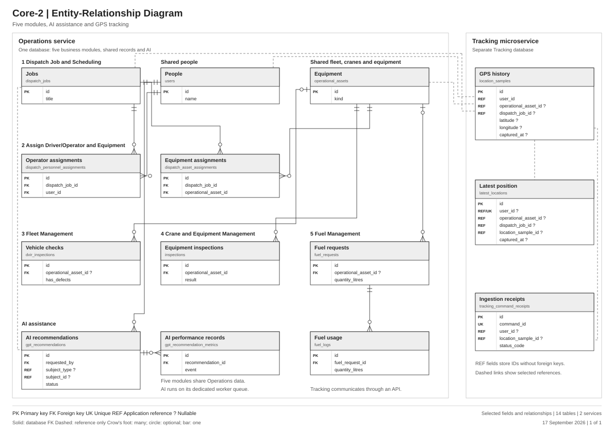

# Core-2: Simplified ERD

Last updated: 2026-09-17.

The finalized ERD fits on one A3 landscape page. It shows all five operational modules, AI inside Operations, and GPS records in the separate Tracking database. Each of the 14 selected tables appears once.

- [Printable one-page PDF](../../../output/pdf/core2-erd-simple.pdf)
- [One-page image](../../../output/pdf/core2-erd-simple.png)
- [Vector diagram](./core2-erd-simple.svg)
- [Editable diagrams.net copy](./core2-erd-simple.drawio)
- [Detailed ERD and schema notes](./capstone-erd.md)



| Module | Main records shown |
| --- | --- |
| 1. Dispatch Job and Scheduling | Jobs |
| 2. Assign Driver/Operator and Equipment | Operator assignments; equipment assignments |
| 3. Fleet Management | Vehicle checks |
| 4. Crane and Equipment Management | Equipment inspections |
| 5. Fuel Management | Fuel requests; fuel usage |

People and equipment are shared records. The equipment table covers vehicles, cranes, and other assets. Vehicle checks and equipment inspections can apply across these asset categories; the module placement explains their main business use.

## AI and Tracking ownership

| Service | Responsibility | Key records |
| --- | --- | --- |
| Operations | All five business modules, identity, shared assets, and AI assistance | `users`, `dispatch_jobs`, `operational_assets`, `gpt_recommendations`, `gpt_recommendation_metrics` |
| Tracking microservice | GPS history, latest positions, and ingestion receipts | `location_samples`, `latest_locations`, `tracking_command_receipts` |

AI generation runs on the `ai` queue within Operations, as implemented by [GenerateGptRecommendationJob](../../../apps/operations/app/Platform/Gpt/Jobs/GenerateGptRecommendationJob.php). AI records use the Operations database. The external model provider is called by Operations; the project does not define a separate AI microservice database.

`gpt_recommendations.requested_by` is a database FK to `users.id`. `gpt_recommendation_metrics.recommendation_id` is a database FK to `gpt_recommendations.id`. The recommendation's `subject_type` and `subject_id` are a polymorphic application reference, which can identify a dispatch job or another supported record. The dashed job-to-recommendation line represents that application reference.

Tracking stores Operations user, job, and asset IDs as scalar references. It declares no cross-database foreign keys. Its `location_sample_id` columns are also unconstrained scalar references, including within the Tracking database. `latest_locations.user_id` is nullable and unique; `tracking_command_receipts.command_id` is unique. Dashed references carry no database-enforced cardinality symbols.

The service boundaries follow the [two-service architecture](../../microservice/architecture.md). The repository also retains Operations' older `location_updates` table and multiple adapters in [TrackingServiceProvider](../../../apps/operations/app/Platform/Tracking/TrackingServiceProvider.php). This is a schema view of the isolated two-service architecture, not a check of the currently deployed tracking driver.

## Notation and scope

PK marks a primary key; FK a declared foreign key; UK a unique column; REF an application reference with no FK constraint. A question mark indicates a nullable column. Crow's-foot endpoint symbols distinguish exactly one, zero or one, and zero or many related records. Solid lines are declared database foreign keys. Dashed lines are application references, including cross-service IDs and polymorphic subjects.

The sheet omits secondary tables, extra fields, and additional relationships. It does not change the database schema. The detailed companion retains the broader operational model, including project planning, operator hours, rental and sales records.

The one-page diagram contains ten drawn FK relationships and six drawn application references. The builder checks selected fields and FK targets against the current migrations, rejects FK links across the two services, and verifies that reference-only columns have no declared FK. The PDF was rendered and the page was visually reviewed.

## Regeneration

`build-simple-erd.py` delegates to `build-service-erd.py`, which reuses the migration reader and vector drawing functions in `build-capstone-erd.py`. The PDF and editable diagrams.net document each contain one A3 landscape page. SVG and PNG exports show the same complete diagram. The earlier detailed exports remain available.

To regenerate with Python and ReportLab installed, run from the repository root:

```text
python Docs/design/Diagrams/build-simple-erd.py
```

The AI and Tracking fields are defined by these migrations:

- [AI recommendation records](../../../apps/operations/database/migrations/2026_07_17_033611_create_tracking_and_gpt_tables.php)
- [AI recommendation metrics](../../../apps/operations/database/migrations/2026_08_09_120000_create_gpt_recommendation_metrics_table.php)
- [GPS history](../../../apps/tracking/database/migrations/2026_09_09_000001_create_location_samples_table.php)
- [Latest positions](../../../apps/tracking/database/migrations/2026_09_09_000002_create_latest_locations_table.php)
- [Tracking command receipts](../../../apps/tracking/database/migrations/2026_09_09_000003_create_tracking_command_receipts_table.php)
