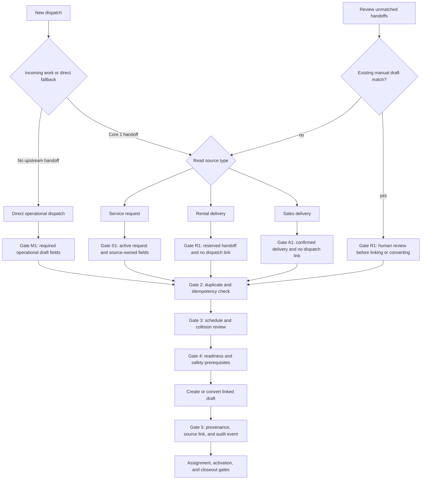

# Dispatch intake source graph

This graph defines the decision path behind the single Core 2 **New dispatch** entry. Core 1 identifies the source; Core 2 routes the handoff into the correct workflow. Manual/direct dispatch remains an explicit fallback.

## Gate contract

| Gate | Applies to | User-facing rule | Enforcement boundary |
| --- | --- | --- | --- |
| 0. Authorization | Every branch | Only users with the dispatch creation capability can see or submit New dispatch. | Capability view model, route middleware, policies |
| 1. Source eligibility | Every branch | The source must be in the allowed lifecycle state and visible to the current user. | Server-side request validation and source-specific action |
| 2. Duplicate/idempotency | Service, rental, sales, reconciliation | Do not create a second operational execution for an already-linked source. | Source link checks and idempotent command/action |
| 3. Schedule/collision | Every dispatch that has a window | A draft can be created, but scheduling or activation must surface temporal and resource conflicts. | Dispatch command layer and conflict review |
| 4. Readiness/safety | Every dispatch before activation | Required technical, site, and safety prerequisites must be explicit before work becomes executable. | Readiness rules, checklist, and activation transition |
| 5. Provenance/audit | Every successful branch | Preserve whether the dispatch is manual, service, rental, or sales-originated, plus the source identifier. | Transactional write and audit event |
| 6. Assignment/closeout | Downstream lifecycle | Assignment, field milestones, condition changes, and closeout remain separate authorized transitions. | Existing dispatch workflow and audit trail |

## Branch semantics

- **Direct operational dispatch** creates a direct Core 2 operational draft. It carries `manual_intake` provenance and does not create a commercial transaction.
- **Service request** preserves the service request link. One request may produce multiple linked draft dispatches when the work is staged or multi-phase.
- **Rental delivery** converts only an eligible reserved rental handoff and keeps the reservation as the source record.
- **Sales delivery** converts only an eligible confirmed sales handoff and keeps the sales order as the source record.
- **Review unmatched handoffs** is a review queue, not a source choice. A suggested manual-draft match is advisory until a human confirms the link or conversion.

The UI may hide unavailable incoming work, but it must never infer authorization from the presence of a card. Every conversion remains server-authoritative and must fail safely when the source becomes stale between render and submit. Automatic routing creates or opens a draft workflow; it never assigns resources or activates work without the downstream gates.
