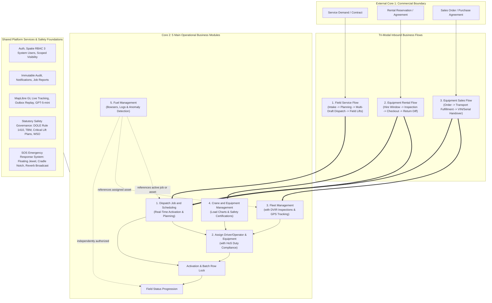
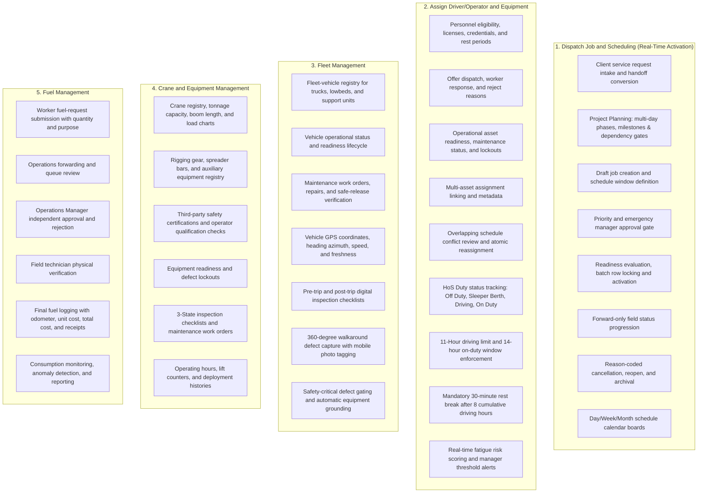
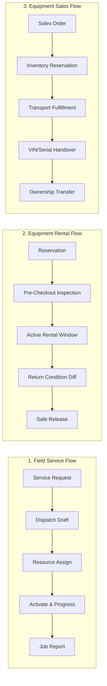
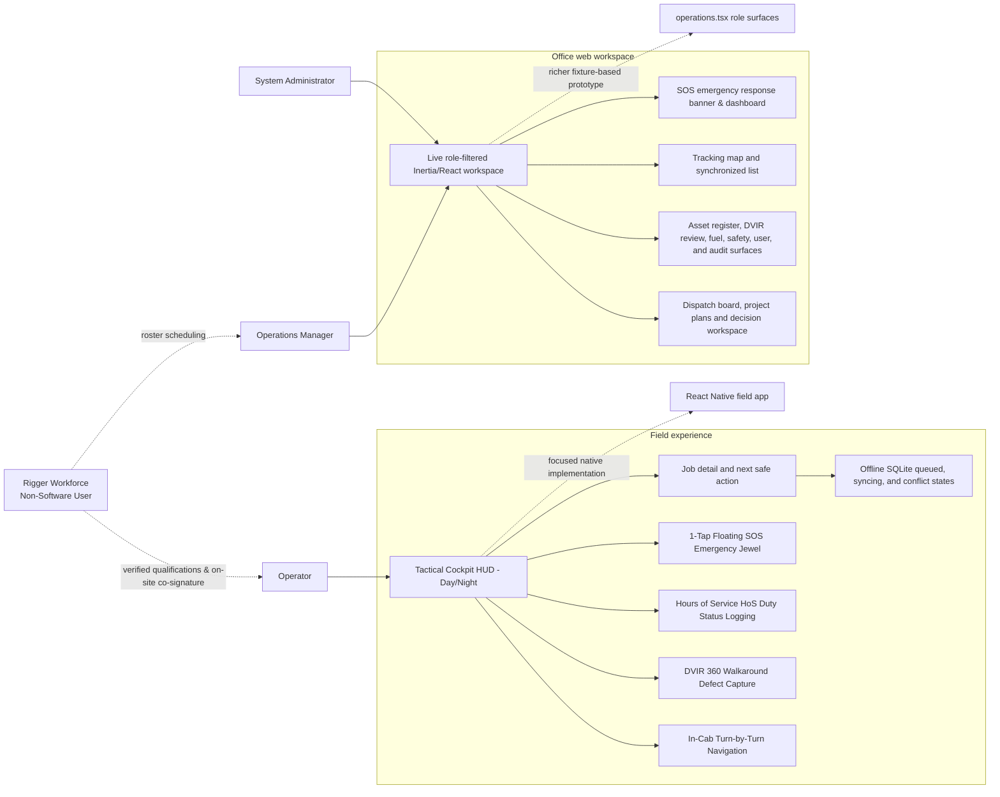
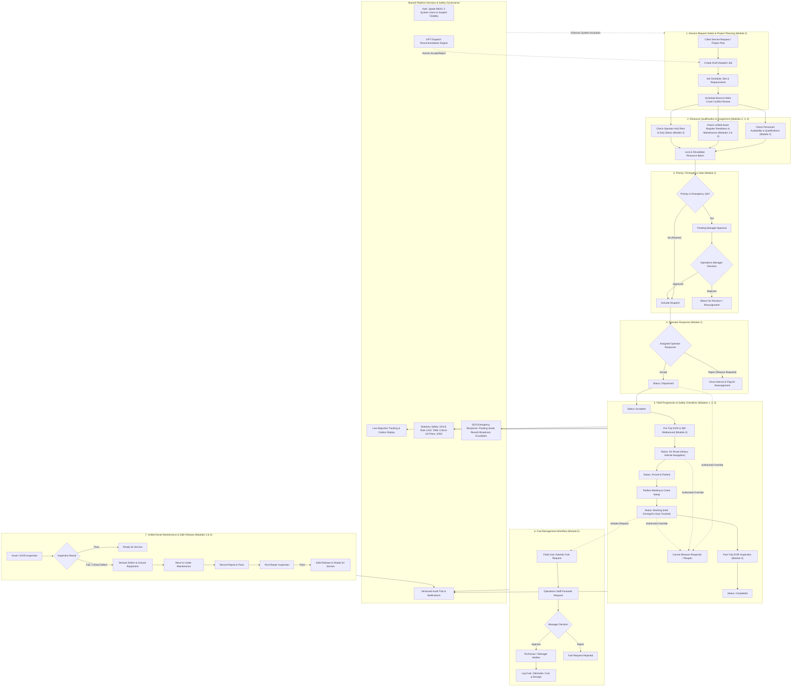

# Core Transaction 2 - Module and Flow Architecture Map

> **Capstone Project Title:**  
> **DESIGN AND IMPLEMENTATION OF A GPT MINI POWERED DISPATCH AND RESOURCE MANAGEMENT PLATFORM WITH MOBILE APPLICATION FOR REAL TIME TRACKING FOR FIELD SERVICE MONITORING**

**Last updated:** 2026-09-05  
**Status:** Canonical architecture and boundary diagram

This document visualizes the **5 Main Operational Business Modules** (1. Dispatch Job and Scheduling [Real-Time Activation], 2. Assign Driver/Operator and Equipment, 3. Fleet Management, 4. Crane and Equipment Management, 5. Fuel Management), the **3 Tri-Modal Inbound Business Flows**, shared
platform services, role-based UI surfaces, and the operational dependency
flow for the **3 System Users** (`System Administrator`, `Operations Manager`, `Operator`). [modules.md](../../architecture/modules.md),
[features.md](../../product/features.md), migrations, and application code remain
authoritative.

## Status legend

- **Live backend/UI** - server-backed behavior is exposed through the current
  routed workspace or a dedicated UI surface.
- **Partial** - the backend or a meaningful UI slice exists, but the complete
  experience is still being connected.
- **Prototype** - demonstrated by fixture/reducer UI and not evidence of live
  product behavior.
- **Planned** - accepted direction without a complete implementation.

## System & Flow Architecture

Core 1 owns Sales, CRM, Client, Job Order, Rental, and Project Management and
is external to this repository. Core 2 receives three actionable business transaction flows:
**Service, Rental, and Sale**. These flows are scheduled, staffed, equipped, and executed by the
**5 main operational business modules** (Dispatch with Planning, Assignment, Fleet, Cranes, Fuel), with DVIR, HoS, and Safety acting as integrated capabilities.

Rental and Sales operations use backend flow handlers in `app/Modules/Rental` and `app/Modules/Sales`
to coordinate equipment reservation, inspection diffs, and prevent inventory collisions with active dispatch operations.

## Module and Submodule Map

### Tri-Modal Inbound Flow Lifecycle Steps

## Role-based UI/UX surfaces

The current production boundary is the routed web workspace and dispatch
detail page. The richer `operations.tsx` role surfaces are design/prototype
sources, while `packages/field-mobile` contains the partial native field
application. The native app is intentionally focused on field work and does
not reproduce the office administration workspace.

## Operational dependency flow

Every state-changing action remains subject to server-side authorization,
validation, optimistic-version checks where applicable, and audit recording.
The UI should explain the next decision, its consequence, and any stale,
blocked, offline, or conflicting state before the user confirms an action.

## Current implementation references

- Live web entry point: `resources/js/pages/workspace.tsx`
- Live dispatch detail: `resources/js/pages/dispatch-detail.tsx`
- Live workspace sections: `resources/js/components/workspace/`
- Prototype role surfaces: `resources/js/pages/operations.tsx` and
  `resources/js/components/surfaces/`
- Native field entry point: `packages/field-mobile/src/navigation/AppNavigator.tsx`
- Server-side role navigation and capabilities:
  `app/ViewModels/OperationsWorkspaceViewModel.php`
