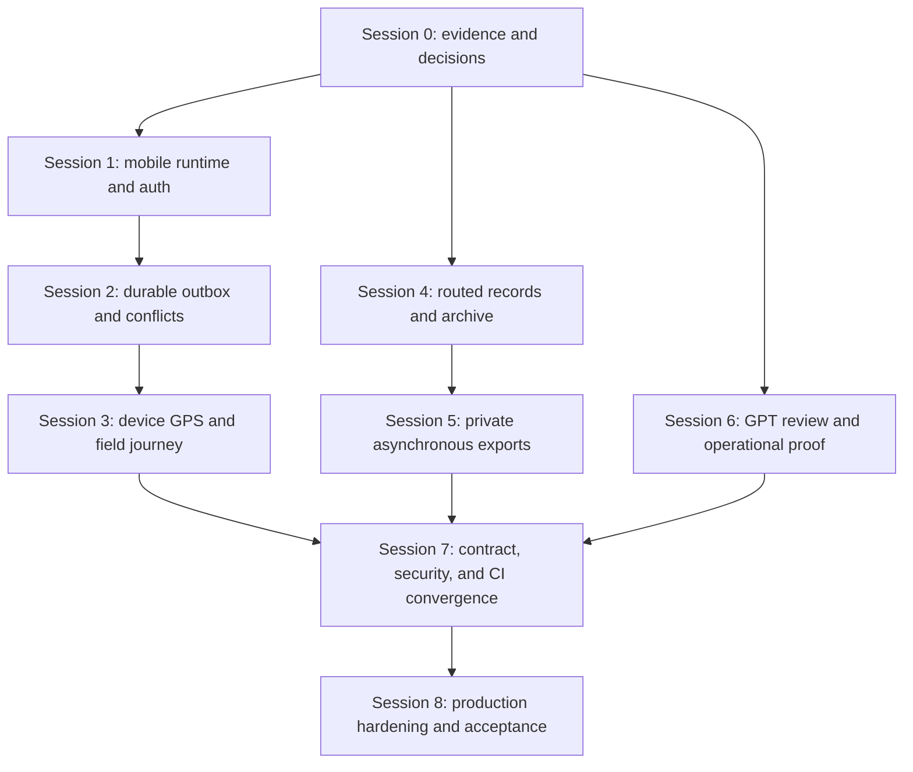

# Core Transaction 2 - Capstone Completion Plan

**Status:** Active execution plan  
**Last updated:** 2026-07-31  
**Purpose:** Close the remaining mandatory capstone and production-readiness
gates without rebuilding capabilities already present in the repository.

## Objective

Deliver a release-ready Core Transaction 2 application with:

- a runnable Android 11+ React Native field application for Driver, Crane
  Operator, and Field Technician;
- durable eight-hour offline command handling and explicit conflict recovery;
- device-backed location sharing with the accepted privacy and freshness rules;
- complete routed web workflows for reports, attachments, notifications,
  archived records, exports, and GPT recommendation review;
- one stable browser contract, one stable versioned mobile contract, and
  CI coverage for both;
- documented production infrastructure, monitoring, recovery, security,
  accessibility, and rollout evidence.

This plan is subordinate to the [product requirements](../prd.md),
[business rules](../business_rules.md), [Phase 0 decisions](../phase-0-baseline.md),
and [roadmap](../Roadmap.md). If implementation evidence and a status document
disagree, code, migrations, routes, and passing tests define current behavior;
the status documents must then be corrected.

## Empirical Capstone Problem Alignment

This execution plan directly resolves the operational failure modes identified in the [BSIT Capstone Requirements Questionnaire](../consolidated/supplements/capstone-requirements-questionnaire.md) gathered at Bestlink College of the Philippines:

| Empirical Field Problem | Cause Identified | Capstone Plan Resolution & Execution Sessions |
| --- | --- | --- |
| **Frequent Double Bookings** | Manual scheduling via OneDrive/Excel activity calendars | **Sessions 0 & 4:** Automated schedule collision checks, server-authoritative overlap validation, and row-level database locking (`PersonnelAssignment`, `AssetAssignment`). |
| **Assignment & Qualification Delays** | Searching physical HR / 201 files for licenses/certifications | **Sessions 1 & 7:** Server-side verification of valid driver licenses and crane operator certifications prior to dispatch activation. |
| **Unmonitored Breakdowns** | Hydraulic leaks, electrical faults, mechanical wear | **Sessions 4 & 8:** Equipment inspection checklists, work order defect tracking, and enforcing the post-repair passing inspection safe release gate (`ready_for_service`). |
| **Untracked Heavy Assets** | Real-time GPS available only for service vehicles | **Sessions 3 & 8:** Mobile device GPS integration, OpenStreetMap live telemetry feed, and freshness state classification for all fleet and heavy machinery. |
| **Excessive Fuel & Lack of Variance Controls** | Weekly manual fuel logs without cost/mileage tracking | **Sessions 4 & 5:** Enforces strict 6-stage fuel workflow (`submitted → forwarded → approved/rejected → verified → logged`), anti-self-approval rule, odometer/hour meter logging, and fuel usage export reports. |
| **Informal Messaging Delays** | Communication via Viber, Messenger, and phone calls | **Sessions 1, 2, & 3:** Dedicated React Native field mobile app and touch-first Inertia view for assigned field status progression (`Today's Work`). |
| **Excessive Waiting / Idle Time** | Lack of central operational visibility | **Sessions 4 & 6:** Real-time Operations Overview dashboard surfacing pending approvals, resource blockers, and stale telemetry. |

## Verified starting point

Do not reimplement these existing foundations:

- The live Inertia dispatch lifecycle covers intake, draft conversion,
  assignment, exceptional approval, activation, assignment response,
  reassignment, cancellation, reopen, archive/restore backend behavior, and
  assigned field progression.
- `/api/v1` already provides device-token authentication, assigned-job
  list/detail, assignment response, forward-only progression, location
  submission, idempotency, and optimistic conflict responses.
- `packages/field-mobile/` contains a runnable Expo native shell around the
  typed API, workflow, outbox, conflict, location, and field-screen building
  blocks. Session 2 has since replaced the memory-only outbox with a durable,
  actor-scoped SQLite repository and explicit conflict recovery.
- The browser tracking workspace already has a server-backed OpenStreetMap
  view, synchronized list, freshness states, polling, local location outbox,
  and 30-day precise-coordinate pruning.
- Final fuel logging, receipt persistence, log history, and the routed form are
  implemented and covered by `FuelAndTrackingWorkflowTest`; documentation that
  still labels final logging as incomplete is stale.
- Asset maintenance records already expose scheduling, parts, work performed,
  and next-due fields. Remaining work must be based on a behavior audit rather
  than the older roadmap summary.
- Reports, private attachments, notifications, daily summaries, and the GPT
  lifecycle have server-backed routes and focused Pest coverage, but their
  complete routed product experiences are not live.
- `composer ci:check` passes with 180 Pest tests and 1,503 assertions, and the
  production web build succeeds.
- The mobile package type-check and 22-test suite pass. An Android JavaScript
  export also passes with Hermes bytecode disabled for this Windows validation
  environment; an installable native binary still requires the platform SDK.

## Execution principles

- Run one editing session at a time in the shared workspace.
- Start every session by checking the worktree and reading affected code,
  tests, and current documentation.
- Use focused Pest coverage for Laravel behavior and automated component,
  integration, and device-flow coverage for web and mobile behavior.
- Keep policies, validation, transitions, transactions, idempotency, and audit
  behavior in Laravel. Clients are adapters, not alternate authorities.
- Each session must be independently reviewable and mergeable.
- Update affected status, API, architecture, and product documents in the same
  session as the implementation.
- Do not enable production credentials, deploy, commit, push, or open a pull
  request unless explicitly authorized.

## Dependency map



## Session 0 - Evidence reconciliation and blocking decisions

**Complexity:** Medium  
**Risk:** Medium - incorrect status labels can cause duplicate or conflicting
implementation.

### Actions

1. Re-run the baseline checks:
   `composer ci:check`, `npm.cmd run build`,
   `npm.cmd --prefix packages/field-mobile run types:check`, and the mobile
   package tests after workspace installation is corrected.
2. Audit every Partial and Planned item in `Docs/features.md`,
   `Docs/requirements.md`, and `Docs/Roadmap.md` against routes, actions,
   view models, UI, migrations, and tests.
3. Correct known stale statements for final fuel logging and any maintenance
   workflows proven complete.
4. Record decisions required by later sessions:
  - Expo development build or bare React Native runtime;
  - supported Android phone versions and the physical phone test target;
  - foreground/background location behavior, capture cadence, and OS
     permission copy;
  - secure token storage and durable outbox technology;
  - mobile E2E runner;
  - export datasets, formats, expiry, and retention;
  - production hosting, region, storage, monitoring, map/routing, and push
     providers;
  - operational-record/attachment retention and AI retention beyond 90 days.
5. Standardize package management. The recommended minimal path is npm
   workspaces because root scripts and GitHub Actions already use npm and
   `package-lock.json`; if pnpm is selected instead, remove the split workflow
   and update all local and CI commands together.

### Primary files

- `package.json`
- `package-lock.json`
- `pnpm-workspace.yaml`
- `packages/field-mobile/package.json`
- `.github/workflows/tests.yml`
- `.github/workflows/lint.yml`
- `Docs/features.md`
- `Docs/requirements.md`
- `Docs/Roadmap.md`
- `Docs/API.md`
- `Docs/Architecture.md`
- `Docs/phase-0-baseline.md`

### Exit gate

- Current status documents match passing implementation evidence.
- Mobile dependencies install deterministically and package tests execute.
- Decisions blocking the native runtime, exports, and production rollout are
  recorded; unresolved provider decisions are assigned an owner and may not be
  silently guessed.

## Session 1 - Runnable native shell and secure authentication

**Complexity:** High  
**Risk:** High - token leakage or incomplete logout would compromise field
accounts.  
**Depends on:** Session 0 mobile runtime and package-manager decisions.

### Actions

1. Convert `packages/field-mobile/` from a component/workflow package into a
   runnable React Native application while preserving its tested API and
   workflow modules.
2. Add the native entry point, runtime configuration, environment-safe API base
   URL handling, navigation, error boundary, loading shell, and role-restricted
   route structure.
3. Add login, authenticated bootstrap through `/api/v1/auth/me`, logout, token
   revocation, expired/revoked-token handling, and account-suspension recovery.
4. Store the bearer token only in approved secure device storage. Clear
   identity-scoped local state on logout or account change.
5. Wire the existing assigned-job list/detail, assignment response, progression,
   and conflict components into real navigation and API state.
6. Add accessible labels, 44px touch targets, visible focus where supported,
   dynamic text handling, non-color status cues, empty/error/retry states, and
   screen-reader announcements.

### Primary files

- `packages/field-mobile/package.json`
- `packages/field-mobile/App.tsx` or the runtime-approved native entry point
- `packages/field-mobile/app.json` or equivalent runtime configuration
- `packages/field-mobile/src/services/apiClient.ts`
- `packages/field-mobile/src/types/index.ts`
- `packages/field-mobile/src/components/AssignedJobsListScreen.tsx`
- `packages/field-mobile/src/components/JobDetailScreen.tsx`
- new `packages/field-mobile/src/auth/` and
  `packages/field-mobile/src/navigation/` modules
- `app/Http/Controllers/Api/V1/AuthController.php`
- `tests/Feature/Api/V1/AuthTest.php`

### Tests

- Authentication bootstrap, invalid credentials, suspension, token revocation,
  logout, cold start, empty jobs, API failure, and cross-user state clearing.
- Existing API authorization tests remain green.
- Mobile type-check, component/integration tests, and a development-device smoke
  build pass.

### Exit gate

An active verified field user can install or run the native application, sign
in, see only their assigned jobs, sign out, and cannot reuse a revoked token.

## Session 2 - Durable outbox and explicit conflict recovery

**Complexity:** High  
**Risk:** High - replay mistakes can duplicate or overwrite operational state.  
**Depends on:** Session 1.

### Actions

1. Introduce a storage interface for `CommandOutboxManager` and implement a
   durable device repository using the approved native database.
2. Persist the complete command envelope: UUID, actor scope, command type,
   payload hash, expected version, state, attempts, timestamps, and safe error
   details.
3. Restore the queue after process death or device restart and preserve commands
   for the accepted eight-hour disconnected shift.
4. Integrate connectivity detection, bounded backoff, manual retry, duplicate
   suppression, and serialization rules for commands affecting the same job.
5. Preserve explicit `queued`, `syncing`, `failed`, `conflict`, and
   `completed` states. A 409 must never auto-apply the client value over the
   server snapshot.
6. Add conflict actions for accepting the current server state or intentionally
   retrying a still-valid command with the refreshed version after user review.
7. Prevent one signed-in user from loading or replaying another user's queue.

### Primary files

- `packages/field-mobile/src/services/commandOutbox.ts`
- `packages/field-mobile/src/components/CommandConflictBanner.tsx`
- new `packages/field-mobile/src/storage/outboxRepository.ts`
- new `packages/field-mobile/src/connectivity/` modules
- `app/Services/IdempotentCommandService.php`
- `app/Exceptions/VersionConflictException.php`
- `tests/Feature/Operations/IdempotentCommandTest.php`
- `tests/Feature/Api/V1/FieldDispatchJobTest.php`
- `packages/field-mobile/src/__tests__/commandOutbox.test.ts`
- `packages/field-mobile/src/__tests__/workflowIntegration.test.ts`

### Exit gate

Automated restart, reconnect, duplicate, stale-version, malformed-command,
logout, and cross-user tests prove there is no duplicate command and no silent
overwrite during an eight-hour offline window.

### Current evidence (2026-08-02)

- File-backed SQLite coverage proves restoration across a real database
  close/reopen at the eight-hour boundary.
- Mobile coverage passes 30 unit/workflow and 20 rendered integration cases;
  focused Laravel idempotency/dispatch coverage passes 14 tests with 77
  assertions.
- Android API 30 and API 36 each pass the durable-outbox Detox journey,
  including offline queueing, process termination, offline cold start,
  automatic verification/replay after reconnect, exactly-once server
  application, and a second relaunch without duplication.
- Both runs report zero secret detections across 12 retained sources. They reuse
  the clean Sprint 1 native APK because no native dependency or configuration
  changed; current JavaScript is loaded through Metro, and no clean rebuild/NDK
  invocation is claimed for this Session 2 evidence.

The Session 2 exit gate is complete. Device-backed GPS remains Session 3 work.

## Session 3 - Device location and complete field journey

**Complexity:** High  
**Risk:** High - precise location is sensitive personal and operational data.  
**Depends on:** Session 2 and the approved location policy.

### Actions

1. Replace injected/mock coordinates with the approved native GPS adapter.
2. Require explicit user sharing, an active assigned job, and the approved OS
   permissions before precise capture.
3. Implement foreground/background behavior exactly as recorded in Session 0,
   including clear sharing, freshness, delayed, stale, offline, permission
   denied, and device-location-disabled states.
4. Queue location commands through the durable outbox, retain capture time
   separately from receive time, and stop collection immediately when sharing
   is disabled or active work ends.
5. Prove the full mobile journey: login, view assignment, accept/reject,
   progress through valid steps, share/stop location, disconnect, queue,
   restart, reconnect, resolve conflict, and logout.
6. Verify one worker cannot access another worker's jobs, assignments,
   locations, files, fuel records, or reports.

### Primary files

- `packages/field-mobile/src/services/locationService.ts`
- `packages/field-mobile/src/components/LocationSharingCard.tsx`
- new `packages/field-mobile/src/native/locationAdapter.ts`
- `app/Http/Controllers/Api/V1/LocationController.php`
- `app/Http/Resources/V1/LocationUpdateResource.php`
- `tests/Feature/Api/V1/LocationTest.php`
- `tests/Feature/Operations/LocationTrackingPrivacyTest.php`
- `tests/Feature/Operations/LocationRetentionTest.php`
- mobile location and end-to-end test suites

### Exit gate

Physical-device evidence demonstrates the complete field workflow and the
accepted privacy, offline, freshness, retention, retry, and isolation behavior.

## Session 4 - Routed reports, attachments, notifications, and archive

**Complexity:** High  
**Risk:** High - these surfaces expose private records and archived operational
history.  
**Depends on:** Session 0 evidence audit.

### Actions

1. Add permission-filtered routed sections for reports and notifications, plus
   an archived-dispatch management view.
2. Load whitelisted report, attachment, notification, and archived-job view
   models through `OperationsWorkspaceController`; do not serialize raw Eloquent
   models into the production page.
3. Connect report submission, review, private attachment upload/download,
   notification read state, and dispatch restore to Inertia redirects,
   validation errors, typed flash, and visible loading/empty/error states.
4. Keep every attachment private, content-MIME validated, checksummed, bounded
   by the accepted file/count limits, and independently authorized on download.
5. Reuse the shared attachment action for fuel receipts or prove equivalent
   controls. Resolve the current fuel-receipt differences from the accepted
   15 MiB/type policy rather than preserving a second upload boundary by
   accident.
6. Add pagination or bounded queries and eager loading for all new collections.

### Primary files

- `app/Http/Controllers/OperationsWorkspaceController.php`
- `app/ViewModels/OperationsWorkspaceViewModel.php`
- `app/Http/Controllers/JobReportController.php`
- `app/Http/Controllers/AttachmentController.php`
- `app/Http/Controllers/NotificationController.php`
- `app/Http/Controllers/DispatchJobController.php`
- `app/Actions/UploadAttachmentAction.php`
- `app/Actions/RestoreDispatchJob.php`
- `resources/js/types/workspace.ts`
- `resources/js/pages/workspace.tsx`
- new focused components under `resources/js/components/workspace/`
- `tests/Feature/Operations/JobReportWorkflowTest.php`
- `tests/Feature/Operations/PrivateAttachmentTest.php`
- `tests/Feature/Operations/NotificationWorkflowTest.php`
- `tests/Feature/Operations/DispatchCancellationAndArchiveTest.php`

### Exit gate

Authorized users can complete the report, attachment, notification, archive,
and restore workflows in the routed application; unauthorized and cross-scope
access fails closed and is covered by Pest and browser tests.

## Session 5 - Private asynchronous exports

**Complexity:** High  
**Risk:** High - exports can aggregate more sensitive data than normal screens.  
**Depends on:** Session 0 export and retention decisions; Session 4 view scopes.

### Actions

1. Define the minimum approved export catalog, filters, formats, maximum date
   ranges, row limits, expiry, and retention before creating an endpoint.
2. Add a persisted export request/status record, policy, validated request,
   domain action, queued generation job, and audit events.
3. Generate exports asynchronously from the same permission-scoped queries used
   by the routed product. Reauthorize at request and download time.
4. Store generated files in private versioned object storage and return only an
   authorized, short-lived download.
5. Expose queued, processing, ready, failed, expired, retry, and empty states in
   the routed reports workspace.
6. Add idempotent queue retry behavior, bounded memory/query usage, formula
   injection protection for spreadsheet-compatible output, and cleanup.

### Primary files

- new migration/model/policy/request/action/job/controller for report exports
- `routes/web.php`
- `app/Enums/PermissionName.php`
- `database/seeders/RolePermissionSeeder.php`
- `resources/js/components/workspace/` report/export components
- `resources/js/types/workspace.ts`
- focused export authorization, queue, download, expiry, and audit tests

### Exit gate

An authorized export completes asynchronously and downloads privately; an
unauthorized, expired, oversized, cross-scope, or failed export is safe,
understandable, and test-covered.

## Session 6 - Complete GPT review and operational proof

**Complexity:** Medium  
**Risk:** High - advisory output must not bypass normal domain authority.  
**Depends on:** Session 0 retention and production-credential decisions.

### Actions

1. Add a complete routed recommendation surface showing generation state,
   purpose, redacted context summary, reasons, assumptions, conflicts, model
   metadata, estimated cost, expiry, and decision history.
2. Add capability-filtered generate, refresh/poll, accept, and reject controls.
   Require explicit human confirmation and meaningful failure/retry copy.
3. Keep acceptance routed through the normal authorized domain action and
   revalidate stale assignments, safety, approval, and optimistic versions.
4. Add measured latency, usage, cost, failure, and queue metrics without logging
   raw prompts, raw responses, secrets, unnecessary personal data, or precise
   location.
5. Enforce the accepted 90-day metadata/redacted-summary retention and record
   any approved policy beyond that period.
6. Exercise expired, stale, unauthorized, over-limit, provider failure, queue
   retry, and no-credential behavior.

### Primary files

- `app/Http/Controllers/GptRecommendationController.php`
- `app/Actions/GenerateGptRecommendation.php`
- `app/Actions/AcceptGptRecommendation.php`
- `app/Actions/RejectGptRecommendation.php`
- `app/Jobs/GenerateGptRecommendationJob.php`
- `app/Services/Gpt/`
- `app/ViewModels/OperationsWorkspaceViewModel.php`
- `resources/js/components/workspace/live-dispatch-workspace.tsx`
- new focused GPT review components
- `resources/js/types/workspace.ts`
- `tests/Feature/Gpt/`

### Exit gate

The complete recommendation lifecycle is visible and usable in the routed
workspace, production limits are measurable, and GPT cannot perform an
operational write without a separately authorized human action.

## Session 7 - Contract, security, test, and CI convergence

**Complexity:** High  
**Risk:** High - this session determines whether the release can be trusted.  
**Depends on:** Sessions 3-6.

### Actions

1. Inventory remaining session-authenticated JSON routes. Convert browser
   mutations to the accepted Inertia contract or move deliberate mobile
   behavior behind `/api/v1`; remove accidental hybrid production behavior.
2. Remove fixture/reducer write paths from production navigation and verify
   development-only login helpers remain unavailable outside local/testing.
3. Apply dedicated throttles to tracking, uploads, GPT generation, login, and
   bulk exports, with focused 429 behavior tests.
4. Run a security review for authentication, authorization, IDOR, file upload,
   location privacy, exports, GPT context, secrets, rate limiting, mass
   assignment, queue retries, and audit attribution.
5. Add critical browser E2E coverage for Dispatcher -> Manager -> Field Worker,
   reports/attachments, archive/restore, exports, GPT review, and important
   accessibility paths.
6. Make root scripts and GitHub Actions install and run every supported
   workspace consistently: PHP lint/types/tests, frontend lint/format/types/
   build, mobile types/tests/build, and E2E smoke coverage.
7. Replace mutating CI lint/format commands with check-only commands and use
   least-privilege workflow permissions.

### Primary files

- `routes/web.php`
- `routes/api.php`
- browser controllers with transitional JSON responses
- `resources/js/pages/operations.tsx`
- `resources/js/data/fixtures.ts`
- `resources/js/state/operations-reducer.ts`
- `composer.json`
- `package.json`
- `packages/field-mobile/package.json`
- `.github/workflows/lint.yml`
- `.github/workflows/tests.yml`
- new browser E2E configuration and tests

### Required validation

```text
composer ci:check
npm.cmd run build
npm workspace mobile type/test/build commands selected in Session 0
browser E2E suite
mobile integration/device smoke suite
```

### Exit gate

One reproducible CI workflow covers every shipped client and server boundary;
no production fixture write path or accidental browser JSON mutation remains;
critical/high-confidence security findings are resolved.

## Session 8 - Production hardening, rollout, and capstone acceptance

**Complexity:** High  
**Risk:** High - provider, recovery, and operational gaps can invalidate an
otherwise correct application.  
**Depends on:** Session 7 and approved provider/policy decisions.

### Actions

1. Provision the accepted single-region Laravel web/worker, Supabase PostgreSQL,
   and private versioned object-storage topology with secrets supplied through
   the approved application credential boundary.
2. Add health/readiness checks, centralized logs, error reporting, queue and
   failed-job monitoring, database/storage monitoring, dashboards, and alerts
   with named owners.
3. Define and rehearse backup/restore, 15-minute RPO, four-hour RTO, deployment
   rollback, queue recovery, incident response, and credential revocation.
4. Run production-like load/concurrency tests for login, assignment,
   activation, location ingestion, exports, file download, and GPT queueing.
5. Complete WCAG 2.2 AA review for critical web flows and platform-appropriate
   native accessibility review, including keyboard/screen reader, reduced
   motion, 200% zoom, text scaling, and non-color status.
6. Run dependency, configuration, secret, authorization, storage, and
   privacy/retention audits.
7. Conduct role-based UAT for all six roles and physical-device acceptance for
   the three field roles.
8. Stage rollout by role with support contacts, training, incident/rollback
   runbooks, and explicit go/no-go approval.

### Primary artifacts

- production environment/configuration templates
- deployment and rollback runbooks
- backup/restore evidence
- monitoring and alert inventory
- security review report
- accessibility report
- load/concurrency results
- UAT acceptance matrix
- updated `Docs/features.md`, `Docs/requirements.md`, `Docs/Roadmap.md`,
  `Docs/API.md`, and `Docs/Architecture.md`

### Exit gate

- Critical flows meet the accepted availability, recovery, privacy, security,
  accessibility, and performance requirements.
- Backup/restore and rollback are rehearsed, not merely documented.
- Product owners approve access, emergency escalation, GPS retention, mobile
  behavior, exports, and GPT policy enforcement.
- Capabilities are marked live only where server-backed and device/browser
  acceptance evidence exists.

## Testing strategy

### Laravel

- Focused Pest feature tests for authorization, validation, transitions,
  transactions, locks, rollback, idempotency, audit, rate limits, private
  downloads, queue retries, retention, and meaningful failures.
- PHPStan and Pint for every backend session.

### Web

- TypeScript, ESLint, Prettier, and production build checks.
- Component/integration tests for stateful routed surfaces.
- Browser E2E for role journeys, keyboard operation, error recovery, stale
  state, private downloads, and non-color status.

### Mobile

- Unit tests for API, secure identity state, durable storage, queue ordering,
  retry, conflict, location, and logout cleanup.
- Integration tests against `/api/v1`.
- Physical-device smoke and end-to-end evidence for permissions, cold start,
  process death, offline/reconnect, and text/screen-reader behavior.

### Production

- Queue retry/failure drills, load/concurrency tests, backup/restore and rollback
  rehearsals, dependency/security scans, privacy/retention checks, and role UAT.

## Principal risks and mitigations

- **Documentation drift:** Start with an evidence reconciliation and update
  status documents in every implementation session.
- **Split package management:** Select one workspace strategy and enforce it in
  local scripts, lockfiles, and CI before expanding mobile dependencies.
- **Mobile replay corruption:** Use durable actor-scoped envelopes,
  idempotency, expected versions, per-record ordering, and restart/reconnect
  tests.
- **Location privacy:** Require explicit sharing and active assignment scope,
  minimize collection, expose freshness, and enforce pruning.
- **Private record aggregation:** Reauthorize exports and downloads, bound
  queries/ranges, use private expiring storage, and audit access.
- **GPT overreach:** Keep output advisory, expire and revalidate it, require
  human action, and measure cost/latency without retaining raw sensitive
  context.
- **Infrastructure decisions delayed:** Assign decision owners and prevent
  provider-specific implementation from silently becoming policy.

## Final definition of done

- [ ] The native field application is runnable on approved devices.
- [ ] Field authentication, job scope, assignment response, progression,
      location, offline replay, and conflict handling pass device acceptance.
- [ ] Reports, attachments, notifications, archive/restore, exports, and GPT
      review are complete routed workflows.
- [ ] Browser and mobile contracts are distinct, stable, and share Laravel
      authority without duplicating domain rules.
- [ ] CI installs and validates every shipped workspace reproducibly.
- [ ] Critical security, accessibility, performance, retention, monitoring,
      recovery, and rollback evidence is complete.
- [ ] Product documentation accurately labels every capability.
- [ ] Authorized owners approve the staged production rollout.

## Agent workflow prompts

Use one executor and one reviewer sequentially. AGY must finish and release the
shared workspace before Luna Max starts. Leave changes uncommitted until the
review is complete.

### AGY executor prompt

Replace the bracketed values and give this complete prompt to AGY. The required
handoff is part of the prompt so the reviewer receives evidence rather than an
informal summary.

```text
You are the implementation executor for Session [NUMBER]:
[SESSION NAME].

Repository:
C:\Users\User\Desktop\Core-2

Authoritative execution plan:
Docs/plans/CAPSTONE_COMPLETION_PLAN.md

Objective:
Implement the complete scope and satisfy every exit-gate criterion in the
Session [NUMBER] section of the authoritative plan.

Instructions:
1. Read AGENTS.md, Docs/README.md, the complete Session [NUMBER] plan section,
   and every product or technical document referenced by that section.
2. Inspect git status, affected implementation, nearby conventions, migrations,
   routes, policies, actions, view models, UI, and tests before editing.
3. Distinguish current server-backed behavior from stale documentation,
   fixtures, prototypes, and planned behavior.
4. Implement only this session's scope. Preserve unrelated user changes and do
   not revert work you did not create.
5. Keep Laravel authorization, validation, domain actions, transactions,
   idempotency, optimistic versions, and audit behavior authoritative.
6. Add or update focused tests for externally visible success, authorization,
   validation, state changes, rollback, conflicts, and meaningful failures.
7. For interface work, preserve type safety, accessibility, responsive
   behavior, loading/empty/error/stale states, and existing design tokens.
8. Update affected product, feature-status, API, architecture, and operational
   documentation in the same session.
9. Run focused checks while iterating, then all checks required by the session.
   Correct failures caused by the session before stopping.
10. Do not commit, push, deploy, start another session, or use destructive Git
    commands.
11. If a required product/provider decision is unresolved, complete all safe
    unblocked work and report the exact blocker. Do not invent policy.
12. End with the exact handoff format below. Every field is mandatory; write
    "none" where appropriate.

Required handoff:

Session: [NUMBER] - [SESSION NAME]
Objective: [one-sentence objective]
Changed files:
- [path and purpose]
Behavior delivered:
- [externally visible outcome]
Tests/checks run:
- [exact command]: [pass/fail and counts where available]
Checks not run and why:
- [command or none]
Documentation updated:
- [path and change or none]
Decisions made:
- [decision and rationale or none]
Open decisions:
- [decision, owner/blocker, and affected next step or none]
Known risks:
- [risk and mitigation or none]
Exit-gate assessment:
- [criterion]: PASS / FAIL / NOT VERIFIED - [evidence]
Next session readiness:
- READY / NOT READY - [reason]
```

### Luna Max correction-review prompt

Start Luna Max only after AGY exits. Paste AGY's complete handoff into the
placeholder below. Luna must inspect the repository itself and must not accept
the handoff as proof without checking the diff and tests.

```text
You are the correction reviewer for Session [11]:
[1].

Repository:
C:\Users\User\Desktop\Core-2

Authoritative execution plan:
Docs/plans/CAPSTONE_COMPLETION_PLAN.md

AGY executor handoff:
[1]

Review instructions:
1. Read AGENTS.md, Docs/README.md, the complete Session [NUMBER] plan section,
   and all documents referenced by that section.
2. Inspect git status, the complete git diff, every changed file, and nearby
   implementation and test conventions. Do not review from the handoff alone.
3. Verify the session scope and every exit-gate criterion.
4. Review authorization, record isolation, validation, state transitions,
   transactions, locking, rollback, idempotency, optimistic conflicts, audit
   attribution, secrets, private files, location privacy, exports, and GPT
   boundaries wherever applicable.
5. Review Inertia/API contracts, whitelisted view models/resources, TypeScript
   safety, accessibility, responsive behavior, and loading/empty/error/stale
   states wherever applicable.
6. Check for unrelated changes, accidental scope expansion, fixture-only
   production behavior, stale documentation, and missing tests.
7. Run focused tests and checks independently. Do not trust executor-reported
   results without reproducing the relevant evidence.
8. Fix critical, high-severity, or otherwise high-confidence issues directly
   when the correction stays within this session's scope. Preserve valid work
   and unrelated user changes.
9. Rerun affected checks after every correction.
10. Do not commit, push, deploy, or begin the next session.
11. Return NOT READY if any exit-gate criterion fails, a critical check cannot
    run, a material decision remains blocked, or a high-confidence security or
    correctness issue remains.

Required review result:

Verdict: READY / NOT READY

Findings:
- [severity] [file:line] [evidence, impact, and required correction]

Corrections made:
- [file and behavior corrected, or none]

Validation:
- [exact command]: [pass/fail and counts where available]

Checks not run:
- [command and reason, or none]

Documentation assessment:
- [accurate / corrections made / remaining mismatch]

Exit-gate assessment:
- [criterion]: PASS / FAIL / NOT VERIFIED - [evidence]

Remaining risks:
- [risk and mitigation, or none]

Next-session readiness:
- READY / NOT READY - [reason]
```

### Progression rule

Proceed to the next session only when Luna Max returns `Verdict: READY` and
every exit-gate criterion is `PASS`. If Luna changes files, its validation
results supersede AGY's original handoff.
