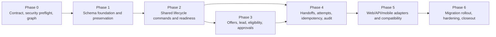

# Dispatch Backend V2 Execution Plan

## Purpose and implementation boundary

This is the implementation-ready, dependency-gated plan for Dispatch Backend V2 in the Core-2 Laravel modular monolith. It preserves existing user data, authorization, eligibility, asset safety, audit history, optimistic concurrency, and mobile idempotency while moving web and mobile adapters onto shared domain commands.

Phase 0 establishes the contract, graph, and seeder security preflight. It does not implement V2 schema, lifecycle commands, API versioning, or runtime behavior. The target design is described in [the domain contract ADR](../architecture/ADR-DISPATCH-BACKEND-V2-DOMAIN-CONTRACT.md); existing runtime values that conflict with that target remain legacy compatibility behavior until the relevant phase is completed.

## Non-negotiable target semantics

- Execution lifecycle: `draft -> dispatched -> en_route -> arrived -> working -> completed`, plus `cancelled`.
- `accepted` is an assignment-offer state only; there is no job-level accepted meaning in V2.
- `pending_approval`, `scheduled`, and `ready` are derived plan/readiness conditions, not execution lifecycle states.
- Dispatch requires every mandatory offer accepted and exactly one designated accepted lead, except for an explicitly approved emergency override. The override never bypasses the lead or asset-safety requirement.
- Only the designated accepted lead or an authorized override may progress global execution.
- Archive is orthogonal and terminal-record-only.
- One dispatch is one scheduled execution attempt linked to one canonical handoff; a handoff may have multiple attempts when policy permits.
- Web and mobile call the same commands. Breaking mobile semantics use `/api/v2` with a temporary tested `/api/v1` compatibility path.
- State and audit writes are atomic; slow side effects are after-commit.
- `on_hold` is deferred until stakeholders define its authority, timers, billing, safety, asset, notification, and audit semantics.

## Dependency DAG



No phase may begin until all dependency phases have their commit gate recorded as complete and their rollback gate is still available. A phase may add characterization tests for legacy behavior, but it may not silently widen its scope to the next phase.

## Phase register

| Phase | Scope | Depends on | Completion output |
| --- | --- | --- | --- |
| 0 | Execution contract, security preflight, graph | None | Plan, prompts, ADR, seeder gate/tests, baseline and Phase 0 commits |
| 1 | Canonical schema foundations and data-preserving migration strategy | 0 | Expand/contract migrations, data inventory, compatibility mapping, rollback evidence |
| 2 | Shared domain commands, separated lifecycle state machines, readiness projection | 1 | Atomic commands and domain tests independent of adapters |
| 3 | Assignment offers, designated lead, mandatory acceptance, eligibility/assets, plan approvals | 2 | Readiness and authorization policy proven under concurrency and override cases |
| 4 | Canonical handoffs, execution attempts, retry/replacement policy, idempotency, audit and after-commit effects | 2, 3 | Source adapters use commands; atomic/audit/idempotency/concurrency gates pass |
| 5 | Web/API/mobile adapter migration and `/api/v1` compatibility path | 4 | Shared command adapters, contract tests, mobile retry/compatibility evidence |
| 6 | Controlled rollout, reconciliation, observability, deprecation, closeout | 5 | Migration report, rollback rehearsal, operational runbook, final review |

## Phase 0 — execution contract, security preflight, and graph

### Scope and dependencies

Depends on no earlier phase. This phase is documentation, security hardening, tests, and execution handoff only. Do not implement V2 tables, enums, lifecycle transitions, API routes, mobile semantics, or data backfills.

### Files and surfaces

- `Docs/README.md`
- `Docs/architecture/ADR-DISPATCH-BACKEND-V2-DOMAIN-CONTRACT.md`
- `Docs/plans/DISPATCH_BACKEND_V2_EXECUTION_PLAN.md`
- `Docs/plans/DISPATCH_BACKEND_V2_EXECUTION_PROMPTS.md`
- `Docs/plans/DISPATCH_BACKEND_V2_PHASE_HANDOFF.md`
- `database/seeders/DatabaseSeeder.php`
- `database/seeders/LocalDevelopmentSeeder.php`
- `database/seeders/BrowserAcceptanceSeeder.php`
- `tests/Feature/Security/DatabaseSeederSecurityTest.php`

### Test gate

- Focused production/local seeder security tests pass.
- Affected existing Dispatch/Rental/Sales handoff tests pass.
- `composer run lint:check`, `composer run types:check`, `composer audit --locked`, and `git diff --check` pass.
- If frontend files are touched, run the relevant npm lint/format/type/build checks; do not claim full npm green when untouched baseline blockers remain.
- Record exact commands, counts, warnings, and blockers in the phase handoff.

### Rollback gate

- Seeder changes can be reverted as one commit without changing user data or schema.
- Production has a safe, explicit bootstrap admin password path; no local/browser fixtures are reachable from production composition or direct seeder invocation.
- No generated dependency/build artifacts are committed.

### Review gate

- Security review confirms production cannot create or re-enable predictable development/browser accounts.
- Documentation review confirms target semantics are not described as runtime V2 behavior.
- Code review covers the complete baseline commit and Phase 0 diff separately.

### Commit gate

- Commit the validated pre-existing baseline first.
- Commit Phase 0 separately with a conventional message in the form `<type>: <user-visible outcome>`.
- No unrelated mobile cleanup or generated files.

## Phase 1 — canonical schema foundation and preservation

### Scope and dependencies

Depends on Phase 0. Establish the persistence vocabulary needed by later commands without changing user-visible lifecycle behavior. Use expand/contract migrations and preserve legacy rows until reconciliation proves the mapping.

### Files and surfaces

- `database/migrations/*` for handoffs, execution attempts, plan versions, offer/lead metadata, idempotency keys, and audit lineage as approved by the Phase 1 design review.
- `app/Modules/Dispatch/Models/*` and relationships/casts.
- `app/Modules/Dispatch/Enums/*` only for additive target vocabulary; do not remove legacy values yet.
- Data inventory/backfill or reconciliation command under an explicit operational namespace.
- SQLite, PostgreSQL, and MySQL-compatible schema assertions where the repository supports them.
- Phase 1 characterization and migration tests under `tests/Feature/Operations`, `tests/PostgreSQL`, and focused unit tests.

### Required behavior

- Define canonical handoff identity separately from execution-attempt identity.
- Represent plan versions and approval bindings without overwriting legacy approval history.
- Represent assignment offer status and a unique designated lead per attempt.
- Add idempotency and optimistic version storage with appropriate uniqueness/index constraints.
- Every legacy row maps to an explicit compatibility state or is reported as a blocker; no silent data loss.

### Test gate

- Fresh migrations and upgrade migrations pass on supported databases.
- Existing suites remain green; migration/backfill tests prove row counts, foreign keys, uniqueness, nullability, and rollback/retry behavior.
- A dry-run reconciliation reports zero unexplained legacy rows for the fixture dataset.
- Static analysis, lint, security audit, and diff checks pass.

### Rollback gate

- Migrations are additive or have a tested reverse path before any destructive step.
- Backfill is resumable, idempotent, bounded, and records a checkpoint.
- A feature flag or command gate leaves legacy runtime behavior available until Phase 2 is proven.

### Review and commit gates

- Data-retention, authorization, foreign-key, and tenant/workspace isolation review passes.
- Commit only schema/migration foundation and its tests, with a conventional user-visible outcome.

## Phase 2 — shared domain commands and readiness projection

### Scope and dependencies

Depends on Phase 1. Implement the domain layer behind adapters. Keep controllers, mobile clients, and source modules thin.

### Files and surfaces

- `app/Modules/Dispatch/Actions` or `Commands` for create/submit/approve/dispatch/progress/cancel/reopen/archive.
- Target lifecycle value objects/enums and transition policy; retain legacy translators at the boundary.
- Readiness evaluator and blocker value objects.
- Authorization policies and capability checks.
- Atomic audit/event recording and optimistic version handling.
- Feature/Unit tests for every valid and invalid transition.

### Required behavior

- Implement only the execution lifecycle in the ADR; no job-level accepted transition.
- Make pending approval, scheduled, and ready derived projections.
- Require expected version on every mutation and return a stable conflict result.
- Evaluate readiness inside the dispatch transaction, not only in a controller preflight.
- Keep notifications/broadcasts deferred until after commit.

### Test gate

- Transition matrix covers every allowed edge, terminal edge, cancellation, stale version, authorization failure, and archive restriction.
- Blocker evaluator has stable codes/evidence and deterministic ordering.
- Atomicity tests prove state/audit commit together and roll back together.
- Existing legacy characterization tests and baseline handoff tests remain green.

### Rollback gate

- Commands are feature-gated and can translate to legacy writes while the flag is off.
- No adapter is switched until command contract tests are green.
- Any failed command leaves no partial audit/state mutation.

### Review and commit gates

- Domain review confirms no hidden job-level accepted meaning and no accidental `on_hold` addition.
- Security review confirms capability and object-scope checks occur inside commands.
- Commit shared command layer and tests separately from adapter migration.

## Phase 3 — offers, lead, eligibility, assets, and approvals

### Scope and dependencies

Depends on Phase 2. Make assignment, safety, and approval rules enforceable before dispatch.

### Files and surfaces

- `app/Modules/Assignment/*` offer commands, lead designation, response handling, and policies.
- `app/Modules/Dispatch/*` plan-version approval and readiness integration.
- Fleet/equipment/credential/inspection services used by eligibility and asset safety.
- Approval/audit models and authorization matrix tests.
- Web/mobile read models may expose blockers, but adapters still call Phase 2 commands.

### Required behavior

- Offer lifecycle is separate from execution lifecycle; only offers can be accepted.
- Dispatch requires all mandatory offers accepted and exactly one designated accepted lead.
- Emergency override is explicit, scoped, approved, time-bounded where policy requires, and fully audited.
- Asset safety and eligibility are blocking facts; emergency override cannot bypass safety.
- Material plan changes create a new immutable version and supersede prior approval.

### Test gate

- Acceptance/rejection/withdrawal/expiry and reassignment tests cover mandatory and optional offers.
- Concurrency tests prove one lead and no double acceptance/dispatch.
- Authorization matrix covers dispatcher, manager, field worker, lead, admin/break-glass, and source adapter capabilities.
- Eligibility/asset safety conflict tests and emergency override audit tests pass.

### Rollback gate

- Offer writes remain compatible with legacy assignment rows until migration cutover.
- Reassignment never deletes historical offers or audit entries.
- A failed approval/override cannot leave a dispatchable plan without a current approval.

### Review and commit gates

- Security review focuses on confused-deputy risks, lead spoofing, assignment scope, and override abuse.
- Commit the policy/readiness slice separately from source/adapters.

## Phase 4 — handoffs, attempts, retries, idempotency, and audit

### Scope and dependencies

Depends on Phases 2 and 3. Connect canonical Rental/Sales/Service handoffs to shared commands and make side effects safe.

### Files and surfaces

- `app/Modules/Rental`, `app/Modules/Sales`, `app/Modules/Dispatch` source adapters and handoff services.
- Attempt lineage, replacement, and retry command/query surfaces.
- Web/mobile idempotency middleware or command-key handling.
- Events/listeners/jobs that must run after commit.
- Audit snapshots and reconciliation tooling.

### Required behavior

- One attempt links to one canonical handoff and has a stable correlation/idempotency key.
- Retry of the same operation is idempotent and does not create a new attempt.
- Replacement attempt is a new terminal-linked record and never reuses an attempt identity.
- Source adapters invoke shared commands; they do not directly mutate execution status.
- Audit/state changes are atomic; notifications, broadcasts, and slow work are post-commit.

### Test gate

- Rental, Sales, Service handoff integration tests pass for create, retry, cancel, completion, replacement, and source mismatch.
- Duplicate web/mobile command tests prove one mutation and one audit event.
- Queue/after-commit tests prove slow side effects do not run before commit and retry safely after failure.
- Concurrency and cross-database tests pass where supported.

### Rollback gate

- Source adapters can be switched back to the legacy path without deleting attempt lineage.
- Failed post-commit work is retryable and does not duplicate operational effects.
- Reconciliation detects orphaned or multiply linked attempts before cutover.

### Review and commit gates

- Security review covers idempotency-key ownership, replay, source authorization, and audit integrity.
- Commit handoff integration only after command and policy gates are green.

## Phase 5 — adapters and compatibility

### Scope and dependencies

Depends on Phase 4. Move web, API, and mobile clients to the shared command/query contracts without breaking installed mobile builds.

### Files and surfaces

- `routes/api.php`, API version route groups, controllers, requests, resources, and exception mapping.
- Web controllers/forms and Inertia view models.
- `packages/field-mobile` API client, outbox/retry, response mapping, and compatibility handling.
- Contract tests for `/api/v2` and the temporary `/api/v1` path.
- Documentation for mobile migration and compatibility sunset.

### Required behavior

- Web and mobile adapters call the same command handlers and receive identical domain conflict/readiness/authorization semantics.
- Breaking payload or transition changes are `/api/v2` only.
- `/api/v1` translates legacy requests/responses without restoring job-level accepted semantics in the V2 core.
- Mobile retries remain idempotent offline/online and preserve conflict evidence.

### Test gate

- Web feature tests, API contract tests, mobile unit/integration tests, and compatibility tests pass.
- Playwright/browser checks run when changed surfaces require them; native checks run when mobile behavior changes.
- `npm run lint:check`, `npm run format:check`, `npm run types:check`, and the relevant build checks are green or their pre-existing blockers are explicitly isolated and approved.

### Rollback gate

- Route/version feature flags allow rollback to the legacy adapter while preserving V2 records.
- Mobile compatibility window and telemetry are active before changing default behavior.
- No client is forced onto a breaking path without a tested fallback.

### Review and commit gates

- API/security review covers authorization, replay, payload validation, version conflicts, and information leakage.
- Commit adapter changes after contract and mobile retry evidence is complete.

## Phase 6 — rollout, reconciliation, hardening, and closeout

### Scope and dependencies

Depends on Phase 5. Operate the migration safely, reconcile legacy data, and close the compatibility window only with evidence.

### Files and surfaces

- Feature flags/configuration and deployment/runbook documentation.
- Backfill/reconciliation commands, dashboards/alerts, audit reports, and operational metrics.
- Legacy-to-V2 compatibility translators and deprecation notices.
- Full backend/frontend/mobile verification surfaces.

### Required behavior

- Roll out by bounded tenant/workspace/cohort with measurable success criteria.
- Reconcile source handoffs, attempts, assignments, approvals, audit rows, asset reservations, and mobile outbox outcomes.
- Keep archive orthogonal and terminal-only during migration.
- Remove compatibility only after the documented mobile sunset and zero active legacy clients.
- Do not add `on_hold` without a new approved ADR.

### Test gate

- Full proportionate backend, frontend, mobile, security, migration, and rollback suites pass.
- Production-like dry run and restore/reconciliation rehearsal pass.
- Metrics show no unexplained duplicate attempts, orphaned offers, unsafe assets, stale approvals, or unaudited transitions.

### Rollback gate

- Feature flags, backups, reverse/reconciliation commands, and operational owner are verified before each cohort.
- Rollback preserves all audit and attempt lineage and does not re-enable predictable fixture seeders.

### Review and commit gates

- Final code, security, data, and operations reviews have no critical/high findings.
- Commit rollout/runbook/deprecation changes separately from any final removal.
- Mark the plan complete only after the graph handoff records evidence and the next consumer can start from a clean commit.

## Execution protocol

For every phase:

1. Read `AGENTS.md` if present, this plan, the ADR, relevant existing docs, and the phase prompt.
2. Inventory the current diff and preserve user-owned changes.
3. Write or extend characterization tests before changing behavior; prove red, implement green, then refactor.
4. Keep state/audit writes atomic and side effects after commit.
5. Run the phase test gate, code review, security review, rollback check, and `git diff --check`.
6. Update the machine-readable status and phase handoff with exact commands/results.
7. Commit only the phase scope with a conventional user-visible commit message.

## Machine-readable graph status

```yaml
schema: dispatch-backend-v2-phase-status/v1
branch: codex/dispatch-backend-v2-phase-0
baseline_commit: 7e9dd0cdccd08666d20bdde713aa25f9cacf1d6e
current_phase: phase_0
ready_for_phase_1: true
phases:
  phase_0:
    status: complete
    commit_sha: 2054c13412cdb6db062a9c6e5994f9c166ecb5f5
    depends_on: []
    checklist:
      baseline_inventory: complete
      baseline_validation: complete
      baseline_commit: complete
      execution_plan: complete
      executor_prompts: complete
      domain_contract_adr: complete
      production_seeder_gate: complete
      focused_seeder_tests: complete
      review_gate: complete
      commit_gate: complete
  phase_1:
    status: ready
    commit_sha: null
    depends_on: [phase_0]
  phase_2:
    status: blocked_on_phase_1
    commit_sha: null
    depends_on: [phase_1]
  phase_3:
    status: blocked_on_phase_2
    commit_sha: null
    depends_on: [phase_2]
  phase_4:
    status: blocked_on_phase_3
    commit_sha: null
    depends_on: [phase_2, phase_3]
  phase_5:
    status: blocked_on_phase_4
    commit_sha: null
    depends_on: [phase_4]
  phase_6:
    status: blocked_on_phase_5
    commit_sha: null
    depends_on: [phase_5]
known_preexisting_blockers:
  - id: mobile-eslint
    status: open
    detail: Full npm run lint:check reports 39 errors in untouched packages/field-mobile files.
  - id: mobile-prettier
    status: open
    detail: Full npm run format:check reports 5 untouched packages/field-mobile files.
execution_record:
  commands:
    - "composer run lint:check: PASS"
    - "composer run types:check: PASS, 0 PHPStan errors"
    - "php artisan test --compact tests/Feature/Security/DatabaseSeederSecurityTest.php: PASS, 4 tests, 20 assertions"
    - "php artisan test --compact affected Dispatch/Rental/Sales handoff files: PASS, 258 tests, 1,577 assertions"
    - "php artisan test --compact: PASS, 533 tests, 6,520 assertions"
    - "npm run build: PASS"
    - "changed resources/js ESLint and Prettier checks: PASS"
    - "npm run types:check: PASS"
    - "composer audit --locked: PASS, no security vulnerability advisories"
    - "git diff --check: PASS"
  review_findings:
    - "Resolved Pint fully_qualified_strict_types finding in the new security test."
    - "Resolved ignored Docs and .ai-reports packaging issue by force-adding only required artifacts."
  rollback_check: complete
```

## Phase 0 execution record

This section is updated before the Phase 0 commit. It must contain the exact branch, baseline SHA, Phase 0 SHA, commands, results, review findings/fixes, and remaining blockers. Do not mark `ready_for_phase_1` true until every Phase 0 gate is complete.

- Branch: `codex/dispatch-backend-v2-phase-0`
- Baseline commit: `7e9dd0cdccd08666d20bdde713aa25f9cacf1d6e`
- Phase 0 commit: `2054c13412cdb6db062a9c6e5994f9c166ecb5f5`
- Review: complete; no critical/high findings open. The Pint finding and ignored-required-file packaging issue were fixed.
- Rollback: complete; seeder-only runtime changes are reversible and do not mutate schema or user data during rollback.
- Remaining blockers: untouched mobile lint/format failures documented in `known_preexisting_blockers`.
