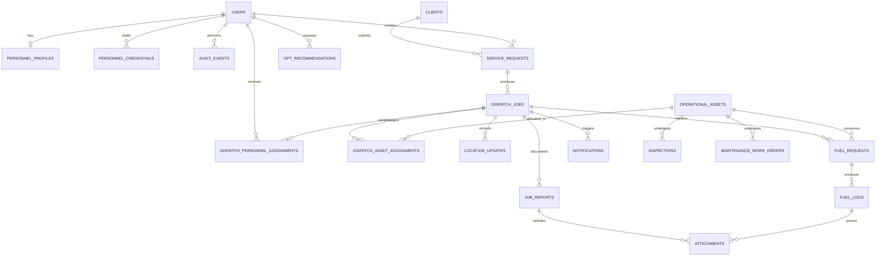

# Supabase and ERD Alignment Plan

## Objective

Align the Laravel application's database with the supplied dispatch-platform planning document and CTMS ERD, deploy the resulting schema to the existing `CTMS-CORE2` Supabase project, and preserve the stronger authorization, workflow, audit, and normalization already present in the codebase.

This is a plan-only document. It does not authorize or apply database changes.

## Reference hierarchy

Use the sources in this order when resolving ambiguity:

1. Approved business scope and workflows in the supplied dispatch-platform planning document.
2. Required business entities, fields, and relationships in the supplied ERD image and Mermaid ERD.
3. Authorization, safety, audit, and delivery decisions in `RBAC_IMPLEMENTATION_PLAN.md`.
4. Existing Laravel migrations, models, policies, actions, and tests.

The ERD is a logical business reference, not a requirement to reproduce every table name literally. A normalized physical schema may combine or split ERD entities when it preserves all required information and relationships.

## Current state

### Application

- Laravel 13 with Eloquent and PostgreSQL support.
- Laravel session authentication and Spatie roles/permissions are already the identity and authorization model.
- Existing migrations cover users, RBAC, dispatch jobs, assignments, approvals, assets, audit events, inspections, maintenance, fuel, location updates, and GPT recommendations.
- The repository is already configured to use the `CTMS-CORE2` PostgreSQL host with required SSL through environment variables.
- Existing automated tests cover authentication, authorization, dispatch, maintenance safety, fuel, and tracking workflows.

### Supabase

- Target project: `CTMS-CORE2` (`zebtoyelrlefthkajtqa`) in `ap-southeast-1`.
- The project currently contains only an empty `public.migrations` table.
- No Laravel application migration has been recorded or deployed.
- Supabase currently reports RLS disabled on `public.migrations`; this must be resolved deliberately during the security phase.

## Architecture decisions

### 1. Supabase is the managed PostgreSQL database

Laravel remains the application server, authentication provider, policy layer, and workflow authority. The browser does not connect directly to operational tables through `supabase-js` in the initial release.

Consequences:

- Eloquent uses a PostgreSQL connection over SSL.
- Laravel migrations remain the canonical schema history.
- Supabase Auth is not introduced during schema alignment.
- The Data API should be disabled for this project or all operational-table privileges should be revoked from `anon` and `authenticated`.
- A future direct-client API requires a separate design and explicit RLS policies.

### 2. Keep one user identity model

Do not create duplicate `drivers` and `operators` identity tables containing names and phone numbers. Keep identity in `users`, use Spatie roles for operational role membership, and add normalized personnel profile and credential tables.

Proposed mapping:

- ERD `DRIVERS` -> `users` + `personnel_profiles` + `personnel_credentials` where credential kind is `driver_license`.
- ERD `OPERATORS` -> `users` + `personnel_profiles` + `personnel_credentials` where credential kind is `operator_certification`.
- Dispatch participation remains in `dispatch_personnel_assignments`.

### 3. Keep one operational asset model

Retain `operational_assets` rather than duplicating common fields in separate `cranes` and `trucks` tables.

- `kind` identifies `truck`, `crane`, or another supported asset class.
- Frequently searched and validated fields become typed columns.
- Flexible manufacturer-specific details remain in `specifications` JSON.
- Database check constraints ensure truck-only and crane-only fields are valid for the selected kind.

### 4. Separate service demand from dispatch execution

Add `clients` and `service_requests`. Keep `dispatch_jobs` as the execution record.

- A client can submit many service requests.
- A service request can produce one or more dispatch jobs when work is staged, retried, or rescheduled.
- If the approved workflow requires only one active dispatch per request, enforce that with a partial unique index rather than a permanent one-to-one limitation.

### 5. Preserve normalized assignments

Do not place nullable `crane_id`, `truck_id`, `driver_id`, and `operator_id` columns directly on `dispatch_jobs`.

- `dispatch_personnel_assignments` supports multiple workers and assignment history.
- `dispatch_asset_assignments` supports multiple assets and assignment history.
- Assignment type identifies the operational purpose.
- Active intervals and indexed overlap checks protect against double-booking.

### 6. Store sensitive files outside table rows

Images, receipts, signatures, and documents belong in private object storage. Database records store object paths, MIME type, checksum, uploader, owning record, and retention metadata. Every download remains authorized by Laravel.

## Target logical model



## ERD reconciliation matrix

| Supplied ERD entity | Target physical model | Planned action |
| --- | --- | --- |
| `USERS` | `users`, Spatie RBAC tables | Add phone and retain normalized roles/status metadata. Never store plaintext passwords. |
| `CLIENTS` | `clients` | Add as a first-class entity with unique identifiers and contact fields. |
| `SERVICE_REQUESTS` | `service_requests` | Add and relate it to client, creator, and dispatch jobs. |
| `CRANES` | `operational_assets` | Retain unified table; add typed crane fields and validation. |
| `TRUCKS` | `operational_assets` | Retain unified table; add plate/capacity fields and validation. |
| `DRIVERS` | users plus personnel profile/credentials | Add availability and license records without duplicating identity. |
| `OPERATORS` | users plus personnel profile/credentials | Add availability and certification records without duplicating identity. |
| `DISPATCH` | `dispatch_jobs` plus assignment tables | Retain the more normalized implementation and link it to `service_requests`. |
| `GPS_TRACKING` | `location_updates` | Add direct dispatch-job link, speed, and remarks while retaining accuracy/consent metadata. |
| `JOB_REPORTS` | `job_reports` plus `attachments` | Add report lifecycle, work summary, private images, and client signature metadata. |
| `AI_ASSISTANT_LOGS` | `gpt_recommendations` | Extend with sanitized prompt/response summaries and model usage; never log secrets or unnecessary PII. |
| `FUEL_LOGS` | `fuel_requests` plus `fuel_logs` | Add unit price, total cost, station, and remarks; retain approval and verification workflow. |
| `MAINTENANCE` | `maintenance_work_orders` plus `inspections` | Add scheduled/next-due dates and remarks while retaining defects, parts, and release controls. |
| `NOTIFICATIONS` | `notifications` | Add Laravel-compatible notifications with optional dispatch-job association. |

## Proposed schema changes

### Identity and personnel

#### `users`

Add:

- `phone` nullable, normalized and indexed only if lookup is required.
- Preserve `is_active`, `suspended_at`, email verification, and password hashing.
- Do not add a `role` string because roles already have normalized relations.

#### `personnel_profiles`

- `id` bigint primary key.
- `user_id` unique foreign key to users.
- `availability_status` with a constrained set of values.
- Optional emergency/contact and employment metadata approved by the product scope.
- Timestamps and optional archival timestamp.

#### `personnel_credentials`

- `id`, `user_id`, `kind`, `credential_number`, `credential_type`.
- `issued_at`, `expires_at`, `status`, and verification metadata.
- Unique credential number within its kind.
- Index `(user_id, kind, expires_at)` for assignment validation.

### Clients and service requests

#### `clients`

- `id`, `company_name`, `contact_person`, phone, email, and address.
- Active/archive state and timestamps.
- Use a stable client code when human-readable references are needed.

#### `service_requests`

- `id`, unique request reference, `client_id`, and `created_by`.
- Project name, service type, location/site notes, requested schedule, priority, status, and requirements.
- Index client history, open-request queues, and schedule queries.

#### `dispatch_jobs`

- Add `service_request_id` and migrate existing client/site data deliberately when data exists.
- Retain lifecycle status, optimistic version, activation/cancellation metadata, and soft deletion.
- Avoid immediately deleting duplicated snapshot fields if historical customer/site snapshots are required.

### Assets and assignments

#### `operational_assets`

Add typed columns where the ERD requires reliable querying or validation:

- Plate/registration number.
- Manufacturer and model.
- Rated capacity and capacity unit.
- Current meter type/value when needed for maintenance decisions.

Keep subtype-specific details in `specifications`. Add check constraints for positive capacity and allowed kinds/statuses.

#### Assignment tables

- Add composite indexes for active personnel and asset allocations.
- Add uniqueness or exclusion rules that prevent duplicate active assignment rows.
- Keep conflict detection inside short transactions with consistent lock ordering.

### Tracking and reports

#### `location_updates`

- Add nullable `dispatch_job_id` for traceability.
- Add non-negative `speed` and optional `remarks`.
- Keep user, asset, capture time, receive time, accuracy, source, and sharing consent.
- Add a retention policy and cleanup job before production.
- Index current-dispatch tracking and latest-user-location queries.

#### `job_reports`

- `id`, `dispatch_job_id`, author, start/end time, work summary, remarks, submission status, and timestamps.
- Decide whether the one-report ERD rule means one final report or multiple report revisions.
- Store images and signatures through `attachments`, not public paths.

#### `attachments`

- Polymorphic owner, uploader, private storage disk/path, original filename, MIME type, byte size, checksum, and retention metadata.
- No public URLs in persistent records.

### Fuel and maintenance

#### `fuel_logs`

Add:

- `price_per_litre` and immutable `total_cost` using exact numeric types.
- `fuel_station` and `remarks`.
- Preserve quantity, odometer/hour meter, recorder, timestamp, and fuel-request relationship.
- Enforce non-negative quantity, price, total, and meter values.

Do not add separate nullable truck and crane foreign keys. The associated fuel request already points to one operational asset and optional dispatch job.

#### `maintenance_work_orders`

Add:

- `scheduled_at` or `maintenance_date`.
- `next_due_at` when scheduled maintenance applies.
- `remarks` and structured release verification metadata.
- Preserve defect, work performed, parts, dispatch-blocking state, technician, status, and release time.

### Notifications and AI records

#### `notifications`

- Use Laravel's notification structure or an equivalent UUID-based table.
- Relate notification data to the receiving user and optionally to a dispatch job.
- Track read time rather than only a free-form status.

#### `gpt_recommendations`

- Preserve purpose, subject, context hash, redacted references, recommendation, conflicts, model, reviewer, and lifecycle.
- Add sanitized prompt/response summaries only when the ERD audit requirement cannot be satisfied by existing structured fields.
- Add retention rules and never store credentials, raw private documents, or unnecessary precise location data.

## PostgreSQL conventions

- Use bigint identity-compatible primary keys for application tables.
- Use timezone-aware timestamps in PostgreSQL and consistent UTC handling in Laravel.
- Use exact numeric columns for capacity, fuel quantity, and money.
- Use text/check constraints or application enums for controlled statuses.
- Index every foreign key used in joins, deletes, or authorization scopes.
- Use composite indexes matching queue and scope queries, with equality columns before range columns.
- Use partial indexes for active, pending, unresolved, or non-deleted records when query patterns justify them.
- Add explicit unique and check constraints for invariants that must survive application bugs.
- Validate indexes with real query plans after representative data exists; do not add speculative indexes to every column.

## Supabase security plan

### Initial server-only mode

1. Keep operational access through Laravel's server-side PostgreSQL connection.
2. Disable the Supabase Data API if it is not needed.
3. Otherwise revoke table, sequence, and function privileges from `anon` and `authenticated` by default.
4. Enable RLS on every table in the exposed `public` schema, with no end-user policies in server-only mode.
5. Do not expose a service-role or database secret to Vite or browser code.
6. Use a dedicated least-privilege runtime database role when operationally supported; reserve the owner connection for migrations.
7. Run Supabase security and performance advisors after every DDL batch.

The existing `public.migrations` advisory requires an explicit decision. The proposed server-only remediation is:

```sql
alter table public.migrations enable row level security;
revoke all on table public.migrations from anon, authenticated;
```

This SQL is recorded for review only and must not be applied until the access model is approved.

### Future direct-client mode

If the browser later uses Supabase REST, GraphQL, Realtime, or `supabase-js`:

- Design explicit grants and RLS policies per operation and table.
- Map Laravel identities to Supabase-compatible JWT claims or adopt Supabase Auth through a separate migration plan.
- Use ownership and active-assignment predicates, not only `TO authenticated`.
- Include both `USING` and `WITH CHECK` for updates.
- Index every column used by RLS policies.
- Add policy tests proving access for all six roles and cross-user denial.

## Connection plan

- Use the direct database connection for migrations and persistent deployments with IPv6 connectivity.
- Use Supavisor session mode on port 5432 for persistent Laravel deployments that require IPv4.
- Avoid transaction-mode pooling unless PDO prepared statements are disabled and tested.
- Require SSL in every environment.
- Keep database credentials only in secret environment configuration, never in committed files.
- Separate migration-owner credentials from least-privilege runtime credentials before production cutover.

## Delivery phases

### Phase 0 - Confirm the canonical model

- Approve the normalization decisions in this plan.
- Confirm whether service requests can create multiple dispatch jobs.
- Confirm whether a job permits one final report or multiple revisions.
- Confirm whether Supabase is server-only or will expose a direct browser Data API.
- Freeze table/column naming for the first production migration.

Exit criterion: every supplied ERD entity has an approved physical mapping and no unresolved cardinality affects migration design.

### Phase 1 - Establish a reproducible PostgreSQL baseline

- Keep the existing Laravel migrations unchanged and add forward migrations for ERD alignment.
- Add a PostgreSQL-backed integration-test environment; retain fast SQLite tests where compatible.
- Verify PHP `pdo_pgsql`, SSL configuration, and the selected connection mode.
- Record a schema inventory before changes.

Exit criterion: a clean PostgreSQL database can run all existing migrations and tests without schema errors.

### Phase 2 - Add clients, service requests, and personnel metadata

- Create clients, service requests, personnel profiles, and credentials.
- Add required user contact information.
- Add models, factories, relationships, validation, policies, and scope tests.
- Seed reference-safe development data separately from production data.

Exit criterion: a valid client request can be created by an authorized user, and an assignment rejects expired or missing required credentials.

### Phase 3 - Reconcile dispatch and assets

- Link dispatch jobs to service requests.
- Add typed asset fields and constraints while retaining `operational_assets`.
- Add assignment conflict indexes and locking rules.
- Preserve audit events for scheduling, assignment, approval, activation, and cancellation.

Exit criterion: the ERD dispatch scenario works without duplicated users/assets and cannot double-book an active resource.

### Phase 4 - Add reports, attachments, tracking, fuel, and maintenance details

- Create job reports and private attachment metadata.
- Extend tracking with job, speed, and remarks.
- Extend fuel logs with cost and station fields.
- Extend maintenance with schedule and next-due fields.
- Add retention and cleanup jobs for location and sensitive files.

Exit criterion: one complete dispatch can be traced from request through assignment, tracking, fuel, maintenance effects, and final report.

### Phase 5 - Add notifications and complete AI audit mapping

- Add database-backed notifications and dispatch associations.
- Reconcile AI audit requirements with `gpt_recommendations` without storing unsafe raw context.
- Add authorization and retention tests.

Exit criterion: users receive only authorized notifications and AI records are attributable, reviewable, and non-mutating until accepted through normal domain actions.

### Phase 6 - Apply database security controls

- Decide whether to disable the Data API or use explicit deny-by-default grants.
- Enable RLS on exposed-schema tables.
- Create a least-privilege runtime role where supported.
- Review functions, views, storage access, and default privileges.
- Run Supabase security and performance advisors and remediate accepted findings.

Exit criterion: no operational table is unintentionally accessible to `anon` or `authenticated`, and advisor findings are resolved or explicitly accepted.

### Phase 7 - Deploy and verify on Supabase

- Take a pre-deployment schema snapshot.
- Run Laravel migrations against `CTMS-CORE2` using migration-owner credentials.
- Run seeders only when explicitly approved; never seed demo users into production by default.
- Verify the Laravel migration ledger, table inventory, foreign keys, indexes, constraints, and RLS state.
- Run focused end-to-end workflows and negative authorization tests.
- Keep a rollback/runbook decision point before production traffic is enabled.

Exit criterion: application tests pass against Supabase PostgreSQL, critical workflows pass, and schema/advisor checks are clean.

## Migration strategy

1. Do not use Supabase `apply_migration` for the Laravel schema; avoid two competing migration ledgers.
2. Create forward Laravel migrations using descriptive names and review generated SQL for PostgreSQL behavior.
3. Test each phase on a disposable PostgreSQL database or an approved Supabase development branch before production.
4. For existing data, use nullable additions, backfill in bounded batches, verify, then add required constraints.
5. Keep DDL and data backfills separate when lock duration could affect production.
6. Never rewrite a migration that may already have run in another environment.
7. Run advisors and application verification after each schema batch.

## Test plan

### Schema tests

- Every target table and required column exists with the intended PostgreSQL type.
- Every relationship has a foreign key with an explicit delete behavior.
- Foreign-key and scope columns have appropriate indexes.
- Status, capacity, quantity, cost, meter, and date invariants have database constraints.
- Migration up/down behavior is tested where rollback is safe.

### Domain tests

- Client -> service request -> dispatch-job lifecycle.
- Multiple personnel/assets per dispatch without duplicate active assignments.
- Expired driver license or operator certification blocks assignment.
- Unsafe or maintenance-blocked assets cannot be dispatched.
- GPS updates are restricted to current authorized assignments.
- Fuel totals and approval/verification stages cannot be bypassed.
- Job reports and private attachments are visible only within policy scope.
- Notifications cannot reveal another worker's dispatch.
- GPT recommendations never mutate operational records without authorized acceptance.

### Security tests

- Anonymous Data API access returns no operational data.
- Cross-user and cross-role requests return 403/404 as designed.
- Suspended users cannot create sessions or mutate records.
- Sensitive storage objects require authorized, short-lived access.
- RLS/grant configuration is inspected after migration.
- Supabase security advisor has no unresolved critical findings.

### Performance and concurrency tests

- Dispatch queues, active assignments, latest locations, pending approvals, and open maintenance work use expected indexes.
- Concurrent assignment attempts cannot double-book a person or asset.
- Locks are acquired in a consistent order and held only inside short transactions.
- Location-history and audit queries remain bounded and paginated.

## Completion checklist

- Every supplied ERD entity is implemented directly or has an approved normalized mapping.
- Required ERD fields are stored, derived safely, or deliberately replaced with a documented equivalent.
- Laravel migrations are the single schema source of truth.
- Supabase contains the full migration history and target tables.
- No operational table is unintentionally exposed through the Data API.
- RLS, grants, indexes, constraints, and advisor results are verified.
- Existing RBAC and workflow tests remain green against PostgreSQL.
- The reference dispatch workflow completes end to end using persisted Supabase data.
- A deployment and rollback runbook exists before production cutover.

## Out of scope for this alignment

- Replacing Laravel authentication with Supabase Auth.
- Direct browser access to operational tables.
- Rebuilding the UI solely to match ERD table names.
- Production data seeding without explicit approval.
- Applying migrations or RLS changes before Phase 0 decisions are approved.
