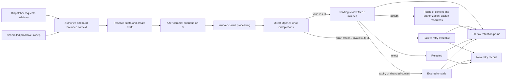

# Direct OpenAI GPT-6 Luna migration plan

Status: Implemented in the local workspace; production deployment and stricter output schema remain open
Last reviewed: 2026-09-27

## Decision and evidence

OpenAI `gpt-6-luna` replaces `gpt-5-mini` for new local dispatch advisory requests. The advisory, human review, and assignment authorization boundaries remain. Before the change, the local Operations environment had an OpenAI API key, `OPENAI_MODEL=gpt-5-mini`, and no OpenRouter key. A read-only `GET /v1/models/gpt-6-luna` with that key returned the exact model ID on 2026-09-26. A synthetic Chat Completions request with `json_object` and `reasoning_effort=low` also returned valid JSON with `finish_reason=stop`. Neither check proves production access or recommendation quality.

[OpenAI's model page](https://developers.openai.com/api/docs/models/gpt-6-luna) lists `gpt-6-luna`, Chat Completions, structured outputs, and Standard text rates of $0.10 per 1M input tokens and $0.50 per 1M output tokens. The previous `gpt-5-mini` rates are $0.25 and $2.00 respectively ([model page](https://developers.openai.com/api/docs/models/gpt-5-mini)). Actual charges can differ with caching, processing mode, and future pricing changes.

## Implementation status

- Completed locally: direct OpenAI configuration defaults and environment examples; `gpt-6-luna` in both local `.env` files; per-recommendation model binding in the worker; Luna and legacy Mini cost rates; cached-input accounting; unrounded cost ceiling check; GPT-6 reasoning effort; rejection of incomplete output and missing usage; active product and architecture document updates.
- Verified: local-key model visibility; a synthetic live Chat Completions response; a live call through `OpenAiClientWrapper` (`gpt-6-luna`, seven expected recommendation fields, 952 total tokens, and an estimated $0.0002 cost); and the earlier `composer test:operations` run (Pint, PHPStan, 1,323 Pest tests and 16,431 assertions passed). The live calls used synthetic contexts and did not exercise real dispatch data or human review.
- Remaining for production: set the deployment's `OPENAI_MODEL`, restart its `ai` workers, compare real advisory quality and spend, and monitor failure rate and latency. A strict JSON schema and validation of all narrative fields remain improvement work; assignment-time checks still enforce operational eligibility.

## Existing flow and lifecycle

The lifecycle below describes the older `dispatch_assignment` purpose. When
`OPENAI_BLOCKER_RESOLUTION_ENABLED=true`, new dispatch requests use
`dispatch_blocker_resolution`: the server identifies one resource blocker and
up to three eligible options, Luna ranks them and selects a verified fact to
emphasize, and a dispatcher
reviews a choice in the normal assignment or reassignment workflow. The old
recommendations remain readable in history. A changed or expired option cannot
prefill the picker. Saving a matching option records adoption only after the
domain action succeeds; a changed selection remains a manual choice. Project
shifts use **Fill coverage** guidance and generate no blocker AI request.

1. `GptRecommendationController` exposes manual request, accept, reject, retry, circuit breaker, and governance telemetry routes. `SweepProactiveGptRecommendationsJob` scans eligible scheduled dispatch jobs every minute. The proactive path checks current need, requester access, cooldown, and quota.
2. `GenerateGptRecommendation` authorizes the requester, locks the dispatch job, builds a bounded candidate context and hash, reuses a current suggestion when appropriate, reserves per-user and system quota, persists a `draft`, then dispatches `GenerateGptRecommendationJob` to the dedicated `ai` queue after commit.
3. The worker claims `processing` with compare-and-set. For automatic requests it rechecks access and context. `OpenAiClientWrapper` sends the context to `/chat/completions` with `json_object` output, checks the response, redacts returned text, and calculates an estimated cost. Before review, the worker rejects unknown, ineligible, or duplicate proposed IDs and fills resource details from the candidate context. It records `pending_review` with a 15-minute expiry or `failed`, plus usage and cost metrics when reported, an audit event on success, and a workspace update.
4. A human can reject or accept. Acceptance locks the recommendation and dispatch job, rechecks authorization, expiration, context hash, and dispatch version, then delegates resource changes to `AssignDispatchResources`. Retry creates a linked new recommendation. The circuit breaker blocks new quota reservations, and a daily job prunes recommendation records after 90 days.

## Migration work and follow-up

The steps below preserve the implementation sequence and remaining rollout work.

1. **Make direct OpenAI configuration explicit.** Both environment examples, the Operations service default, the Compose fallback, and the local environments now select `gpt-6-luna` with the direct OpenAI endpoint. The unused OpenRouter configuration branch and test fixtures were removed. Active product and architecture documentation was updated; historical progress records were retained. The deployed environment still needs its own model configuration and worker restart.
2. **Pin the model to each request.** Before the change, the row recorded `services.openai.model` when queued but the worker read the current provider model at execution time. The worker now uses the persisted model for that request, so queued Mini and new Luna records can coexist. Tests cover the legacy queued model and current default.
3. **Correct reasoning and cost controls.** The reasoning-model check now includes GPT-6, and the client sends `low` effort. The client estimates costs with Luna or legacy Mini rates, accounts for cached input, and compares the unrounded amount with the $0.05 ceiling. Evaluate whether the 4,000 completion-token cap leaves enough space for complex real advisories and whether `decimal(8,4)` is precise enough for spend reporting. The ceiling remains a post-request acceptance gate; it cannot prevent a provider charge already incurred.
4. **Strengthen the output contract.** Luna returned valid JSON in both synthetic live requests, including the application wrapper call. The client rejects truncated `finish_reason` values and missing usage. The worker now rejects proposed IDs absent from the bounded candidate set, marked ineligible, or repeated, and uses candidate details for display. Next, evaluate a strict JSON schema and validation of narrative fields. Acceptance-time `AssignDispatchResources` checks remain the final authority. Avoid broad prompt changes in the initial quality comparison so differences are attributable to the model.
5. **Verify and roll out.** Local configuration, cost, model binding, refusal, timeout, malformed-output, proactive, accept/reject/retry, and stale-context tests passed in the Operations suite. The synthetic live probe confirmed JSON validity and usage. Deployment still requires an environment change, `ai` worker restart, a small volume of real manual advisories, and monitoring of quality, failure rate, latency, acceptance, and spend before relying on proactive generation. Roll back by restoring the model configuration and restarting the worker; previously created recommendations retain their recorded model and lifecycle.

## Findings and improvement priorities

| Priority | Finding | Reason to address |
| :--- | :--- | :--- |
| Resolved | Queued record model and worker request model could diverge. | The worker now requests the model recorded on the recommendation. |
| Resolved | Cost estimate used only GPT-5 Mini rates and rounded before the ceiling comparison. | Model-specific rates and an unrounded comparison are in place. |
| Resolved | The reasoning-model check matched GPT-5 but not GPT-6. | Luna now receives the application's intended `low` setting. |
| Resolved | Proposed resource IDs could be absent, ineligible, or duplicated; model supplied labels could misidentify a resource. | The worker now rejects those IDs and fills resource labels and assignment types from the bounded candidate context. |
| Medium | `json_object` still uses a shallow top-level shape check for schedule and narrative fields. | A strict schema would make review content more predictable; continue to treat explanations as model generated text. |
| Resolved | Failed recommendations with reported usage and cost were omitted from spend telemetry. | The worker now persists and records those values on failed results. |
| Medium | The worker treats most provider failures as terminal and returns a generic retry message; `$tries = 2` does not retry normal HTTP error results. | Brief 429/5xx incidents require a manual retry and limit proactive coverage. Add bounded retry only for transient errors, with an idempotent state transition and no duplicate billing assumptions. |
| Medium | The model response is redacted after generation, while bounded context still includes job and candidate names. | Review the minimum names and client details needed in the outbound request and document the data policy. |

## Completion criteria

- New direct OpenAI requests use `gpt-6-luna`; queued legacy requests retain the exact model recorded for them.
- Structurally invalid, refused, truncated, costly, or invalid-candidate responses fail closed without operational mutation.
- Authorization, eligibility, context freshness, 15-minute expiry, audit, metrics, rate limits, and the `ai` queue remain effective.
- Local tests and a synthetic live probe pass, the active docs match the implementation, and production rollout can be rolled back through configuration.
