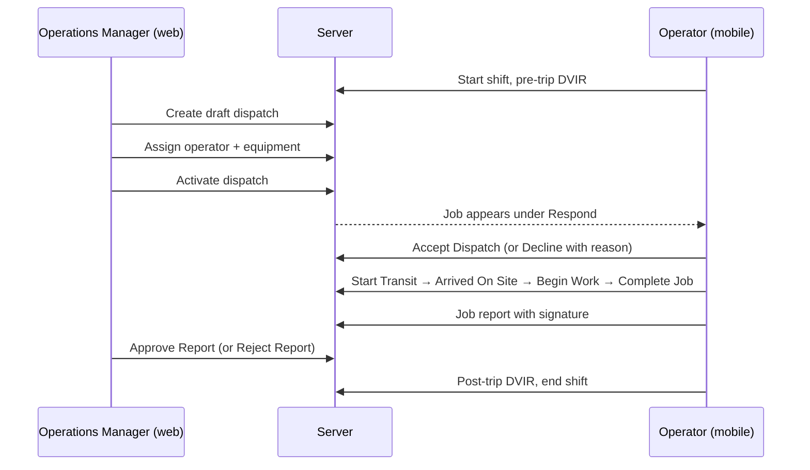

# Click-by-click user flows: Operations Manager and Operator

Last reviewed: 2026-09-29.

This guide shows what each role clicks in the current app, one step at a time. Button names in **bold** are the labels in the code. The Operations Manager works in the **web workspace**. The Operator works mainly in the **native field app** (`packages/field-mobile`).

These flows were written from the source code, not from a recorded browser or device session. A button appears only when the user has permission and the record is in the right state. The server checks every action again. For system rules, audit findings and return paths, see the [Operations Manager web flow](operations-manager-web-user-flow.md), the [sidebar flows](web-sidebar-user-flows.md) and [all-role user flows](userflow.md).

## How the two roles work together

---

## Part A: Operations Manager (web)

### A1. Sign in

1. Open the web app. You are sent to the login page.
2. Type your **username** and **password**. Click **Sign in**.
3. If a code screen appears, type the emailed code. Click **Verify and sign in**. Click **Resend code** if it did not arrive.
4. If asked to verify your email, follow the verification screen.
5. You land on **Operation Dashboard**.

### A2. Check the dashboard first

1. At the top, look for the red **Active emergency response** banner. If present, go to [A9 SOS](#a9-respond-to-an-emergency-sos) now.
2. Read the **Manager action & exception queue**. Use the filter chips (**All**, **Emergency SOS**, **Blocked unit**, **Approval**, **Fuel request**, **Fuel anomaly**).
3. Click an item to handle it:
   - **Approval** → **Review approval** opens the dispatch. Go to [A6](#a6-approve-or-reject-a-dispatch).
   - **Blocked unit** → opens **Fleet & Equipment**. Go to [A8](#a8-fix-a-blocked-asset-fleet--equipment).
   - **Fuel request** or **Fuel anomaly** → opens **Fuel Management**. Go to [A10](#a10-review-fuel-requests).
4. Check today's schedule panel. Filter by source (**All**, **Service**, **Rental**, **Manual intake**). Click a job to open it.

> The queue shows loaded records only (finding A1). An empty queue does not prove that no approvals, fuel requests or blocked assets remain.

### A3. Create a dispatch from incoming work

1. In the sidebar, click **Dispatch workspace**.
2. Click the **Incoming work** tab.
3. Pick the type of work:
   - **Service request:** Click a request under **Service demand awaiting dispatch**. Click **Review**. Click **Check for duplicates**. Set **Dispatch start**, **Dispatch end** and **Priority** (**Routine**, **Priority** or **Emergency**). Click **Create draft dispatch**.
   - **Rental delivery:** Click a reservation marked **Reservation confirmed**. Check the **Delivery location**. Click **Create rental dispatch**.
4. The new dispatch opens as a draft. Continue with [A5](#a5-assign-people-and-equipment-then-activate).

### A4. Create a direct dispatch (no Core 1 record)

Use this only when there is no service request or rental.

1. In **Dispatch workspace**, click **New dispatch**, then **Direct intake**.
2. Fill in **Client**, **Dispatch title**, **Job site**, **Work type**, **Scheduled start**, **Scheduled end** and priority.
3. Under requirements, click **Select recommended** or **Add requirement** for equipment and crew.
4. Check the **Draft summary**. Fix anything under **Missing required fields**.
5. Click **Create draft dispatch**.

### A5. Assign people and equipment, then activate

1. Open the dispatch from **Schedule** (click the row, then **View details**) or from the dashboard.
2. Read **Schedule and requirements**. Click **Assign resources**.
3. In the resource picker:
   1. Under **People**, filter with **Crane operators** or **Drivers**. Turn on **Eligible only** to hide blocked people. Click **Select** on an operator.
   2. Under **Assets**, filter with **Cranes**, **Mobile cranes**, **Tower cranes**, **Trucks** or **Vehicles**. Click **Select** on a unit.
   3. Check **Selected resources**. Click **Assign selected resources**.
4. If a resource is blocked (expired permit, maintenance, overlap, missing credential), choose another one or fix the cause first.
5. Saving the assignment creates an approval request. **Every** dispatch, whatever its priority, needs approval before it can be activated. An Operations Manager can approve their own request (see A6).
6. After approval, click **Review readiness and activate**. Check **Activation checks**.
7. Click **Activate dispatch**.
   - **Refresh needed** or **Refresh and review**: someone else changed the job. Click **Refresh readiness**, review, then try again.
8. The job moves to the operator's **Respond** tab on the mobile app.

### A6. Approve or reject a dispatch

Operations Managers and System Administrators can approve their own requests.

1. From the dashboard queue, click **Review approval**.
2. Read the requester, schedule, site and resource changes.
3. Either:
   - Click **Approve request** (or **Approve only** to approve without activating), or
   - Click **Reject request**, type a reason, and click **Confirm rejection**.

### A7. Watch the job in the field

1. In **Dispatch workspace**, click the **In progress** tab and click the job.
2. Read **Recorded progress**, **Execution issues** (delay reports) and **Shared location**. Capture and receipt times are shown separately.
3. If the operator declined or cannot continue, open the dispatch and click **Replace operator**, **Replace driver** or **Replace equipment**. Choose the replacement, fill in **Reassignment reason / notes**, and click **Review replacement**.
4. To stop a job, open **Administrative actions**. Click **Cancel dispatch**, give a reason, and click **Confirm cancellation**.

### A8. Fix a blocked asset (Fleet & Equipment)

1. In the sidebar, click **Fleet & Equipment**.
2. Use the triage bar (**Lockouts**, **Blocking orders**, **Permit expired**, **Stale GPS**) or search to find the unit. Click it.
3. Review the **Latest field DVIR** and **Walkaround Photos**.
4. Under maintenance, click **Open maintenance work order**. Describe the issue and whether it blocks dispatch. Click **Create work order**.
5. After the repair, click **Record repair**. Fill in **Work performed** and **Parts used**. Click **Record repair completion**.
6. Under inspections, click **Record workshop inspection**. Choose the post-repair inspection type and **Passed**. Click **Save inspection record**.
7. Back in maintenance, click **Release work order**, then **Confirm release**. The asset becomes dispatchable only when no blocking work remains.

### A9. Respond to an emergency (SOS)

SOS is behind `SOS_ENABLED`. Follow the [SOS runbook](../runbooks/field-emergency-sos.md) before relying on it.

1. Click **Open emergency queue** on the red banner.
2. Click the incident. Click **Acknowledge emergency**.
3. Call the worker and coordinate help using the location and contact details.
4. When it is over, pick an **Outcome code** (**Worker safe**, **Medical assistance**, **Emergency services contacted**, **Asset secured** or **Other outcome**). Write a **Closure note**. Click **Resolve emergency**.
   - If it was not real, click **Record false alarm** and give a reason.
5. Click **Return to Operations Overview**.

### A10. Review fuel requests

1. In the sidebar, click **Fuel Management**.
2. Click a request marked **Awaiting decision**.
3. Click **Review Decision**. Add a **Decision note**. Click **Approve Request** or **Reject Request**.
4. After the operator refuels, open the request and click **Verify Allocation**.
5. For a log without a receipt, open **Receipt review** and click **Mark exception reviewed**.
6. Use the **Fuel Logs** and **Consumption** tabs to check litres and **Anomalies**.

### A11. Review the job report and close the job

1. In the sidebar, click **Job reports**.
2. Click a report marked **Pending Review**.
3. Check the work summary, times, meter reading, GPS stamp, delays and signature.
4. Under **Manager Review Decision**, click **Approve Report**. To send it back, click **Reject Report** and give a reason. The operator sees **Needs Rework**.
5. To export, click **Export Records** and choose **CSV** or **PDF**.
6. In **Dispatch workspace**, click the **History** tab to confirm the result.

### A12. Finish the day

1. Click the bell icon to read any remaining notifications.
2. Open the account menu. Click **Sign out**.

---

## Part B: Operator (mobile field app)

### B1. Sign in

1. Open the field app.
2. Type your **Username** and **Password**. Tap **Sign in**.
3. If **Device Verification** appears, type the code. Tap **Verify and Sign In**. Tap **Resend code** if needed.
4. You land on the **Home** screen with its tiles: **Dispatch**, **Fuel**, **Hours of Service**, **Vehicle Inspection**, **Documents**, **Machine Profile** and **Rental Handover**.

### B2. Start your shift

1. Tap the **Hours of Service** tile.
2. Under **CHANGE DUTY STATUS**, tap the status you are starting (for example operating, driving or standby).
3. Add any remarks. Tap **Change to …**.
4. Go back to **Home**.

### B3. Do the pre-trip inspection (DVIR)

You cannot start work until this passes.

1. On **Home**, tap **Start Pre-Trip DVIR Inspection**, or tap the **Vehicle Inspection** tile.
2. Confirm the assigned unit. Under **Choose inspection type**, pick pre-trip.
3. Take the 4 walkaround photos: **front**, **back**, **driver side** and **passenger side**. Tap **Next** after each step.
4. Enter the meter readings and go through each check item.
5. If something is wrong, add the defect with a photo and description. A safety-critical defect locks the unit. You will see **SAFETY LOCKOUT**. Tap **Ask for replacement** or **Standby / Await Dispatch** and wait for the manager.
6. Read **CONFIRM INSPECTION** and confirm. Tap **Next** to submit.
7. When you see **Saved · Back to …**, tap it to return.

### B4. Respond to a new job

1. Tap the **Dispatch** tile, or **View dispatch orders** on the assignment card.
2. Open the **Respond (n)** tab.
3. Read the job: site, schedule, equipment and contact.
4. Either:
   - Tap **Accept Dispatch**. The job moves to **Scheduled**.
   - Tap **Decline**, choose a reason (or **Other** with details), and tap **Decline**. Tap **Keep dispatch** to go back. A declined job returns to the manager.

### B5. Do the job

1. Open the **Scheduled** tab and find the job.
2. **Press and hold** **Start Transit** until the bar fills. The job moves to **Active** (en route).
3. When you reach the site, **press and hold** **Arrived On Site**. If asked, tap **Confirm On-Site**.
4. Tap **Begin Work**.
5. If you are held up at any point, tap **Report Delay**. Choose the stage or **Entire Dispatch Job**, add notes, and tap **Report to Dispatch**.
6. When the work is finished, tap **Complete Job**.
7. In the signature screen:
   1. Type the **Work summary** and **Ending meter reading**.
   2. Type the signer's full name and choose the role (for example **Client Representative**).
   3. Have them sign. Use undo or clear if needed.
   4. Tap confirm to sign and complete the job.
8. The job moves to **History**. The manager reviews the report. If it comes back as **Needs Rework**, fix it and resubmit.

> If you see **Refresh and review**, the job changed on the server. Refresh and check it before tapping again. Actions made offline are saved first and sent when you reconnect. The status pill shows **Waiting to sync**, **Syncing** or **Needs attention**.

### B6. Request and record fuel

1. Tap the **Fuel** tile.
2. Tap **Request fuel**.
3. Choose **Equipment**, the job (or **No job**), fuel type (**Diesel** or **Gasoline**), **Current fuel level**, **Urgency** (**Normal**, **Urgent** or **Critical**), **Needed by** and **Purpose**.
4. Tap **Submit fuel request**. It shows **Waiting to sync**, then **Submitted**.
5. Wait for the office. When it says **Ready to refuel**, open it and tap **Record refueling**.
6. Enter litres received, **Engine hours** or **Odometer**, **Total cost** and station.
7. Tap **Take photo** to capture the receipt. If there is no receipt, choose a reason instead.
8. Tap **Save refueling**.
9. To cancel a request before a decision, tap **Withdraw request**, then **Confirm withdraw**.

### B7. Emergency SOS

1. Tap the floating **SOS** button, which is on every screen.
2. Choose the emergency **TYPE**. Add hazards and notes if you can.
3. Tap **Confirm & Broadcast** (hold to confirm). Tap **Cancel & Edit** to go back.
4. Watch the status, for example **Help Dispatch Transmitted**, then **Response Team Dispatched**. If the signal is weak, the alert is saved on the phone and sent when possible.
5. Tap **Done** when the safety desk clears it.

### B8. End your shift

1. Tap **Hours of Service**.
2. If the button says **Do post-trip inspection**, tap it. Complete the **Post-Trip DVIR** the same way as B3.
3. Back in **Hours of Service**, tap **Release [unit] & end shift** or **End shift & go off duty**.
4. At 9.0 hours on duty you get a warning. At 10.0 hours new dispatch work is blocked until you rest.
5. To sign out, tap **Profile**, then **Sign Out**.

### Other operator screens

| Tile or button | Use it to |
| --- | --- |
| **Documents** | View your permits and certificates. |
| **Machine Profile** | Check the assigned unit's specs and readiness. |
| **Rental Handover** | Check out (**Confirm Rental Checkout & Dispatch**) or check in (**Confirm Return Check-in & Close**) rental equipment. |
| **Relief Handover** | Hand the unit to a relief crew during a shift. |
| **Pause Telemetry** / **Resume Telemetry** | Stop or restart location sharing. |

Operators can also sign in to the web app. There, **Operation Dashboard** → **Open today's work** shows assigned jobs, and **Job reports** → **File job report** → **Submit Job Report** files a report. The mobile app is the main field tool.

## Sources checked

- Web: [dashboard action queue](../../apps/operations/resources/js/components/dashboards/manager/manager-action-queue.tsx), [dispatch desk](../../apps/operations/resources/js/components/workspace/dispatch-desk/dispatch-desk.tsx), [incoming work](../../apps/operations/resources/js/components/workspace/live-dispatch-intake.tsx), [dispatch detail](../../apps/operations/resources/js/pages/dispatch-detail.tsx) and its [components](../../apps/operations/resources/js/components/dispatch-detail/), [fleet](../../apps/operations/resources/js/components/workspace/fleet/), [fuel](../../apps/operations/resources/js/components/workspace/fuel/), [job reports](../../apps/operations/resources/js/components/workspace/reports-workspace-section.tsx), [SOS](../../apps/operations/resources/js/components/sos/)
- Mobile: [login](../../packages/field-mobile/src/auth/LoginScreen.tsx), [home tiles](../../packages/field-mobile/src/screens/AssignedJobsListScreen.tsx), [dispatch orders](../../packages/field-mobile/src/screens/DispatchOrdersScreen.tsx), [job card actions](../../packages/field-mobile/src/components/cards/job-card/job-card-actions.tsx), [DVIR](../../packages/field-mobile/src/screens/dvir/), [Hours of Service](../../packages/field-mobile/src/screens/hos/), [fuel](../../packages/field-mobile/src/components/fuel/), [SOS](../../packages/field-mobile/src/components/sos/)
