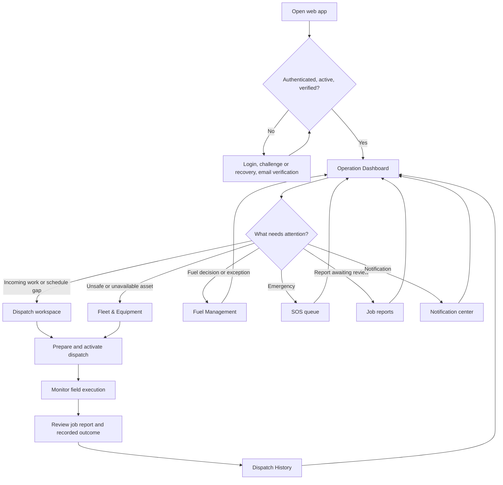
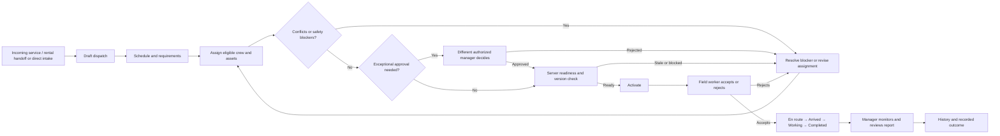

# Operations Manager web user flow

Last reviewed: 2026-09-27.

This maps the **current routed Operations workspace** for an account with the standard Operations Manager role. It covers the whole manager web journey, from sign-in and daily triage through dispatch closeout. Sections appear according to server permissions; account administration and audit history belong to other permissions. Core 1 owns commercial service, rental, and project transactions. Core 2 owns operational intake, resource coverage, assignment, safety, execution, and reporting.

## Whole-web journey

The dashboard is the daily decision hub. Its action queue prioritizes unresolved SOS incidents, dispatch-blocking assets, pending approvals, and fuel decisions. The schedule and readiness summaries link into the relevant workspace. The manager can enter any permitted section directly from navigation without following the dashboard sequence. The queue currently uses bounded workspace snapshots, so its count and empty state are **not** a complete all-records check; see the audit below.

## Section map and manager decisions

| Web surface | Manager's question | Main path and outcome |
| --- | --- | --- |
| **Operation Dashboard** | What needs action now, and what is scheduled today? | Inspect action queue, schedule, fleet readiness, and tracking preview; open the relevant record. |
| **Dispatch workspace → Incoming work** | Which service request or reserved rental delivery needs operational dispatch? | Review the source record and possible matching draft; convert an eligible handoff, or use **Create direct dispatch** for work without an upstream record. Unmatched handoffs need review. |
| **Dispatch workspace → Schedule** | Which jobs and resources cover the selected day or period? | Search/filter jobs; inspect schedule, requirements, conflicts and saved assignments; select a job. Use **Resource coverage** for phases, equipment reservations, crew shifts and linked dispatches. |
| **Selected dispatch → Prepare** | Are qualified people and safe assets assigned? | Set schedule and requirements; stage personnel and assets; inspect eligibility; save assignments; resolve overlaps, maintenance, inspection, credential and coverage blockers. Staged choices are not saved readiness. |
| **Selected dispatch → Approvals and activation** | May this job start now? | Review priority or exception requests independently, recheck the authoritative readiness state, then activate. A requester cannot approve their own exceptional request. A stale version requires refresh and review. |
| **Dispatch workspace → In progress** | What has the field actually recorded? | Monitor status events, reports, assignments and authorized shared location, with capture and receipt times. Respond to rejection, delay, safety issue or resource change through the permitted controls. |
| **Dispatch workspace → History** | What was the recorded outcome? | Search and page through completed or cancelled dispatches and inspect their outcome. |
| **Fleet & Equipment** | Is each vehicle or machine dispatchable? | Inspect status, DVIR evidence, blocking work and location; record inspection or maintenance action; return an asset to service only after clearance. An unsafe asset stays unavailable to assignment. |
| **Fuel Management** | Which requests and fuel records need a decision? | Review or reject submitted requests, verify approved work, inspect refueling logs, anomalies and missing receipt exceptions. The requester cannot review their own request. |
| **SOS banner and responder queue** | Is a field worker in immediate danger? | When enabled, acknowledge an incident, coordinate response, and resolve or cancel it with an audited outcome. Unacknowledged incidents escalate to company contacts at the configured deadline. |
| **Job reports** | Is the field report complete and credible? | Review submitted work evidence, approve or return for rework, and export permitted reports. |
| **Notifications and account settings** | What changed, and is my account secure? | Open a notification's related work; manage profile, password, two-step sign-in, sessions and trusted devices from account settings; sign out. |

## Primary dispatch path

Field status progression, DVIR walkaround, HoS duty logging, refueling and SOS initiation happen in the field client. The manager web app supervises the recorded work and handles office decisions; it does not substitute an office click for field evidence. Rental checkout/return and Core 1 receiving integration are only partially surfaced on the web, so the complete commercial rental journey is outside this flow.

## Cross-cutting branches and recovery

- **Project coverage:** In Schedule → Resource coverage, record the Core 1 project reference, phases, equipment and shifts; submit a baseline for independent approval; fill missing crew; open each linked dispatch. A change to an approved phase or allocation can require fresh approval and crew reconfirmation.
- **Asset safety:** A critical defect or blocking maintenance prevents assignment or activation. Follow inspection → maintenance → repair → passing post-repair inspection → release before treating the asset as ready.
- **Priority and emergency dispatch:** The requesting manager cannot decide their own approval. Rejection returns the job for revision; approval still requires the normal activation checks.
- **Stale, failed or incomplete data:** Refresh and review a changed job version. Dispatch search and calendar show the scope of totals and loaded pages; a failed search identifies when only a limited snapshot is visible. Missing location or report evidence remains explicitly unrecorded.
- **SOS release boundary:** The responder flow is implemented behind `SOS_ENABLED=false`; production use requires the enablement checks in the [SOS runbook](../runbooks/field-emergency-sos.md).
- **AI assistance:** A selected dispatch may offer advisory resource options when enabled. The manager still confirms any assignment in the normal picker. The standard manager role does not receive the GPT governance section.

## A manager's day, end to end

1. **Sign in.** Complete login and any required verification or two-step challenge. Arrive at **Operation Dashboard**; if the account is inactive or has no capabilities, resolve access through an administrator rather than attempting operational work.
2. **Triage emergencies first.** Check the persistent SOS banner and **Manager action & exception queue**. If an SOS incident is present and SOS is enabled, acknowledge it and open the responder queue. Confirm the worker, dispatch, asset, received time and escalation deadline; record the outcome after coordination.
3. **Clear safety blockers.** Open a blocked unit from the queue, find it in **Fleet & Equipment**, inspect the DVIR/inspection and maintenance history, and arrange repair or a different eligible asset. Do not infer that a missing item in the dashboard queue means all assets are safe.
4. **Handle independent decisions.** Open a pending dispatch approval from the queue, review its requester, job, schedule, site and resource delta, then approve or reject with a reason. A request made by this manager needs another authorized manager.
5. **Review fuel work.** Open **Fuel Management**, find the referenced request, approve or reject it, then verify completed refueling and receipt exceptions when applicable. Review anomalies as recorded evidence, not as an automatic fraud conclusion.
6. **Take in new work.** Open **Dispatch workspace → Incoming work**, inspect the service or reserved-delivery rental source, and check possible draft matches. Convert the eligible handoff. Use **Create direct dispatch** only when there is no upstream handoff; review unmatched handoffs separately.
7. **Plan coverage.** In **Schedule**, select the date and job. For a long-running project, use **Resource coverage** to create phases, reserve equipment, submit an independently approved baseline and fill shifts. Return from a linked dispatch to the selected coverage context.
8. **Prepare the job.** Open the selected dispatch, review schedule and requirements, choose qualified people and safe equipment, save the assignments, then resolve any readiness blockers. If the candidate list is empty, change the schedule/resource plan or resolve the underlying credential, overlap or safety condition; do not bypass server checks.
9. **Activate.** Review the saved readiness state and required approvals. Activate only after server revalidation. On a stale version or conflicting resource, refresh and review the changed job before trying again.
10. **Follow the field.** In **In progress**, open **Field execution** to inspect reported status, delays, recent job reports, assigned resources and shared location timestamps. Missing or stale telemetry is not proof of arrival or a live position. Reassign or escalate through the permitted controls when the field rejects work or reports a blocker.
11. **Close the loop.** Review the submitted **Job report**, approve it or return it for rework, and use **History** to confirm the recorded dispatch outcome. Export operational records when needed. A rejected report requires field correction; it does not erase the dispatch history.
12. **Finish the shift.** Review remaining notifications and account security as needed, then sign out.

## Screen-level paths and return routes

| Starting screen and trigger | Next screen or decision | How the manager gets back | What the current UI actually preserves |
| --- | --- | --- | --- |
| Dashboard → **Open incident** | SOS responder queue; acknowledge and resolve/cancel with recorded outcome | Workspace navigation → Dashboard | SOS opens its queue; the dashboard banner stays available while incidents are active. |
| Dashboard → **Review unit** | Fleet & Equipment; inspect asset, safety block and work orders | **Back to fleet list** on narrow layouts, or workspace navigation → Dashboard | The target **asset ID is not passed**. The manager must locate the unit again, and it may be outside the current fleet page. |
| Dashboard → **Review approval** | Direct dispatch detail; inspect approval context and submit reasoned decision | **Back to dispatch workspace** | Direct detail link identifies the job. The return destination defaults to dispatch unless a `return_to` context was supplied. |
| Dashboard → **Review request** or **Review fuel logs** | Fuel Management; find request, decision, log or exception | **Back to fuel queue**, **Fuel Logs**, or **Consumption** within Fuel; workspace navigation → Dashboard | The dashboard does not pass the request or log ID. Fuel preserves its internal list origin after a request is selected. |
| Dashboard → scheduled job reference | Direct dispatch detail; review next operational action | **Back to dispatch workspace** | Job ID is carried; the dashboard date/filter context is not. |
| Dispatch → **Incoming work** → handoff | Source review, possible draft review, then conversion to dispatch | Back to incoming queue or Schedule | Server-paginated incoming results; direct intake warns before discarding unsaved details. |
| Dispatch → **Schedule** → job row | Selected job review → separate detail page for preparation/assignment/activation | **Back to results** on phones; **Back to dispatch workspace** from detail | Desk URL preserves date, view, source, search, page and selected job; list scroll and focus restoration are implemented for the desk. |
| Dispatch → **Resource coverage** → linked shift | Linked dispatch detail | **Return to resource coverage** | Return URL carries coverage context, phase and timeline state. |
| Dispatch → **In progress** → job | Field execution view with status, reports, location and resources | Return to dispatch desk/history using the supplied return URL | Missing field evidence is shown as missing; capture and receipt times are distinct. |
| Fleet → asset list/map selection | Asset detail, inspection, maintenance, DVIR and location | **Back to fleet list** on narrow layouts | Fleet search/category are URL parameters; selected asset is local component state. |
| Fuel → request/log selection | Request detail, review decision or receipt exception | Contextual **Back to…** action | Internal return target is tracked for logs/consumption; cross-section source is not. |
| Job reports → report selection | Report detail; approve or reject with reason | **Back to reports queue** on narrow layouts | Selection is local; report search/filter determines the visible queue. |
| Notification center → alert | Destination section for dispatch, fuel, safety or SOS | Workspace navigation or browser Back | Notification routing carries a **section only**, not the linked dispatch/request/incident record. |

## Decision, loading and error-state coverage

| Situation | Current screen behavior | Required manager response / audit judgment |
| --- | --- | --- |
| Wrong credentials, inactive account, unverified email or challenge | Authentication gates keep the user out of operational pages. | Resolve login or access before work. No operational fallback should bypass this gate. |
| No dashboard queue items | Shows **Nothing needs your decision**. | Treat this as no items in the loaded snapshot, not proof that all permitted approvals, fuel requests and blocked assets are clear. **Finding A1.** |
| Dashboard daily schedule cannot load | Schedule panel shows an error and **Retry**; other dashboard data remains usable. | Retry or open Dispatch workspace before using schedule counts for decisions. |
| Dispatch search fails | Explicit warning says whether a last loaded page or limited initial snapshot is visible, with **Retry search**. | Do not treat the fallback list or its counts as a complete queue. This is a sound recovery pattern. |
| Incoming handoff has a possible draft or is unmatched | Handoff review/reconciliation precedes conversion. | Confirm the match or resolve the unmatched source; avoid duplicate dispatches. |
| No eligible person or asset / safety or overlap conflict | Candidate and readiness views describe eligibility/blockers; server rejects invalid assignment/activation. | Adjust schedule, fix credentials/safety, or choose another candidate; refresh after changes. |
| Priority approval rejected or self-review blocked | Approval stays separate from activation; a reason is required. | Revise or cancel the request, or wait for independent review. Rejection never activates the job. |
| Dispatch version changed | Server rejects stale mutation; the detail workflow calls for refresh and review. | Re-read assignments, approvals and readiness before resubmitting. |
| No recent field location/report/status evidence | Field execution distinguishes unrecorded evidence and location capture/receipt times. | Contact the field or wait for sync; do not infer status or ETA from the planned route. |
| Report rejected | Report retains the rejection reason and returns to the field for rework. | Review the resubmission rather than treating the job as lacking a recorded outcome. |
| SOS unavailable in production | SOS remains behind `SOS_ENABLED=false` pending runbook gates. | Follow the organization's external emergency procedure; the web flow cannot be relied upon until enabled and drilled. |

## UX audit findings and action order

This is a **static code and document audit** of the routed manager web app. It covers information architecture, operational clarity, return paths, state completeness, and permission boundaries. The app was not running locally on ports 8000, 8001, 5173 or 4173, so visual contrast, responsive layout, keyboard behavior, and real end-to-end timing were **not** directly verified in a browser. Five focused React test files were run: 118 tests passed. Those tests check existing components; they do not prove the cross-section handoffs or eliminate the findings below.

| ID / priority | Finding and evidence | Manager impact | Recommended acceptance outcome |
| --- | --- | --- | --- |
| **A1 / P1** | The dashboard queue is assembled from loaded `assets`, `approvals` and `fuelRequests`, while the overview loader caps assets at 50 and fuel/approvals at 100. Its empty message says **Nothing needs your decision** without that scope. See `manager-dashboard.tsx`, `manager-action-queue.tsx`, and `OperationsWorkspaceController.php`. | A manager could interpret an incomplete snapshot as an all-clear for safety or approvals. | Show the scope beside queue counts and empty state, or supply authoritative server counts/query for every queued category. Link to complete filtered queues. |
| **A2 / P2** | **Review unit** and **Review request** call only `onSectionChange('assets'/'fuel')`; those surfaces initialize selection locally and can be paginated. See `manager-action-queue.tsx`, `fleet-surface.tsx`, `fuel-surface.tsx`. | The manager must search again and may not find the item on the loaded page. | Carry asset/request IDs through the section URL, fetch the record when needed, open its detail, and preserve a dashboard return route. |
| **A3 / P2** | Notification destination is a section enum. The notification center and popover call `onNavigate(destination)` without record identity. See `notification-center-popover.tsx` and `notifications-workspace-section.tsx`. | A dispatch, fuel or safety alert can open a broad section without locating the event it announced. | Make notification targets typed record URLs or section-plus-ID targets; verify missing/deleted/unauthorized targets have an explicit fallback. |
| **A4 / P2** | Workspace section changes use a partial Inertia visit. The page shows a loading placeholder while required section props are absent, but `changeSection` has no explicit visit-error state or retry for a failed section navigation. See `workspace.tsx`. | A failed transition can leave the manager facing a loading section with no local recovery action. | Add a section-load error with Retry and a route back to the prior section; preserve the last usable data if safe. Test network and server failures. |
| **A5 / P3** | Dashboard scheduled job links identify the job, but generic dashboard-to-section navigation does not carry the dashboard's selected source or date. Direct dispatch detail has a return link to the workspace. See `manager-schedule-panel.tsx`, `manager-dashboard.tsx`, and `dispatch-detail.tsx`. | Returning from a scheduled job can require resetting the day/filter in the desk. | Pass an origin URL or desk date/filter context from dashboard links, then restore it on return. |

### What is already working well

- Dispatch desk search gives explicit page scope, a stale/snapshot warning and a retry action. Its detail URL and phone **Back to results** path preserve more context than generic cross-section links.
- The manager approval path shows requester and proposed changes, requires a reason and enforces independent review on the server.
- Field execution separates planned information from actual reported status and location timestamps; missing evidence is described rather than filled in.
- Fleet, Fuel and Reports each have a narrow-screen list-to-detail return control. Fuel also remembers whether the request was opened from logs or consumption.

### Release verification to perform after fixing A1–A4

1. Seed more than 50 assets and more than 100 pending fuel/approval records. Confirm dashboard counts and empty wording state their actual scope, and every queued item opens the correct record even when it starts outside page one.
2. Open an asset, fuel request, dispatch and SOS alert from dashboard and notifications at desktop and phone widths. Confirm record identity, Back behavior, filters, scroll and keyboard focus.
3. Force a failed partial section load, failed daily schedule fetch, failed dispatch search, stale dispatch version, rejected approval and no eligible asset. Confirm the exact next action and retry path on each screen.
4. Run the manager browser journey with keyboard navigation and Axe on the dashboard, each list/detail surface, approval dialog and SOS controls. Validate contrast and hit target sizes against the design system.

## Permission boundary

The standard Operations Manager role can work across dispatch, assignments, assets, fuel review, tracking, safety, SOS response and reports. **Users & access**, **Audit trail**, **Archived dispatches**, and **GPT AI Advisory governance** are not standard manager navigation items. Visibility is permission-scoped and every mutation is authorized again by the server.

## Sources checked

- [Current web navigation and capabilities](../../apps/operations/app/Platform/Workspace/ViewModels/OperationsWorkspaceViewModel.php)
- [Manager role permissions](../../apps/operations/database/seeders/RolePermissionSeeder.php)
- [Workspace section loading and navigation](../../apps/operations/resources/js/pages/workspace.tsx) and [overview data limits](../../apps/operations/app/Platform/Workspace/Http/Controllers/OperationsWorkspaceController.php)
- [Dashboard actions](../../apps/operations/resources/js/components/dashboards/manager/manager-action-queue.tsx), [fleet selection](../../apps/operations/resources/js/components/workspace/fleet/fleet-surface.tsx), [fuel selection](../../apps/operations/resources/js/components/workspace/fuel/fuel-surface.tsx), and [notification destinations](../../apps/operations/resources/js/components/workspace/notification-center-popover.tsx)
- [Dispatch desk](../../apps/operations/resources/js/components/workspace/dispatch-desk/dispatch-desk.tsx), [dispatch search recovery](../../apps/operations/resources/js/components/workspace/dispatch-desk/use-dispatch-search.ts), and [detail return path](../../apps/operations/resources/js/pages/dispatch-detail.tsx)
- [Office dispatch workspace](dispatch-workspace.md) and [resource coverage](dispatch-project-planning.md)
- [Existing all-role flows](userflow.md) and [SOS runbook](../runbooks/field-emergency-sos.md)
