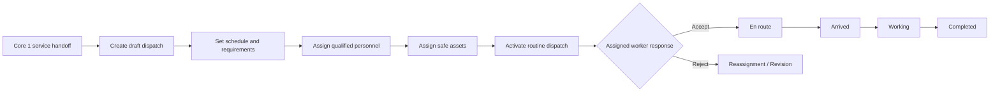
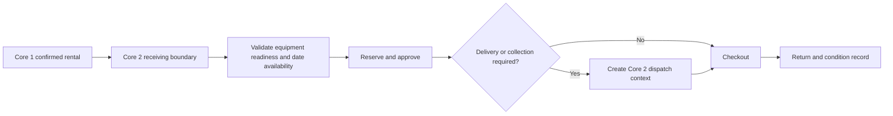
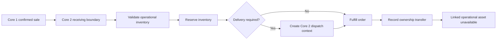
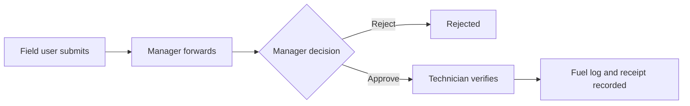
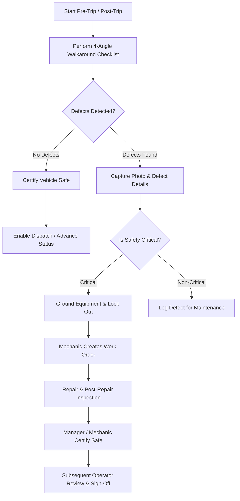
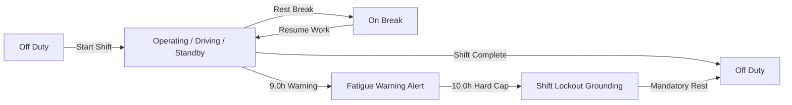
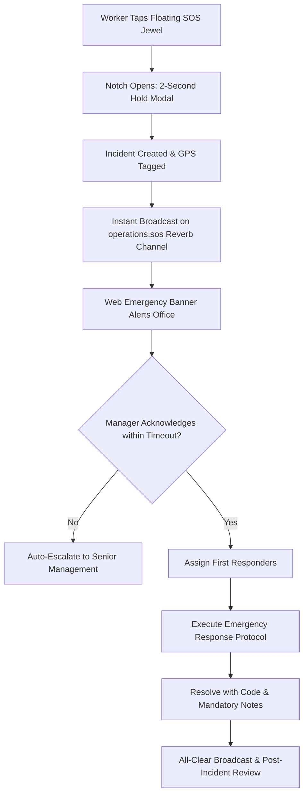

# Core Transaction 2 — User Flows

**Last updated:** 2026-09-16

## 1. Internal access

1. User opens the application and a guest is redirected to `/login`.
2. Credentials are validated against an active, non-suspended account.
3. Laravel regenerates the session.
4. Unverified users are directed to email verification.
5. Verified users enter the capability-scoped operations workspace.
6. Navigation and server data reflect the authenticated user's permissions.

Failure paths include invalid credentials, throttling, suspension, and unverified email.

The operational journeys below execute across the **5 Main Operational Business Modules** (1. Dispatch Job and Scheduling [Real-Time Activation], 2. Assign Driver/Operator and Equipment, 3. Fleet Management, 4. Crane and Equipment Management, 5. Fuel Management) and govern the **3 tri-modal business flows** (Service, Rental, and Sales). DVIR, HoS, emergency SOS, statutory safety governance, and GPT advisories operate as integrated sub-features and platform services.

Core 1 is the upstream source for customer, commercial, job-order, rental, and
project context. Core 2 receives three handoff types from Core 1—service,
rental, and sale—and performs the operational workflow. Complete commercial
contracts, customer-facing screens, payments, billing, and invoicing remain in
Core 1 and are outside this repository's scope. Only the Core 2 receiving
adapter and downstream operational handoffs are potential Core 2 work. See
[Alibaton Business Context and CT2 Scope](./alibaton-business-scope.md) for Core 1 commercial boundaries.

The target entry flow is:

```text
Core 1 service, rental, or sale transaction
    -> authenticated Core 2 receiving boundary
    -> Core 2 validation and operational record
    -> availability/readiness checks
    -> scheduling, assignment, fulfillment, or dispatch
    -> operational status and audit
```

### Source-aware New dispatch entry

The dispatch workspace exposes one **New dispatch** entry point. Core 1
identifies each incoming handoff, so Core 2 routes it automatically:

1. An eligible Service Request opens the linked service workflow.
2. An eligible reserved Rental delivery opens the rental handoff workflow.
3. An eligible confirmed Sales delivery opens the sales handoff workflow.
4. If no upstream handoff exists, an authorized user can choose **Create
   direct dispatch**. This creates a Core 2 operational draft with
   `manual_intake` provenance and does not create a commercial transaction.

Incoming work is shown as a queue of source-specific records, not as three
source categories the user must choose between. Unmatched handoffs are
reviewed through a separate **Review unmatched handoffs** action. A suggested
match to a manual draft remains advisory until the user reviews and confirms
it. Source eligibility, duplicate prevention, readiness, authorization, and
audit are enforced server-side after automatic routing and every submission.
See the
[dispatch intake source graph](../design/Diagrams/dispatch-intake-source-graph.md)
for the decision graph and gate contract.

## 2. Module 1 & Module 2: Dispatch, scheduling, assignment, and management




The current routed workspace provides transitional local creation of active
clients and service requests until the Core 2 receiving boundary is
implemented. It converts a received or locally recorded request into one or
more distinct draft dispatches. The first conversion changes the request from `submitted` to
`dispatching`; request-owned fields cannot be overridden during conversion.
The live dispatch workspace renders a server-backed schedule board, conflict
review, and detailed resource availability checks covering credentials, asset
readiness, blocking maintenance, and schedule overlaps.

At confirmation time, the server locks and revalidates the selected resources,
rejecting duplicate, unavailable, suspended, unqualified, unsafe, maintained,
or overlapping personnel and assets without partially saving the batch.
Activation rejects stale job versions and revalidates the current eligibility
of assigned personnel and assets before changing the dispatch status. Activation
and field status controls remain separated: authorized Operations Managers activate from the live detail
workspace, while assigned field users receive their own next-step controls.
Assigned personnel can accept or reject an assignment with a required reason.
Authorized users may also execute required-reason cancellation, reassignment,
and controlled job reopening within the Inertia workflow. Activation requires at
least one active personnel assignment and one active asset assignment,
revalidates current asset safety, and returns stale versions to an explicit
refresh-and-review state.

## 3. Module 1: Priority or emergency dispatch

1. Operations Manager creates a priority or emergency job and assigns resources.
2. Assignment creates a pending approval request.
3. Operations Manager reviews the requester, dispatch context, schedule, site,
   version, and named resource changes.
4. The manager approves or rejects with a required reason; the requester cannot
   decide their own request.
5. Activation succeeds only when the latest applicable approval is approved.
6. Rejection returns the work to Operations Manager attention; it does not activate the job.

## 4. Module 2: Assigned field worker (Operator)

1. Operator opens the native mobile app (Tactical Cockpit HUD) and requests assigned work.
2. The server returns only jobs with an active personnel assignment for that authenticated user.
3. The live `Today's work` surface displays assigned jobs with priority, location, equipment, and contact details without exposing another worker's records.
4. Operator performs mandatory pre-trip **Driver Vehicle Inspection Report (DVIR)** with 360-degree walkaround photo tagging and logs **Hours of Service (HoS)** duty status change to `on_duty_not_driving` or `driving`.
5. Operator responds to the assignment by accepting or rejecting it with a required reason. Rejection closes the active assignment interval and flags the dispatch for manager review.
6. Once accepted, the server supplies only the next valid action. The operator reviews a consequence-specific confirmation before submitting it.
7. Operator advances one step at a time:
   `dispatched → accepted → en_route → arrived → working → completed`.
8. Each request includes the current optimistic version and disables repeated submission while processing.
9. A stale version receives a distinct refresh-and-review state; skipped, reversed, unauthorized, and terminal transitions fail without a state or audit write.
10. Every successful step increments the version and records the actor, subject, before/after status, time, IP context, and a server-generated request ID in the audit trail.
11. When sharing is enabled, the operator submits timestamped coordinates. At any point in time, the operator can tap the floating SOS emergency jewel to trigger an immediate distress alert.

### Heavy-crane navigation and operational mode split

When the assigned asset is a mobile or heavy crane, the operator's field journey uses an explicit driving/setup split:

1. Assignment review identifies the selected asset as a heavy crane and verifies the operator's professional credentials.
2. Drive mode activates turn-by-turn heavy vehicle navigation showing approved truck/crane corridors, height/weight clearances, destination, site entrance, and ETA.
3. The Tactical Cockpit HUD remains glanceable with high-contrast day/night themes while moving; the operator is not required to type or pan the map while the vehicle is in motion.
4. After arrival, the operator confirms the crane is parked and secured.
5. Only then does Crane setup mode expose the site map, ground bearing checks, outrigger deployment, work zone, 15m exclusion area, hazards, and blocking safety checks. Crane operation remains blocked until the required checks are confirmed.
6. Switching between Drive mode and Crane Operation mode is an explicit operator action and never implicit.

### Heavy-lift rigging & ground crew workflow

1. Riggers assigned to the lift crew are verified for valid certifications (e.g., TESDA Crane Rigging NC II, DOLE-BOSH) and availability status during dispatch assignment.
2. Because Riggers are non-software employees without mobile or web user accounts, all on-site safety verifications (sling condition, rigging tackle, tag-line attachment, outrigger pad positioning, 15m exclusion zone enforcement) and lift milestone completions are confirmed with the rigger and submitted digitally via the Operator's mobile app or the Operations Manager's workspace.

The current browser tracking surface queues location writes in a local outbox,
adds an idempotency key, replays after reconnection, and surfaces queued,
syncing, failed, conflict, and synchronized states on a MapLibre tracking
map with freshness filters. The versioned `/api/v1` command flow is implemented
with expected versions and conflict responses; the 8-hour native field outbox
and device integration remain planned.

## 5. Tri-Modal Inbound Flow: Rental received from Core 1



Core 1 owns the customer-facing rental transaction, contract, commercial
terms, deposits, payments, and billing. Core 2 receives the operational rental
work, checks date overlap and equipment readiness, approves the reservation,
records checkout and return condition, and updates asset status. A delivery or
collection creates a dispatch only when operational scheduling is required.

The reservation, approval, checkout, return, condition, and asset-status
actions remain a partial backend/API slice. The Dispatch Workspace now lists
reserved delivery rentals and can create an authenticated, source-linked
dispatch handoff atomically. A linked rental cannot be checked out while its
dispatch is incomplete; pickup and legacy unlinked delivery records remain
compatible. The Core 1 receiving adapter and complete routed rental UI remain
future work.

Every Rental command is a session-authenticated, CSRF-protected JSON request.
The server derives rental days and totals, requires exact route permission, and
rechecks the complete asset batch after ascending row locks. A stale asset,
blocking maintenance/inspection, overlapping active Rental/Dispatch use, or
committed Sales use fails the whole command with a validation conflict. Checkout
and return require bounded non-empty condition evidence; return preserves a
more restrictive asset state.

## 6. Tri-Modal Inbound Flow: Sale received from Core 1



Core 1 owns quotations, customer acceptance, commercial pricing, payments,
taxes, invoicing, and accounting. Core 2 receives confirmed sale work, checks
operational inventory, reserves and fulfills it, coordinates delivery when
required, records ownership transfer, and makes a linked operational asset
unavailable.

Inventory reservation, ledger entries, fulfillment, and ownership transfer
remain a partial backend/API slice. The Dispatch Workspace now lists confirmed
delivery orders, accepts a delivery window, and creates an authenticated,
source-linked dispatch handoff atomically. A linked sale cannot be fulfilled
while its dispatch is incomplete; pickup and legacy unlinked delivery records
remain compatible. The Core 1 receiving adapter and complete commercial UI
remain future work.

Sales commands are also JSON-only on the session boundary. Quote acceptance
locks and rechecks the quote, catalog rows, and linked assets before creating an
order, reserving stock, writing the ledger, changing quote state, and auditing.
Fulfillment rechecks stock and readiness and makes physical linked assets
unavailable. Confirmed, fulfilled, and transferred order status remains a sale
commitment; ownership transfer is terminal and cannot be reversed by an
operational status, inspection, maintenance, or Rental-return path.

## 7. Module 5: Fuel Management (Fuel Request & Anomaly Tracking)



The server implements submission, forwarding, approve/reject, verification,
and final logging. Logging records quantity, price per litre, total cost,
odometer, hour meter, station, remarks, an optional receipt attachment, and
audit history.

## 8. Module 3 & Module 4: Fleet & Crane/Equipment Inspection and Maintenance Release

Fleet vehicles (Module 3) and Crane/Equipment assets (Module 4) are managed through a
unified operational asset register in the routed workspace:

1. Authorized technician submits an inspection checklist and result.
2. Failed or conditional result places the asset under inspection.
3. Technician opens maintenance and declares whether the defect blocks dispatch.
4. Asset moves to `under_maintenance`; blocking work prevents assignment.
5. Repair work is recorded.
6. A new inspection completed after the repair must pass.
7. Technician releases the work order.
8. Asset becomes `ready_for_service` only if no unreleased blocking work remains.

## 9. Shared service: User administration

1. System Administrator creates an internal account with one canonical role.
2. Administrator records personnel availability and credentials where relevant.
3. Role or activation changes invalidate the user's existing sessions.
4. The system refuses a change that would remove the last active System Administrator.
5. The access change is written to the audit log.

The backend endpoints exist; the current workspace only lists users and roles.

## 10. Shared service: GPT-assisted dispatch — current backend flow

1. Authorized office user requests a recommendation using scoped, redacted context.
2. GPT returns proposed assignments, reasons, assumptions, and conflicts.
3. The product stores model metadata and recommendation lifecycle.
4. User resolves conflicts and explicitly accepts or rejects the recommendation.
5. Acceptance invokes the normal assignment/approval action.
6. All authorization, validation, locking, and audit rules still apply.

GPT must never write directly to operational records. The current repository
queues a bounded recommendation, stores lifecycle/usage/expiry metadata, and
supports authorized human accept/reject commands that re-enter normal domain
actions. The live routed workspace does not yet expose the complete GPT review
surface.

## 11. Fleet & Equipment Sub-system: Driver Vehicle Inspection Reports (DVIR)



1. **Initiation**: Operator selects assigned crane/vehicle and initiates pre-trip inspection prior to dispatch or post-trip inspection at shift end.
2. **4-Angle Walkaround**: Operator completes mandatory checklist items across 4 tagged angles (`front`, `back`, `driver_side`, `passenger_side`) covering brakes, steering, tires/tracks, outriggers, wire rope, hydraulics, cab instruments, lights.
3. **Defect Capture**: If a component fails, operator takes mandatory photographic evidence via mobile camera and inputs a defect description.
4. **Safety-Critical Gate**: If flagged `is_safety_critical`, the asset immediately transitions to `grounded` and is barred from dispatch.
5. **Corrective Workflow**: Mechanic or Operations Manager reviews defect list, opens linked maintenance work orders, and repairs the issue.
6. **Sign-Off & Return to Service**: Mechanic certifies repair; subsequent operator reviews prior defect history and signs off before operational handover.

## 12. Driver/Operator Assignment Sub-system: Hours of Service (HoS) & Fatigue Management



1. **Duty Status Changes**: Operator toggles duty status (`operating`, `driving`, `standby`, `on_break`, `off_duty`) on the mobile Cockpit HUD (`HosScreen.tsx`).
2. **Shift Duration Enforcement**: System tracks continuous elapsed shift time against Philippine DOLE-OSHC heavy equipment limits: 10.0-hour hard cap with Night Shift Differential (+10%) calculated between 22:00 and 06:00.
3. **Fatigue Warnings & Lockout**: At 9.0 cumulative hours of shift duty, an automated threshold warning alerts the operator and dispatch supervisor. At 10.0 hours, automated shift lockout is triggered, barring further dispatch operations until mandatory rest requirements are met.
4. **Rest Break Logging**: Operator logs `on_break` periods during the shift for fatigue mitigation.
5. **Log Certification & Edits**: Operator electronically signs duty logs (`operator_duty_logs`); any manual adjustments require a mandatory reason and are logged to an immutable audit trail.

## 13. Statutory Safety Governance (DOLE OSHS Rule 1410 & DO 198-18)

1. **Toolbox Meeting (TBM)**:
   - Before daily operations, Operator conducts a site briefing.
   - Operator records topics discussed, hazards identified, and site GPS coordinates.
   - Rigger and other crew members sign digitally on the mobile device.
   - Operations Manager reviews and countersigns the TBM in the web workspace.
2. **Critical Lift Plan Authorization**:
   - For lifts > 75% rated crane capacity, tandem lifts, or lifts over structures, Operations Manager creates or reviews a Critical Lift Plan.
   - Ground bearing capacity, crane boom configuration, rigging tackle, and maximum wind speed limits are verified.
   - The plan requires managerial digital authorization before field lifting can proceed.
3. **Work Stoppage Order (WSO)**:
   - Any worker observing imminent danger (e.g. soil shifting, high winds, crane instability) invokes a WSO under DOLE DO 198-18.
   - The system immediately halts field dispatches on site and broadcasts an emergency alert via Reverb.
   - The Operations Manager conducts an investigation and must digitally certify hazards resolved before lifting the stoppage.
4. **Safety Hazard Reporting**:
   - Field personnel submit near-miss or hazard reports with severity rating (`low`, `medium`, `high`, `critical`), GPS, and photos.
   - Operations Manager assigns corrective actions and tracks resolution status.

## 14. SOS Emergency Response System



1. **Distress Activation**: Operator taps the persistent floating SOS jewel in the mobile app, triggering the cradle notch and a 2-second hold confirmation modal (with 5-second cancel countdown).
2. **Instant Alert Broadcast**: Server records the incident with GPS coordinates and broadcasts immediately across the `operations.sos` Reverb channel.
3. **Office Notification**: Operations workspace renders an audible/visual emergency banner with live worker location and contact info.
4. **Escalation Sweep**: If not acknowledged within the escalation threshold, automated scheduler escalates the alert to senior management.
5. **Resolution**: Responders coordinate assistance, mark the status as resolved using a valid code (`all_clear`, `assistance_rendered`, `evacuated`, `medical_attended`, `false_alarm`), and record detailed notes.

## 15. Dispatch Project Planning & Multi-Crane Allocations

1. **Project Plan Creation**: Operations Manager creates a multi-day industrial project plan, setting scope, customer, site, and operational dates.
2. **Phases & Milestones**: Manager defines sequenced phases with predecessor dependencies (e.g. Phase 1: Site Prep & Foundation, Phase 2: Heavy Turbine Lift).
3. **Multi-Crane Allocation**: Manager assigns required crane fleet and operator crews across milestones. Conflict detection engine flags overlapping dispatches or equipment maintenance conflicts.
4. **Task Dispatch Generation**: Structured tasks are converted into actionable dispatch jobs linked to the project plan.
5. **Closeout Dossier**: Upon project completion, the system collates all dispatch tickets, job reports, DVIR walkarounds, and safety sign-offs into a unified compliance archive.

