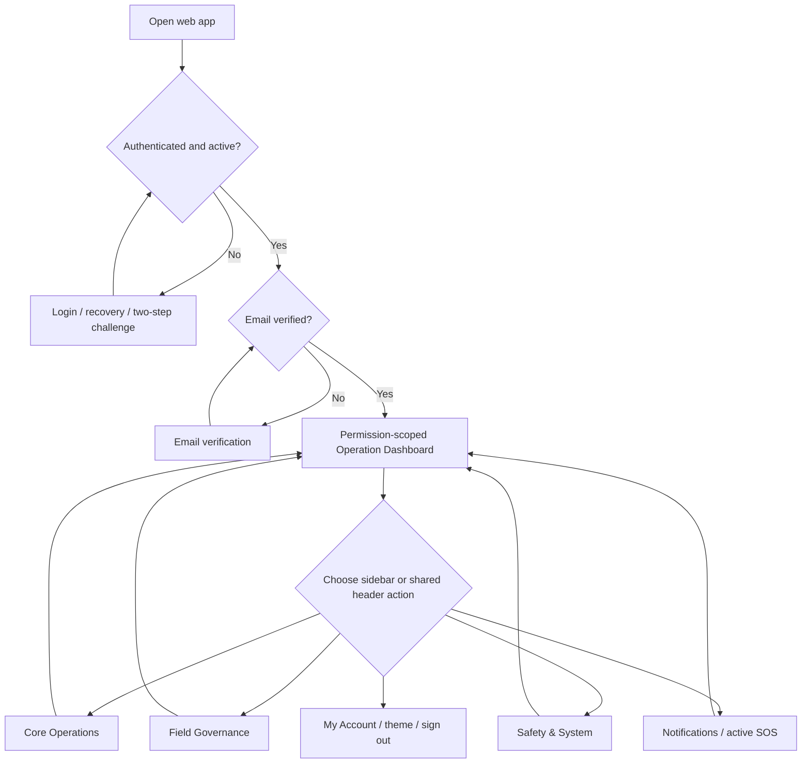

# Whole-web sidebar and user flows

Last reviewed: 2026-09-27.

This maps the **routed** Core 2 web workspace at `/` and `/operations`, including every standard sidebar item and shared header destination for the three interactive users: System Administrator, Operations Manager, and Operator. Riggers are non-software workforce crew: they have no web or mobile login journey. The separate [Operations Manager web audit](operations-manager-web-user-flow.md) gives the deeper dispatch-to-closeout journey and manager findings.

This is a code and documentation audit, not a completed browser walkthrough. The legacy read-only prototype at `resources/js/pages/operations.tsx` and the native field app are separate surfaces. Current implementation, seeded permissions, and tests take precedence over older product prose.

## Entry and navigation model

The shell groups server-provided navigation into **Core Operations**, **Field Governance**, and **Safety & System**. Navigation changes the `view` parameter through an Inertia partial visit. The first permitted item is the default. On narrow screens the sidebar becomes a dialog with Escape, Tab containment, and focus restoration. The header holds notification access, active SOS response when permitted, refresh/freshness notices, and the account menu. A sidebar item being hidden does not replace server authorization for its actions.

## Who sees each sidebar item

The table reflects the **three interactive product roles**, not custom permissions. ✓ means present in the sidebar; — means absent. The code still contains a legacy `rigger` software role; that is an implementation contradiction, not a fourth intended login role (finding W1).

| Sidebar item | Administrator | Manager | Operator | Primary destination |
| --- | :---: | :---: | :---: | --- |
| Operation Dashboard | ✓ | ✓ | ✓ | Role-specific overview and next actions. |
| Dispatch workspace / Today's work | ✓ | ✓ | ✓ | Office dispatch desk for Administrator/Manager; assigned-work view for Operator. |
| Fleet & Equipment / assigned asset label | ✓ | ✓ | ✓ | Asset list/map/detail scoped by permissions. |
| Fuel Management | ✓ | ✓ | ✓ | Office review for Administrator/Manager; own requests and recording for Operator. |
| Job reports | ✓ | ✓ | ✓ | All/dispatch/own reports as permitted; manager review and export only where granted. |
| Archived dispatches | ✓ | — | — | Search and inspect archived/cancelled jobs; authorized restore. |
| GPT AI Advisory | ✓ | — | — | Recommendation lifecycle, governance telemetry and circuit-breaker controls. |
| Users & access | ✓ | — | — | Account management and personnel credentials. |
| Audit trail | ✓ | — | — | Audit event search, detail and permitted export. |

**Not permanent sidebar items:** Notifications opens from the header. The SOS responder queue opens from the active banner or dashboard action for a user with `sos.view`/`sos.respond`; the standard Administrator can view but not respond, and the Manager can respond. Tracking uses the Fleet & Equipment map, so there is no separate standard Tracking item. The approval renderer exists, but standard manager approvals are entered from the dashboard or dispatch detail rather than an Approvals sidebar item. Account settings is reached from the account menu, not the sidebar.

## Screen paths for every destination

| Start → click | Next decision and completion | Return / recovery |
| --- | --- | --- |
| **Operation Dashboard** → action card or schedule item | Administrator checks service health, users, audit, AI and operations; Manager triages SOS, blocked assets, approvals and fuel; Operator opens assigned work. | Use the relevant section's Back control or sidebar Dashboard. Dashboard cards can open only a broad section; linked-record gaps are documented below and in the manager audit. |
| **Dispatch workspace** → Incoming work / Schedule / In progress / History | Office role reviews Core 1 handoff or direct intake, plans and assigns resources, obtains independent approval if needed, activates, monitors field work and reviews history. Schedule → Resource coverage handles phases and shifts. | Desk URL preserves its filters, page, selected job and date; detail uses `return_to`. Failed search has an explicit limited-snapshot warning and Retry. See [office dispatch flow](dispatch-workspace.md). |
| **Today's work** → assigned job | Operator reviews assigned dispatch, responds and performs the next permitted field step. | Return to assigned list; rejected assignment returns to office attention. Rigger checks are confirmed with the crew and recorded by an Operator or Manager. |
| **Fleet & Equipment** → asset list/map → asset detail | Inspect recorded location freshness, DVIR, inspections, maintenance and dispatch readiness; authorized users can record maintenance or release after clearance. | Back to fleet list on narrow screens; search/category live in URL. Missing location is labelled unavailable. A dashboard blocked-unit action does not preselect the asset. |
| **Fuel Management** → Requests & Approvals / Fuel Logs / Consumption | Review/approve/reject/verify as permitted, record refueling if permitted, inspect anomalies and receipt exceptions. | Contextual Back to queue/logs/consumption within the section. Validation errors stay on the form. A dashboard fuel action does not preselect its request. |
| **Job reports** → report queue → report detail | Office reviewer approves or rejects a submitted report with reason, or exports permitted records; field role sees own permitted reports. | Back to reports queue on narrow screens; search and status filters remain within the section. Rejected reports retain the reason for resubmission. |
| **Archived dispatches** → archived row | Administrator reviews reference, client, status, cancellation/archive reason and timestamp; restores when permitted. | Remain in archive after action. Search is local to the loaded archive sample; see W2. |
| **GPT AI Advisory** → recommendation history/detail or governance | Administrator inspects pending, accepted, rejected, stale or failed recommendations; can retry permitted failures and review governance telemetry/circuit breaker. | Stay in governance list/detail. A selected recommendation ID supports deep linking; failed telemetry fetch shows retry before circuit-breaker action. Advice never directly changes dispatch without normal validation. |
| **Users & access** → Accounts / Personnel credentials | Administrator searches software accounts, creates one of the three interactive roles, changes role or active state, resets password, reviews sign-in activity; credentials are managed in the other tab. | Return to account list or switch tabs. Riggers should appear as workforce personnel profiles, without an account; current candidate/credential paths are partly user-linked (W3). |
| **Audit trail** → event row/detail/export | Administrator filters by action, actor, date and text, inspects before/after and request ID, and requests permitted CSV/PDF export. | Close detail to the loaded event list. The list is capped at the most recent 100 records; see W2. |
| **Header → Notifications** → alert | Mark/read the alert and open its destination section, or load older notifications. | Use sidebar or browser Back. Alert navigation currently carries section only, not the specific record; see manager finding A3. |
| **Banner/header → SOS queue** → incident | Authorized office responder acknowledges, coordinates and resolves/cancels with an audited outcome. | Return by sidebar; response is feature-gated in production per the [SOS runbook](../runbooks/field-emergency-sos.md). |
| **Account menu → My Account** | Update profile/password, email verification-code two-step sign-in, sessions and trusted devices; choose light/dark/system theme or sign out. | Return to workspace with browser Back or app navigation. Logout ends the session. |

## Role journeys across the sidebar

### System Administrator

Sign in → **Operation Dashboard** service health and governance indicators → **Users & access** account/credential work → **Audit trail** to verify access changes → **GPT AI Advisory** for advisory governance → **Archived dispatches** for restore/history → operational sections for oversight → Notifications/My Account → sign out. Administrator has broad read and governance permissions but does not receive the standard manager's SOS response, field fuel recording, own tracking sharing or field SOS trigger permission.

### Operations Manager

Sign in → Dashboard triage → Dispatch intake/schedule/resource coverage → assign and approve independently → activate → monitor field execution → Fleet/Fuel/Safety decisions → review Job reports and Dispatch History → notifications and sign out. See the [detailed manager flow and audit](operations-manager-web-user-flow.md).

### Operator

Sign in → field Dashboard → **Today's work** for assigned dispatch and response/status → assigned asset view → own Fuel Management request/logging → own Job reports → account/notifications. DVIR, HoS, navigation and emergency SOS initiation are primarily native field-app workflows; web availability depends on the implemented route and capability, and web status controls are still server-authorized.

### Rigger / Signalperson: no software journey

The Operations Manager selects a qualified Rigger from workforce personnel records during crew planning and checks certification and availability. On site, the Operator or Manager confirms safety checks and lift milestones with the Rigger, then records the evidence in their own authenticated workflow. A Rigger receives **no web sidebar, mobile app session, password, or API token**. The current user-linked assignment model does not yet fully satisfy this product boundary (W3).

## Whole-web audit findings outside the manager flow

| ID / priority | Evidence and effect | Recommended acceptance outcome |
| --- | --- | --- |
| **W1 / P1** | Product and workforce-boundary docs require no Rigger software account. The backend still defines a `rigger` RBAC role with web permissions; `LoginRequest` checks account activity and password but not this role. An active legacy Rigger `User` with credentials could therefore sign in to the web. The mobile `AuthController` likewise checks activity and verification but not role before issuing a Sanctum token; the mobile client rejects the role afterward. | Remove or disable the legacy interactive Rigger role after migrating dependent records. Deny web session and mobile token issuance for any remaining Rigger `User`, revoke existing sessions/tokens, and test both entry points. |
| **W2 / P2** | Administrator **Audit trail** loads the latest 100 events and **Archived dispatches** loads 100 jobs. Both surfaces filter only their loaded arrays, while archive's empty/search copy reads as if it covers the full history. | Add server pagination/search and clear result scope, or label both as recent/loaded records and link to a complete authorized query. Verify record 101 can be found. |
| **W3 / P1** | Riggers are meant to be assigned from non-login `PersonnelProfile`/credential records, but `PersonnelCandidateQuery`, assignment requests, and project shift candidate search use `users`/`user_id`, including the Rigger type. This creates pressure to create a software account just to schedule a Rigger. | Make Rigger assignment and credential checks profile-backed across dispatch and resource coverage; keep Operators as account-backed candidates. Test planning, conflicts, safety eligibility, and historical assignments without a Rigger `User`. |
| **W4 / P2** | Cross-section navigation generally passes a section ID. The manager audit identifies lost asset/fuel record context, and notifications also open only the destination section. The same navigation contract is shared across roles. | Use typed destinations carrying record identity, permissions, return URL and missing-record fallback. Test each sidebar-adjacent alert/card jump. |
| **W5 / P2** | Partial section visits show a loading placeholder while required props are absent, but navigation has no local visit-error state/retry. This affects every sidebar item, not only Manager screens. | Provide a section-load error and Retry/Back, preserving the prior usable section. Exercise failure for each data-heavy destination. |

The manager-specific findings A1–A5 remain in the [manager audit](operations-manager-web-user-flow.md). Three focused React test files passed (24 tests) for the overview dashboard, user management and GPT governance. These tests do not verify the no-login Rigger boundary. This document does not claim a visual or accessibility pass: no local web server was available for browser inspection. A complete release review should execute each **interactive** role journey above at desktop and phone widths, with keyboard and Axe checks, stale/error fixtures and more than 100 audit/archive records. Separately, verify that Riggers can be scheduled without accounts and cannot authenticate on web or mobile.

## Evidence checked

- [Role names](../../apps/operations/app/Platform/Identity/Enums/RoleName.php), [seeded permissions](../../apps/operations/database/seeders/RolePermissionSeeder.php), [server sidebar builder](../../apps/operations/app/Platform/Workspace/ViewModels/OperationsWorkspaceViewModel.php)
- [Sidebar shell](../../apps/operations/resources/js/components/workspace/live-workspace-shell.tsx), [workspace section loader](../../apps/operations/app/Platform/Workspace/Http/Controllers/OperationsWorkspaceController.php), [section renderers](../../apps/operations/resources/js/components/workspace/live-workspace-sections.tsx)
- [Role-specific dashboards](../../apps/operations/resources/js/components/dashboards/operations-overview-dashboard.tsx), [dispatch entry](../../apps/operations/resources/js/components/workspace/dispatch-workspace-entry.tsx), [dispatch desk](../../apps/operations/resources/js/components/workspace/dispatch-desk/dispatch-desk.tsx)
- [Account role options](../../apps/operations/resources/js/components/workspace/personnel/user-management-workspace-section.tsx), [server assignable roles](../../apps/operations/app/Platform/Identity/Http/Controllers/UserManagementController.php), [archive](../../apps/operations/resources/js/components/workspace/archive-workspace-section.tsx), [GPT governance](../../apps/operations/resources/js/components/workspace/gpt-workspace-section.tsx)
- [Workforce login boundary](core-hr-workforce-boundary.md), [web credential check](../../apps/operations/app/Platform/Identity/Http/Requests/Auth/LoginRequest.php), [mobile token issuance](../../apps/operations/app/Platform/Identity/Http/Controllers/Api/V1/AuthController.php), [mobile client role check](../../packages/field-mobile/src/auth/fieldRoles.ts), [assignment candidates](../../apps/operations/app/Modules/Assignment/Queries/PersonnelCandidateQuery.php)
