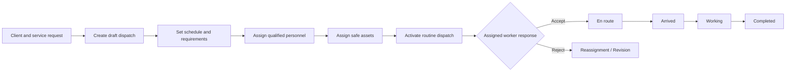
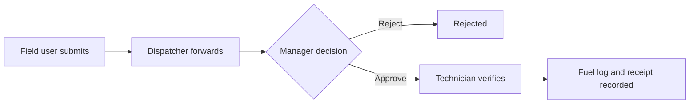

# Core Transaction 2 — User Flows

**Last updated:** 2026-07-31

## 1. Internal access

1. User opens the application and a guest is redirected to `/login`.
2. Credentials are validated against an active, non-suspended account.
3. Laravel regenerates the session.
4. Unverified users are directed to email verification.
5. Verified users enter the capability-scoped operations workspace.
6. Navigation and server data reflect the authenticated user's permissions.

Failure paths include invalid credentials, throttling, suspension, and unverified email.

The operational journeys below use the five accepted business modules:
Dispatch Job and Scheduling; Driver/Operator and Equipment Assignment; Fleet
Management; Crane and Equipment Management; and Fuel Management. Identity,
tracking, audit, and GPT steps are shared platform services.

## 2. Modules 1–2: Dispatch, scheduling, assignment, and management

The canonical routed workspace creates active clients, records client-selected
service requests, and converts a request into one or more distinct draft
dispatches. The first conversion changes the request from `submitted` to
`dispatching`; request-owned fields cannot be overridden during conversion.
The live dispatch workspace renders a server-backed schedule board, conflict
review, and detailed resource availability checks covering credentials, asset
readiness, blocking maintenance, and schedule overlaps.

At confirmation time, the server locks and revalidates the selected resources,
rejecting duplicate, unavailable, suspended, unqualified, unsafe, maintained,
or overlapping personnel and assets without partially saving the batch.
Activation rejects stale job versions. Activation and field status controls
remain separated: authorized Dispatchers activate from the live detail
workspace, while assigned field users receive their own next-step controls.
Assigned personnel can accept or reject an assignment with a required reason.
Authorized users may also execute required-reason cancellation, reassignment,
and controlled job reopening within the Inertia workflow. Activation requires at
least one active personnel assignment and one active asset assignment,
revalidates current asset safety, and returns stale versions to an explicit
refresh-and-review state.

## 3. Module 1: Priority or emergency dispatch

1. Dispatcher creates a priority or emergency job and assigns resources.
2. Assignment creates a pending approval request.
3. Operations Manager reviews the requester, dispatch context, schedule, site,
   version, and named resource changes.
4. The manager approves or rejects with a required reason; the requester cannot
   decide their own request.
5. Activation succeeds only when the latest applicable approval is approved.
6. Rejection returns the work to Dispatcher attention; it does not activate the job.

## 4. Module 2: Assigned field worker

1. Driver or Crane Operator requests their assigned work.
2. The server returns only jobs with an active personnel assignment for that user.
3. The live `Today's work` surface links directly to each assigned job without
   exposing another worker's assignment record.
4. Worker reviews job, site, current assets, requirements, and the
   color-independent progression sequence.
5. Worker responds to the assignment by accepting or rejecting it with a
   required reason. Rejection closes the active assignment interval and flags
   the dispatch for dispatcher review.
6. Once accepted, the server supplies only the next valid action. The worker
   reviews a consequence-specific confirmation before submitting it.
7. Worker advances one step at a time:
   `dispatched → accepted → en_route → arrived → working → completed`.
8. Each request includes the current optimistic version and disables repeated
   submission while processing.
9. A stale version receives a distinct refresh-and-review state; skipped,
   reversed, unauthorized, and terminal transitions fail without a state or
   audit write.
10. Every successful step increments the version and records the actor, subject,
    before/after status, time, IP context, and a server-generated request ID in
    the audit trail.
11. When sharing is enabled, the worker submits timestamped coordinates.

The current browser tracking surface queues location writes in a local outbox,
adds an idempotency key, replays after reconnection, and surfaces queued,
syncing, failed, conflict, and synchronized states on an OpenStreetMap tracking
map with freshness filters. The versioned `/api/v1` command flow is implemented
with expected versions and conflict responses; the 8-hour native field outbox
and device integration remain planned.

## 5. Module 5: Fuel request

The server implements submission, forwarding, approve/reject, verification,
and final logging. Logging records quantity, price per litre, total cost,
odometer, hour meter, station, remarks, an optional receipt attachment, and
audit history.

## 6. Modules 3–4: Inspection and maintenance release

Fleet vehicles (Module 3) and Crane/Equipment assets (Module 4) are managed through a
unified operational asset register in the routed workspace:

1. Authorized technician submits an inspection checklist and result.
2. Failed or conditional result places the asset under inspection.
3. Technician opens maintenance and declares whether the defect blocks dispatch.
4. Asset moves to `under_maintenance`; blocking work prevents assignment.
5. Repair work is recorded.
6. A new inspection completed after the repair must pass.
7. Technician releases the work order.
8. Asset becomes `ready_for_service` only if no unreleased blocking work remains.

## 7. Shared service: User administration

1. System Administrator creates an internal account with one canonical role.
2. Administrator records personnel availability and credentials where relevant.
3. Role or activation changes invalidate the user's existing sessions.
4. The system refuses a change that would remove the last active System Administrator.
5. The access change is written to the audit log.

The backend endpoints exist; the current workspace only lists users and roles.

## 8. Shared service: GPT-assisted dispatch — current backend flow

1. Authorized office user requests a recommendation using scoped, redacted context.
2. GPT returns proposed assignments, reasons, assumptions, and conflicts.
3. The product stores model metadata and recommendation lifecycle.
4. User resolves conflicts and explicitly accepts or rejects the recommendation.
5. Acceptance invokes the normal assignment/approval action.
6. All authorization, validation, locking, and audit rules still apply.

GPT must never write directly to operational records. The current repository
queues a bounded recommendation, stores lifecycle/usage/expiry metadata, and
supports authorized human accept/reject commands that re-enter normal domain
actions. The live routed workspace does not yet expose the complete GPT review
surface.
